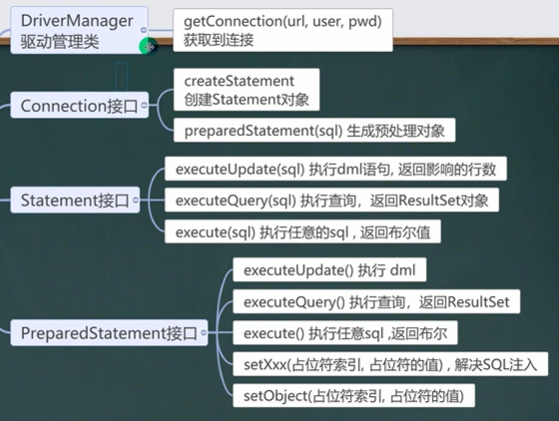
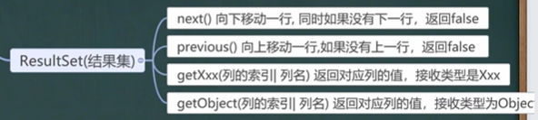
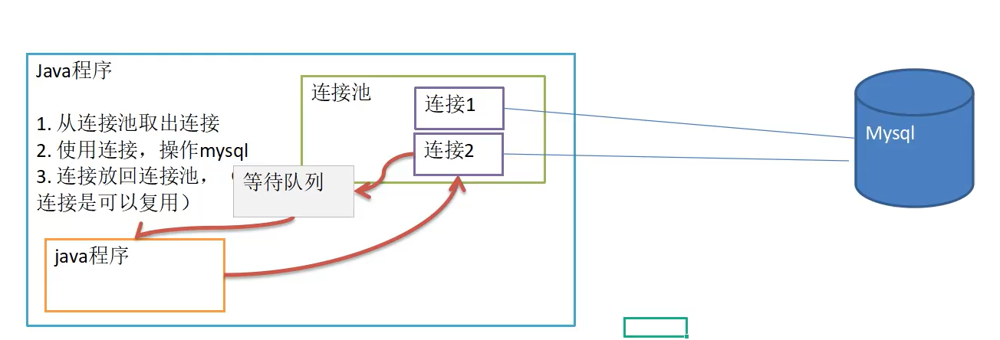
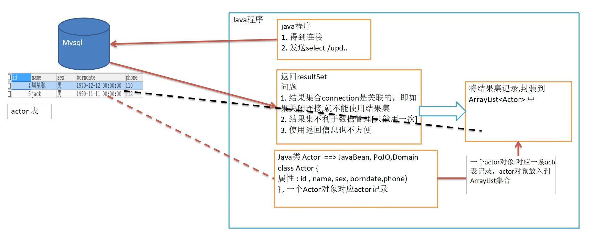

---
# 当前页面内容标题
title: JDBC
author:
- name: Ahzy
# 分类
category:
  - 计算机
# 标签
tag:
  - javaweb
sticky: false
# 是否收藏在博客主题的文章列表中，当填入数字时，数字越大，排名越靠前。
star: false
# 是否将该文章添加至文章列表中
article: false
# 是否将该文章添加至时间线中
timeline: false
# 是否原创
isOriginal: true
headerDepth: 2

---


## 1. 概述

JDBC为访问不同的数据库提供了统一的接口，为使用者屏蔽了细节问题
使用JDBC，可以连接任何提供了JDBC驱动程序的数据库系统，从而完成对数据库的各种操作


## 2. 快速上手

步骤

> 注册驱动	得到连接	 执行SQL	关闭连接资源

```java
Driver driver = new com.mysql.jdbc.Driver();

/*  jdbc:mysql:// 规定好表示协议,通过jdbc的方式连接mysql
	localhost 主机,可以是ip地址
	3306 表示mysql监听的端口
	hsp_db02 连接到mysql dbms 的哪个数据库
	mysqL的连接本质就是前面学过的socket连接	*/
String uri = "jdbc:mysql://localhost:3306/jdbc_db";

// 将用户名密码放入 properties对象
Properties info = new Properties(;
info.setProperty("user", "root");
info.setProperty("password", "abc123");
                                 
// 2.获取连接
Connection connection = driver.connect(url, info);
//Connection connection = DriverManager.getConnection("jdbc:mysql://localhost:3306/jdbcdb", "root", "hsp");
                                 
// 3-1.编写sql语句
String sql = "delete from actor where id = 2";
// String sql = "update actor set name='s' where id = 1";
// String sql="insert into actor values(null,'小龙女','女','1998-1-1','110')";
// String sql="insert into actor values(null,'小龙女2','女','1999-1-1','119')";
                                 
// 3-2. Statement用于执行静态sql语句 并返回其生成结果的对象
Statement statement = connection.createStatement();
// 3-3.使用命令对象指向sql语句, DML的语句返回影响的行数
int rows = statement.executeUpdate(sql);
// 3-4.处理执行结果
System.out.println(rows > 0 ? "success" : "failure");
                                 
// 4.关闭连接
statement.close(;
connection.close(;}}
```


## 3. 连接mysql五种方式

### 第一种方式

（属于静态加载，灵活性差，依赖性强）

```java
Driver driver = new Driver(); //创建driver对象

String url = "jdbc:mysql://localhost:3306/hsp_db02";
//将 用户名和密码放入到Properties 对象
Properties properties = new Properties();
//说明 user 和 password 是规定好，后面的值根据实际情况写
properties.setProperty("user", "root");// 用户
properties.setProperty("password", "hsp"); //密码

Connection connect = driver.connect(url, properties);
```


### 第二种方式

（使用反射加载Driver类,动态加载,更加的灵活,减少依赖性）

```java
Class <? > aClass = Class.forName("com.mysql. jdbI.Driver");
Driver driver = (Driver) aClass.newInstance();

String uri = "jdbc:mysql://localhost:3306/jdbc_db";
Properties info = new Properties(;
info.setProperty("user", "root");
info.setProperty("password", "abc123");
                                 
Connection connection = driver.connect(url, info);
```


### 第三种方式

（DriverManager代替Driver来统一管理）

```java
//使用反射加载Driver
Class <? > aClass = Class.forName("com.mysql.jdbc.Driver");
Driver driver = (Driver) aClass.newInstance();

//创建url 和 user 和 password
String url = "jdbc:mysql: //localhost: 3306/hsp_db02";
String user = "root";
String password = "hsp";

DriverManager.registerDriver(driver);//注册Driver驱动

Connection connection = DriverManager.getConnection(url, user, password);
```


### 第四种方式

（使用 Class.forName自动完成注册驱动,简化代码）

```java
Class.forName("com.mysql.jdbc.Driver");

String url = "jdbc:mysql://localhost:3306/jdbc_db";
String user = "root";
String password = "hsp";

Connection conn = DriverManager.getConnection(url, user, password);
```

- mysqL驱动5.1.6可以无需CLass.forName(“com.mysql.jdbc.Driver");

- 从jdk1.5以后使用了jdbc4, 自动调用驱动jar包下META-INF\services\java.sql.Driver文本中的类名称去注册


### 第五种方式

（在方式4的基础上改进，增加配置文件，让连接mysql更加灵活）

```properties
user=root
password=hsp
url=jdbc:mysql://localhost: 3306/hsp_db02
driver=com.mysql.jdbc.Driver
```

```java
//通过Properties对象获取配置文件的信息
Properties properties = new Properties();
properties.load(new FileInputStream("src\\mysql.properties"));
//获取相关的值
String user = properties.getProperty("user");
String password = properties.getProperty("password");
String driver = properties.getProperty("driver");
String url = properties.getProperty("url");

Class.forName(driver);//建议写上

Connection connection = DriverManager.getConnection(url, user, password);
```


## 4. ResultSet

表示数据库结果集的数据表，通常通过执行查询数据库的语句生成

- ResultSet对象保持一个光标指向其当前的数据行。最初，光标位于第一行之前，next方法将光标移动到下一行，并且由于在ResultSet对象中没有更多行时返回false，因此可以在while循环中使用循环来遍历结果集

```java
//通过Properties对象获取配置文件的信息
Properties properties = new Properties();
properties.load(new FileInputStream("src\\mysql.properties"));

//获取相关的值
String user = properties.getProperty("user");
String password = properties.getProperty("password");
String driver = properties.getProperty("driver");
String url = properties.getProperty("url");
 
//1. 注册驱动
Class.forName(driver);//建议写上
 
//2. 得到连接
Connection connection = DriverManager.getConnection(url, user, password);

//3. 编写sql命令
String sql = "select id,name,sex,borndate from actor";

//4. 获取执行sql的命令对象
Statement statement = connection.createStatement();

// 执行sql语句
ResultSet set= statement.executeQuery(sql);//执行查询语句,返回一个结果集

// 处理执行后的结果
while(set.next()){
	int id = set.getInt(1);	// 也可以按列名获取
	String name = set.getString(2);
	String sex = set.getString(3);
	Date date = set.getDate(4);
}

//4.关闭连接
set.close();
statement.close();
connection.close();
```


## 5. PreparedStatement

Statement用于执行静态SQL语句并返回其生成的结果的对象

> 需要用+拼接sql，编译次数多，存在 <span style="color: red;">SQL注入风险</span>

因此使用PreparedStatement

```java
//通过Properties对象获取配置文件的信息
Properties properties = new Properties();
properties.load(new FileInputStream("src\\mysql.properties"));
        
//获取相关的值
String user = properties.getProperty("user");
String password = properties.getProperty("password");
String driver = properties.getProperty("driver");
String url = properties.getProperty("url");
 
//1. 注册驱动
Class.forName(driver);//建议写上
 
//2. 得到连接
Connection connection = DriverManager.getConnection(url, user, password);

// 得到PreparedStatement
String sql = "select name , pwd from admin where name =? and pwd = ?";

// preparedStatement 对象实现了 PreparedStatement 接口的实现类的对象
PreparedStatement preparedStatement = connection.prepareStatement(sql);

// 给?赋值, 第一个参数表示给第几个占位符赋值
preparedStatement.setString(1, admin_name);
preparedStatement.setString(2, admin_pwd);

//4. 执行 select 语句使用
ResultSet resultSet = preparedStatement.executeQuery();


//5. 关闭连接
resultSet.close();
preparedStatement.close();
connection.close();
```


## 6. API

> DriveManager &nbsp;&nbsp;	Connection&nbsp;&nbsp;	Statement	&nbsp;&nbsp;PreparedStatement&nbsp;&nbsp;	ResultSet






## 7. JDBCUtil

```java
public class JDBCUtils {
	private static String user;
    private static String password;
	private static String url;
    private static String driver;
	
    static{
		try {
			Properties info = new Properties();
			info.load(new FilelnputStream("src\\jdbc.properties"));
			user = info.getProperty("user");
			password = info.getProperty("password");
			url = info.getProperty("url");
			driver = info.getProperty("driver");
		
            // 注册驱动
			Class.forName(driver);
		} catch (Exception e) {
			throw new RuntimeException(e);}
    	}	

    
//功能:获取可用的连接对象Connection
public static Connection getConnection({
	try {
		return DriverManager.getConnection(url, user, password);
	} catch (Exception e) {
		throw new RuntimeException(e);}}

                                       
//功能:释放资源
/*
   1. ResultSet
   2. Statement 或者 PreparedStatement
   3. Connection
   4. 如果需要关闭资源，就传入对象，否则传入 null
*/
public static void close(ResultSet set,Statement statement,Connection connection){
	try {
		if (set != null) {
			set.close();	}
		if (statement != null) {
			statement.close();	}
		if (connection != null) {
			connection.close();	}
	}catch (SQLException e) {
		throw new RuntimeException(e);} } }
```


## 8. 事务

JDBC程序中当一个Connection对象创建时,  默认情况下是自动提交事务:  每次执行一个SQL语句时, 如果执行成功,  就会向数据库自动提交,  而不能回滚。JDBC程序中为了让多个SQL语句作为一个整体执行,  需要使用事务


### connection方法

| 方法            | 功能                     |
| --------------- | ------------------------ |
| setAutoCommit() | (false) 取消自动提交事务 |
| commit()        | 方法提交                 |
| rollback()      | 方法回滚                 |

案例：

```java
	//没有使用事务.
    @Test
    public void noTransaction() {
 
        //操作转账的业务
        //1. 得到连接
        Connection connection = null;
        //2. 组织一个sql
        String sql = "update account set balance = balance - 100 where id = 1";
        String sql2 = "update account set balance = balance + 100 where id = 2";
        PreparedStatement preparedStatement = null;
        //3. 创建PreparedStatement 对象
        try {
            connection = JDBCUtils.getConnection(); // 在默认情况下，connection是默认自动提交
            preparedStatement = connection.prepareStatement(sql);
            preparedStatement.executeUpdate(); // 执行第1条sql
 
            int i = 1 / 0; //抛出异常
            preparedStatement = connection.prepareStatement(sql2);
            preparedStatement.executeUpdate(); // 执行第3条sql
 
 
        } catch (SQLException e) {
            e.printStackTrace();
        } finally {
            //关闭资源
            JDBCUtils.close(null, preparedStatement, connection);
        }
    }
 
    //事务来解决
    @Test
    public void useTransaction() {
 
        //操作转账的业务
        //1. 得到连接
        Connection connection = null;
        //2. 组织一个sql
        String sql = "update account set balance = balance - 100 where id = 1";
        String sql2 = "update account set balance = balance + 100 where id = 2";
        PreparedStatement preparedStatement = null;
        //3. 创建PreparedStatement 对象
        try {
            connection = JDBCUtils.getConnection(); // 在默认情况下，connection是默认自动提交
            //将 connection 设置为不自动提交
            connection.setAutoCommit(false); //开启了事务
            preparedStatement = connection.prepareStatement(sql);
            preparedStatement.executeUpdate(); // 执行第1条sql
 
            int i = 1 / 0; //抛出异常
            preparedStatement = connection.prepareStatement(sql2);
            preparedStatement.executeUpdate(); // 执行第3条sql
 
            //这里提交事务
            connection.commit();
 
        } catch (Exception e) {
            //这里我们可以进行回滚，即撤销执行的SQL
            //默认回滚到事务开始的状态.
            System.out.println("执行发生了异常，撤销执行的sql");
            try {
                connection.rollback();
            } catch (SQLException throwables) {
                throwables.printStackTrace();
            }
            e.printStackTrace();
        } finally {
            //关闭资源
            JDBCUtils.close(null, preparedStatement, connection);
        }
    }
}
```


## 9. 批处理

当需要成批插入或者更新记录时。可以采用Java的批量更新机制，这一机制允许多条语句一次性提交给数据库批量处理。通常情况下比单独提交处理更有效率。

### JDBC的批量处理语句

| 方法           | 功能                            |      |
| -------------- | ------------------------------- | ---- |
| executeBatch() | 执行批量处理语句                |      |
| clearBatch()   | 清空批处理包的语句              |      |
| addBatch()     | 添加需要批量处理的SQL语句或参数 |      |


> - JDBC连接MySQL时，如果要使用批处理功能，请再url中加参数==?rewriteBatchedStatements=true==
> - 批处理往往和 <span style="color: red;">PreparedStatement</span> 搭配使用，可以既减少编译次数，又减少运行次数

案例：

```java

    //传统方法，添加5000条数据到admin2
	@Test
    public void noBatch() throws Exception {
 
        Connection connection = JDBCUtils.getConnection();
        String sql = "insert into admin2 values(null, ?, ?)";
        PreparedStatement preparedStatement = connection.prepareStatement(sql);
        System.out.println("开始执行");
        long start = System.currentTimeMillis();//开始时间
        for (int i = 0; i < 5000; i++) {//5000执行
            preparedStatement.setString(1, "jack" + i);
            preparedStatement.setString(2, "666");
            preparedStatement.executeUpdate();
        }
        long end = System.currentTimeMillis();
        System.out.println("传统的方式 耗时=" + (end - start));//传统的方式 耗时=10702
        //关闭连接
        JDBCUtils.close(null, preparedStatement, connection);
    }
 
    //使用批量方式添加数据
    @Test
    public void batch() throws Exception {
 
        Connection connection = JDBCUtils.getConnection();
        String sql = "insert into admin2 values(null, ?, ?)";
        PreparedStatement preparedStatement = connection.prepareStatement(sql);
        System.out.println("开始执行");
        long start = System.currentTimeMillis();//开始时间
        for (int i = 0; i < 5000; i++) {//5000执行
            preparedStatement.setString(1, "jack" + i);
            preparedStatement.setString(2, "666");
            //将sql 语句加入到批处理包中 -> 看源码
            /*
            //1. //第一就创建 ArrayList - elementData => Object[]
            //2. elementData => Object[] 就会存放我们预处理的sql语句
            //3. 当elementData满后,就按照1.5扩容
            //4. 当添加到指定的值后，就executeBatch
            //5. 批量处理会减少我们发送sql语句的网络开销，而且减少编译次数，因此效率提高
            public void addBatch() throws SQLException {
                synchronized(this.checkClosed().getConnectionMutex()) {
                    if (this.batchedArgs == null) {
                        this.batchedArgs = new ArrayList();
                    }
                    for(int i = 0; i < this.parameterValues.length; ++i) {
                        this.checkAllParametersSet(this.parameterValues[i], this.parameterStreams[i], i);
                    }
                    this.batchedArgs.add(new PreparedStatement.BatchParams(this.parameterValues, this.parameterStreams, this.isStream, this.streamLengths, this.isNull));
                }
            }
             */
            preparedStatement.addBatch();
            //当有1000条记录时，在批量执行
            if((i + 1) % 1000 == 0) {//满1000条sql
                preparedStatement.executeBatch();
                //清空
                preparedStatement.clearBatch();
            }
        }
        long end = System.currentTimeMillis();
        System.out.println("批量方式 耗时=" + (end - start));//批量方式 耗时=108
        //关闭连接
        JDBCUtils.close(null, preparedStatement, connection);
    }
}
```


## 10. 连接池

### 背景

1. 传统的JDBC数据库连接使用 DriverManager来获取，每次向数据库建立连接的时候都要将 Connection 加载到内存中再验证IP地址，用户名和密码(0.05s~ 1s时间)。需要数据库连接的时候就向数据库要求一个，频繁的进行数据库连接操作将占用很多的系统资源，容易造成服务器崩溃。

2. 每一次数据库连接，使用完后都得断开，如果程序出现异常而未能关闭，将导致数据库内存泄漏，最终将导致重启数据库。

3. 传统获取连接的方式，不能控制创建的连接数量，如连接过多，也可能导致内存泄漏，MySQL崩溃。


### 概念

1. 预先在缓冲池中放入一定数量的连接，当需要建立数据库连接时，只需从“缓冲池”中 ==取出一个== ，使用完毕之后再放回去。

2. 数据库连接池负责分配、管理和释放数据库连接，它允许应用程序 ==重复使用== 一个现有的数据库连接，而不是重新建立一个

3. 当应用程序向连接池请求的连接数超过最大连接数量时，这些请求将被加入到等待队列中



### 种类

- JDBC 的数据库连接池使用 javax.sql.DataSource 来表示，DataSource只是一个接口，该接口通常由第三方提供实现

- ==**C3PO**== ，速度相对较慢，稳定性不错 (hibernate,spring)

- **DBCP**，速度相对c3p0较快，但不稳定

- **Proxool**，有监控连接池状态的功能，稳定性较c3p0差一点

- **BoneCP**，速度快

- ==**Druid(德鲁伊)**==，集DBCP 、C3PO 、Proxool优点于一身的数据库连接池


### C3P0


方式一

```java
@Test
public void testC3P0_01() throws Exception{
    //1.创建一个数据源对象
    ComboPooledDataSource comboPooledDataSource = new ComboPooledDataSource();
    
    //2.通过配置文件mysql.propertie获取相关的信息
    Properties properties = new Properties();
    properties.load(new FileInputStream("src\\mysql.properties"));
    //读取相关的属性值
    String user = properties.getProperty("user");
    String password = properties.getProperty("password");
    String url = properties.getProperty("url");
    String driver = properties.getProperty("driver");

    //给数据源 comboPooledDataSource 设置相关的参数
    //注意：连接管理是由 comboPooledDataSource 来管理
    comboPooledDataSource.setDriverClass(driver);
    comboPooledDataSource.setJdbcUrl(url);
    comboPooledDataSource.setUser(user);
    comboPooledDataSource.setPassword(password);
    //设置初始化连接数
    comboPooledDataSource.setInitialPoolSize(10);
    //设置最大连接数
    comboPooledDataSource.setMaxPoolSize(50);

    //这个方法是从 DataSource 接口实现的
    Connection connection = comboPooledDataSource.getConnection();
    connection.close();
}
```

方式二

```java
//	使用配置文件模板来完成

//1. 将c3p0 提供的 xml 文件拷贝到src目录下
//2. 该文件指定了连接数据库和连接池的相关参数
@Test
public void testC3P0_02() throws SQLException {
    ComboPooledDataSource cp = new ComboPooledDataSource("c3p0");

    Connection connection = cp.getConnection();
    connection.close();
}
```


```
<?xml version="1.0" encoding="UTF-8"?>
<c3p0-config>
<!--配置连接池mysql-->
    <named-config name="c3p0">             				<!--数据源名称代表连接池 这里等会连接时候使用-->
        <property name="driverClass">com.mysql.jdbc.Driver</property>    <!--驱动类-->
        <property name="jdbcUrl">jdbc:mysql://localhost:3306/mysql?characterEncoding=utf-8&serverTimezone=UTC</property>  						  <!--url-->
        <property name="user">root</property>            <!--用户名-->
        <property name="password"></property>      		 <!--密码-->
        <property name="initialPoolSize">10</property>   <!--初始化的连接数-->
        <property name="acquireIncrement">5</property>   <!--每次增长的连接数-->
        <property name="maxIdleTime">30</property>
        <property name="maxPoolSize">60</property>  	 <!--最大的连接数-->
        <property name="minPoolSize">10</property>   	 <!--最小的连接数-->
    </named-config>
    <!--配置连接池2,可以配置多个-->
</c3p0-config>
```


### Druid

```
driverClassName=com.mysql.cj.jdbc.Driver
#URL连接数据库的URL，其中travel（以下面例子来说）为连接的数据库，后面的参数可不改但不删
url=jdbc:mysql://localhost:3306/travel?useSSL=false&allowPublicKeyRetrieval=true&serverTimezone=UTC
characterEncoding=utf-8
username=root				#安装mysql时候设置的用户与密码
password=root
initialSize=5				#初始化物理连接的个数
maxActive=10				#最大连接池数量
maxWait=3000				#获取连接时最大等待时间
validationQuery=SELECT 1	#用来检测连接是否有效的sql
testWhileIdle=true			#保证安全性！
```

```java
@Test
public void testDruid() throws Exception {
    //1. 加入jar 包
    //2. 加入配置文件
    //3. 创建Properties对象，读取配置文件
    Properties properties = new Properties();
    properties.load(new FileInputStream("src\\druid.properties"));
    //4. 创建一个指定参数的数据库连接池,Druid连接池
    DataSource dataSource = DruidDataSourceFactory.createDataSource(properties);
    Connection connection = dataSource.getConnection()  
    connection.close();
}
```


**工具类**

```java
package com.ahzy.mhl.utils;

import com.alibaba.druid.pool.DruidDataSourceFactory;

import javax.sql.DataSource;
import java.io.FileInputStream;
import java.sql.Connection;
import java.sql.ResultSet;
import java.sql.SQLException;
import java.sql.Statement;
import java.util.Properties;

/**
 * @author 韩顺平
 * @version 1.0
 * 基于druid数据库连接池的工具类
 */
public class JDBCUtilsByDruid {

    private static DataSource ds;

    //在静态代码块完成 ds初始化
    static {
        Properties properties = new Properties();
        try {
            properties.load(new FileInputStream("src\\druid.properties"));
            ds = DruidDataSourceFactory.createDataSource(properties);
        } catch (Exception e) {
            e.printStackTrace();
        }

    }

    //编写getConnection方法
    public static Connection getConnection() throws SQLException {
        return ds.getConnection();
    }

    //关闭连接, 老师再次强调： 在数据库连接池技术中，close 不是真的断掉连接
    //而是把使用的Connection对象放回连接池
    public static void close(ResultSet resultSet, Statement statement, Connection connection) {

        try {
            if (resultSet != null) {
                resultSet.close();
            }
            if (statement != null) {
                statement.close();
            }
            if (connection != null) {
                connection.close();
            }
        } catch (SQLException e) {
            throw new RuntimeException(e);
        }
    }
}

```

Utility工具类
```java
package com.ahzy.mhl.utils;


/**
	工具类的作用:
	处理各种情况的用户输入，并且能够按照程序员的需求，得到用户的控制台输入。
*/

import java.util.*;
/**

	
*/
public class Utility {
	//静态属性。。。
    private static Scanner scanner = new Scanner(System.in);

    
    /**
     * 功能：读取键盘输入的一个菜单选项，值：1——5的范围
     * @return 1——5
     */
	public static char readMenuSelection() {
        char c;
        for (; ; ) {
            String str = readKeyBoard(1, false);//包含一个字符的字符串
            c = str.charAt(0);//将字符串转换成字符char类型
            if (c != '1' && c != '2' && 
                c != '3' && c != '4' && c != '5') {
                System.out.print("选择错误，请重新输入：");
            } else break;
        }
        return c;
    }

	/**
	 * 功能：读取键盘输入的一个字符
	 * @return 一个字符
	 */
    public static char readChar() {
        String str = readKeyBoard(1, false);//就是一个字符
        return str.charAt(0);
    }
    /**
     * 功能：读取键盘输入的一个字符，如果直接按回车，则返回指定的默认值；否则返回输入的那个字符
     * @param defaultValue 指定的默认值
     * @return 默认值或输入的字符
     */
    
    public static char readChar(char defaultValue) {
        String str = readKeyBoard(1, true);//要么是空字符串，要么是一个字符
        return (str.length() == 0) ? defaultValue : str.charAt(0);
    }
	
    /**
     * 功能：读取键盘输入的整型，长度小于2位
     * @return 整数
     */
    public static int readInt() {
        int n;
        for (; ; ) {
            String str = readKeyBoard(2, false);//一个整数，长度<=2位
            try {
                n = Integer.parseInt(str);//将字符串转换成整数
                break;
            } catch (NumberFormatException e) {
                System.out.print("数字输入错误，请重新输入：");
            }
        }
        return n;
    }
    /**
     * 功能：读取键盘输入的 整数或默认值，如果直接回车，则返回默认值，否则返回输入的整数
     * @param defaultValue 指定的默认值
     * @return 整数或默认值
     */
    public static int readInt(int defaultValue) {
        int n;
        for (; ; ) {
            String str = readKeyBoard(10, true);
            if (str.equals("")) {
                return defaultValue;
            }
			
			//异常处理...
            try {
                n = Integer.parseInt(str);
                break;
            } catch (NumberFormatException e) {
                System.out.print("数字输入错误，请重新输入：");
            }
        }
        return n;
    }

    /**
     * 功能：读取键盘输入的指定长度的字符串
     * @param limit 限制的长度
     * @return 指定长度的字符串
     */

    public static String readString(int limit) {
        return readKeyBoard(limit, false);
    }

    /**
     * 功能：读取键盘输入的指定长度的字符串或默认值，如果直接回车，返回默认值，否则返回字符串
     * @param limit 限制的长度
     * @param defaultValue 指定的默认值
     * @return 指定长度的字符串
     */
	
    public static String readString(int limit, String defaultValue) {
        String str = readKeyBoard(limit, true);
        return str.equals("")? defaultValue : str;
    }


	/**
	 * 功能：读取键盘输入的确认选项，Y或N
	 * 将小的功能，封装到一个方法中.
	 * @return Y或N
	 */
    public static char readConfirmSelection() {
        System.out.print("确认是否预订(Y/N): ");
        char c;
        for (; ; ) {//无限循环
        	//在这里，将接受到字符，转成了大写字母
        	//y => Y n=>N
            String str = readKeyBoard(1, false).toUpperCase();
            c = str.charAt(0);
            if (c == 'Y' || c == 'N') {
                break;
            } else {
                System.out.print("选择错误，请重新输入：");
            }
        }
        return c;
    }

    /**
     * 功能： 读取一个字符串
     * @param limit 读取的长度
     * @param blankReturn 如果为true ,表示 可以读空字符串。 
     * 					  如果为false表示 不能读空字符串。
     * 			
	 *	如果输入为空，或者输入大于limit的长度，就会提示重新输入。
     * @return
     */
    private static String readKeyBoard(int limit, boolean blankReturn) {
        
		//定义了字符串
		String line = "";

		//scanner.hasNextLine() 判断有没有下一行
        while (scanner.hasNextLine()) {
            line = scanner.nextLine();//读取这一行
           
			//如果line.length=0, 即用户没有输入任何内容，直接回车
			if (line.length() == 0) {
                if (blankReturn) return line;//如果blankReturn=true,可以返回空串
                else continue; //如果blankReturn=false,不接受空串，必须输入内容
            }

			//如果用户输入的内容大于了 limit，就提示重写输入  
			//如果用户如的内容 >0 <= limit ,我就接受
            if (line.length() < 1 || line.length() > limit) {
                System.out.print("输入长度（不能大于" + limit + "）错误，请重新输入：");
                continue;
            }
            break;
        }

        return line;
    }
}

```


## 11. DButils

### 背景

当关闭connection后，resultset结果集就无法使用了，这就使得resultset不利于数据的管理




### 简介

commons-dbutils 是 Apache 组织提供的的一个开源 JDBC工具类库，是对JDBC的封装

> **QueryRunner类:** 该类封装了SQL的执行，是线程安全的。可以实现增、删、改、查、批处理
>
> **ResultSetHandler接口:** 该接口用于处理 java.sql.ResultSet，将数据按要求转换为另一种形式


### 实现类

实现了ResultSetHandler接口

| 实现类 | 作用 |
| ------------------ | --------------- |
| ArrayHandler       | 把结果集中的第一行数据转成对象数组 |
| ArrayListHandler   | 把结果集中的每一行数据都转成一个数组，再存放到List中 |
| BeanHandler        | 将结果集中的第一行数据封装到一个对应的JavaBean实例中 |
| BeanListHandler    | 将结果集中的每一行数据都封装到一个对应的JavaBean实例中，存放到List里 |
| ColumnListHandler  | 将结果集中某一列的数据存放到List中 |
| KeyedHandler(name) | 将结果集中的每行数据都封装到Map里，再把这些map存到一个map里,其key为指定的key |
| MapHandler         | 将结果集中的第一行数据封装到一个Map里，key是列名，value就是对应的值 |
| MapListHandler     | 将结果集中的每一行数据都封装到一个Map里，然后再存放到List |
| ScalarHandler | 查询中获取单个值（单行单列），返回Object |


### 原始方法

```java
@Test
public void testSelectToArrayList(){
    System.out.println("我们使用Druid方式完成");
    //1.得到连接
    Connection connection = null;
    //2.组织sql语句
    String sql = "select * from actor";
    //delete 与 insert
    PreparedStatement preparedStatement = null;
    ResultSet set = null;
    ArrayList<actor> list = new ArrayList<actor>();
    //3.创建PrepareStatement 对象
    try {
        connection = JDBCUtilsByDruid.getConnection();
        System.out.println(connection.getClass());//运行类型
        preparedStatement = connection.prepareStatement(sql);
        //执行
        set = preparedStatement.executeQuery();
        //遍历该结果集
        while (set.next()) {
            int id = set.getInt("id");
            String name = set.getString("name");
            String sex = set.getString("sex");
            Date borndate = set.getDate("borndate");
            String phone = set.getString("phone");
            //把得到的result 的记录，封装到 actor 对象，放入到list集合
            list.add(new actor(id,name,sex,borndate,phone));
        }
        System.out.println("list集合数据=" + list);
    } catch (SQLException e) {
        throw new RuntimeException(e);
    } finally {
        //关闭资源
        JDBCUtilsByDruid.close(set,preparedStatement,connection);
    }
}
```


### DBUtils实现

#### DQL

```java
//使用apache-DBUtils 工具类 + druid 完成对表的crud操作
@Test
public void testQueryMany() throws SQLException { //返回结果是多行的情况

    //1. 得到连接 (druid)
    Connection connection = JDBCUtilsByDruid.getConnection();
    
    //2. 引入DBUtils 相关的jar
    
    //3. 创建 QueryRunner
    QueryRunner queryRunner = new QueryRunner();
    
    //4. 就可以执行相关的方法，返回ArrayList 结果集
    // String sql = "select * from actor where id >= ?";
    // 注意: sql 语句也可以查询部分列
    String sql = "select id, name from actor where id >= ?";
    
    //(1) query 方法就是执行sql 语句，得到resultset ---封装到 --> ArrayList 集合中
    //(2) 返回集合
    //(3) connection: 连接
    //(4) sql : 执行的sql语句
    //(5) new BeanListHandler<>(Actor.class): 在将resultset -> Actor 对象 -> 封装到 ArrayList
    //    底层使用反射机制 去获取Actor 类的属性，然后进行封装
    //(6) 1 就是给 sql 语句中的? 赋值，可以有多个值，因为是可变参数Object... params
    //(7) 底层得到的resultset ,会在query 关闭, 关闭PreparedStatment
    List<Actor> list =
        queryRunner.query(connection, sql, new BeanListHandler<>(Actor.class), 1);
    System.out.println("输出集合的信息");
    for (Actor actor : list) {
        System.out.print(actor);
    }

    // 释放资源
    JDBCUtilsByDruid.close(null, null, connection);
}
```


#### DML

```java
//演示apache-dbutils + druid 完成 dml (update, insert ,delete)
@Test
public void testDML() throws SQLException {
 
    //1. 得到 连接 (druid)
    Connection connection = JDBCUtilsByDruid.getConnection();
    //2. 使用 DBUtils 类和接口 , 先引入DBUtils 相关的jar , 加入到本Project
    //3. 创建 QueryRunner
    QueryRunner queryRunner = new QueryRunner();
 
    //4. 这里组织sql 完成 update, insert delete
    //String sql = "update actor set name = ? where id = ?";
    //String sql = "insert into actor values(null, ?, ?, ?, ?)";
    String sql = "delete from actor where id = ?";
 
    //(1) 执行dml 操作是 queryRunner.update()
    //(2) 返回的值是受影响的行数 (affected: 受影响)
    //int affectedRow = queryRunner.update(connection, sql, "林青霞", "女", "1966-10-10", "116");
    int affectedRow = queryRunner.update(connection, sql, 1000 );
    System.out.println(affectedRow > 0 ? "执行成功" : "执行没有影响到表");
 
    // 释放资源
    JDBCUtilsByDruid.close(null, null, connection);
}
```


## 12. BasicDao

### 背景

apache-dbutils+Druid 简化了JDBC开发，但还有不足：

1. SQL 语句是固定，不能通过参数传入，通用性不好

2. 对于select 操作，如果有返回值, 返回类型不能固定

3. 需要使用泛型将来的表很多，业务需求复杂,不可能只靠一个Java类完成


### 实现

写一个实体类（domain、pojo、javabean）对应数据库列名

```java
package com.ahzy.mhl.dao;


import com.ahzy.mhl.utils.JDBCUtilsByDruid;
import org.apache.commons.dbutils.QueryRunner;
import org.apache.commons.dbutils.handlers.BeanHandler;
import org.apache.commons.dbutils.handlers.BeanListHandler;
import org.apache.commons.dbutils.handlers.ScalarHandler;

import java.sql.Connection;
import java.sql.SQLException;
import java.util.List;

/**
 * @author 韩顺平
 * @version 1.0
 * 开发BasicDAO , 是其他DAO的父类
 */
public class BasicDAO<T> { //泛型指定具体类型

    private QueryRunner qr =  new QueryRunner();

    //开发通用的dml方法, 针对任意的表
    public int update(String sql, Object... parameters) {

        Connection connection = null;

        try {
            connection = JDBCUtilsByDruid.getConnection();
            int update = qr.update(connection, sql, parameters);
            return  update;
        } catch (SQLException e) {
           throw  new RuntimeException(e); //将编译异常->运行异常 ,抛出
        } finally {
            JDBCUtilsByDruid.close(null, null, connection);
        }

    }

    //返回多个对象(即查询的结果是多行), 针对任意表

    /**
     *
     * @param sql sql 语句，可以有 ?
     * @param clazz 传入一个类的Class对象 比如 Actor.class
     * @param parameters 传入 ? 的具体的值，可以是多个
     * @return 根据Actor.class 返回对应的 ArrayList 集合
     */
    public List<T> queryMulti(String sql, Class<T> clazz, Object... parameters) {

        Connection connection = null;
        try {
            connection = JDBCUtilsByDruid.getConnection();
            return qr.query(connection, sql, new BeanListHandler<T>(clazz), parameters);

        } catch (SQLException e) {
            throw  new RuntimeException(e); //将编译异常->运行异常 ,抛出
        } finally {
            JDBCUtilsByDruid.close(null, null, connection);
        }

    }

    //查询单行结果 的通用方法
    public T querySingle(String sql, Class<T> clazz, Object... parameters) {

        Connection connection = null;
        try {
            connection = JDBCUtilsByDruid.getConnection();
            return  qr.query(connection, sql, new BeanHandler<T>(clazz), parameters);

        } catch (SQLException e) {
            throw  new RuntimeException(e); //将编译异常->运行异常 ,抛出
        } finally {
            JDBCUtilsByDruid.close(null, null, connection);
        }
    }

    //查询单行单列的方法,即返回单值的方法

    public Object queryScalar(String sql, Object... parameters) {

        Connection connection = null;
        try {
            connection = JDBCUtilsByDruid.getConnection();
            return  qr.query(connection, sql, new ScalarHandler(), parameters);

        } catch (SQLException e) {
            throw  new RuntimeException(e); //将编译异常->运行异常 ,抛出
        } finally {
            JDBCUtilsByDruid.close(null, null, connection);
        }
    }

}

```

```java
public class ActorDAO extends BasicDAO<Actor> {
    //1. 有 BasicDAO 的方法
    //2. 根据业务需求，可以编写特有的方法.
}
```


测试

```java
//测试ActorDAO 对actor表crud操作
    @Test
    public void testActorDAO() {
 
        ActorDAO actorDAO = new ActorDAO();
        //1. 查询
        List<Actor> actors = actorDAO.queryMulti("select * from actor where id >= ?", Actor.class, 1);
        System.out.println("===查询结果===");
        for (Actor actor : actors) {
            System.out.println(actor);
        }
 
        //2. 查询单行记录
        Actor actor = actorDAO.querySingle("select * from actor where id = ?", Actor.class, 6);
        System.out.println("====查询单行结果====");
        System.out.println(actor);
 
        //3. 查询单行单列
        Object o = actorDAO.queryScalar("select name from actor where id = ?", 6);
        System.out.println("====查询单行单列值===");
        System.out.println(o);
 
        //4. dml操作  insert ,update, delete
        int update = actorDAO.update("insert into actor values(null, ?, ?, ?, ?)", "张无忌", "男", "2000-11-11", "999");
 
        System.out.println(update > 0 ? "执行成功" : "执行没有影响表");
    }
}
```


