---
# 当前页面内容标题
title: Servlet
author:
- name: Ahzy
# 分类
category:
  - 计算机
# 标签
tag:
  - javaweb
sticky: false
# 是否收藏在博客主题的文章列表中，当填入数字时，数字越大，排名越靠前。
star: false
# 是否将该文章添加至文章列表中
article: false
# 是否将该文章添加至时间线中
timeline: false
# 是否原创
isOriginal: true
headerDepth: 2

date: 2024-10-07

---


## 1. Selvet基础

>1. JavaEE 规范之一，规范就是接口
>2. JavaWeb[^1] 三大组件[^2]之一
>3. 运行在服务器上的一个 java 小程序（由Tomcat解析和执行），可以接收请求响应数据
>4. 由java编写，本质是一个java类
>5. servlet3.0 前使用 web.xml , servlet3.0 版本以后(包括 3.0)支持注解，同时支持web.xml 配置


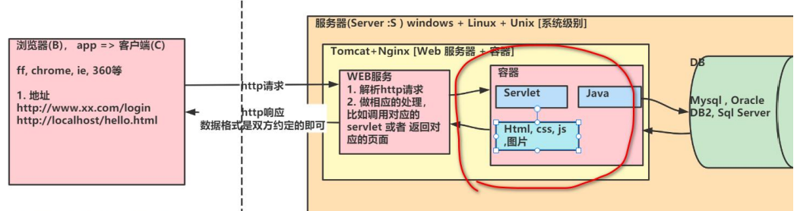

- 请求动态资源一条路，只访问静态资源 Apache 和 Nignx 足以，不需 Tomcat
- 请求静态资源一条路，直接返回


###  1.1 快速入门

添加 `servlet-api.jar` (在 **tomcat/lib** 下) 到工程, 因为servlet.jar 不是jdk自带的, 要引入

```java
/**
  * 1. 编写类实现Servlet接口
  * 2. 实现 service 方法5个
  * 3. 在 web.xml 中去配置 servlet 程序的访问地址
  */
public class HelloServlet implements Servlet {

    private int count = 0; //属性

    /**
     * 1.初始化 servlet
     * 2.当创建HelloServlet 实例时，会调用init方法
     * 3. 该方法只会被调用一次
     * @param servletConfig
     * @throws ServletException
     */
    @Override
    public void init(ServletConfig servletConfig) throws ServletException {
        System.out.println("init() 被调用");
    }

    /**
     * 返回ServletConfig 也就是返回Servlet的配置
     * @return
     */
    @Override
    public ServletConfig getServletConfig() {
        return null;
    }

    /**
     * 1. service方法处理浏览器的请求(包括get/post)
     * 2. 当浏览器每次请求Servlet时，就会调用一次service
     * 3. 当tomcat调用该方法时，会把http请求的数据封装成实现ServletRequest接口的request对象
     * 4. 通过servletRequest 对象，可以得到用户提交的数据
     * 5. servletResponse 对象可以用于返回数据给tomcat->浏览器
     * @param servletRequest
     * @param servletResponse
     * @throws ServletException
     * @throws IOException
     */
    @Override
    public void service(ServletRequest servletRequest,
                        ServletResponse servletResponse) throws ServletException, IOException {

        count++;
        //如果count的值，在不停的累计，说明HelloServlet是单例的
        System.out.println("hi HelloServlet~ count= " + count);
        //Tomcat每处理一次http请求，就生成一个新的线程
        System.out.println("当前线程id= " + Thread.currentThread().getId());

        //思考->从servletRequest对象来获取请求方式->
        //1. ServletRequest 没有得到提交方式的方法
        //2. ServletRequest 看看ServletRequest子接口有没有相关方法
        //3. 老师小技巧：ctrl+alt+b => 可以看到接口的子接口和实现子类
        //4. 把servletReqeust转成 HttpServletRequest引用
        //5. 仍然是Java基础的OOP
        HttpServletRequest httpServletRequest = (HttpServletRequest) servletRequest;
        String method = httpServletRequest.getMethod();
        if("GET".equals(method)) {
            doGet(); //用doGet() 处理GET请求
        } else if("POST".equals(method)) {
            doPost(); //用doPost() 处理POST请求
        }

    }

    /**
     * 用于响应get请求的
     */
    public void doGet() {
        System.out.println("doGet() 被调用..");
    }

    /**
     * 用于响应post请求的
     */
    public void doPost() {
        System.out.println("doPost() 被调用..");
    }

    /**
     * 返回servlet信息，使用较少
     * @return
     */
    @Override
    public String getServletInfo() {
        return null;
    }

    /**
     * 1. 该方法是在servlet销毁时，被调用
     * 2. 只会调用一次
     */
    @Override
    public void destroy() {
        System.out.println("destroy() 被调用...");
    }
}

```

web.xml中的配置

```xml
<?xml version="1.0" encoding="UTF-8"?>
<web-app xmlns="http://xmlns.jcp.org/xml/ns/javaee"
         xmlns:xsi="http://www.w3.org/2001/XMLSchema-instance"
         xsi:schemaLocation="http://xmlns.jcp.org/xml/ns/javaee http://xmlns.jcp.org/xml/ns/javaee/web-app_4_0.xsd"
         version="4.0">

    <!--老韩小技巧: web.xml主要用来配置该web应用使用到的Servlet
        老师解读
        1. servlet-name: 给Servlet取名(程序员决定), 该名字唯一
        2. servlet-class: Servlet的类的全路径: Tomcat在反射生成该Servlet需要使用
        3. url-pattern: 这个就是该servlet访问的url的配置(路径)
        4. 这时我们应该这样访问servlet http://localhost:8080/servlet/helloServlet
        5. url-pattern 取名是程序员决定的
        6. load-on-startup 表示在tomcat 启动时，会自动的加载servlet实例

        小技巧： alt+r => 老师配置
    -->
    <!-- 配置HelloServlet -->
    <servlet>
        <servlet-name>HelloServlet</servlet-name>
        <servlet-class>com.hspedu.servlet.HelloServlet</servlet-class>
        <!--<load-on-startup>1</load-on-startup>-->
    </servlet>
    <servlet-mapping>
        <servlet-name>HelloServlet</servlet-name>
        <url-pattern>/helloServlet</url-pattern>
    </servlet-mapping>
    
</web-app>
```

> `http://ip:port/工程路径 `  默认访问 index.jsp


### 1.2 浏览器请求Servlet UML分析

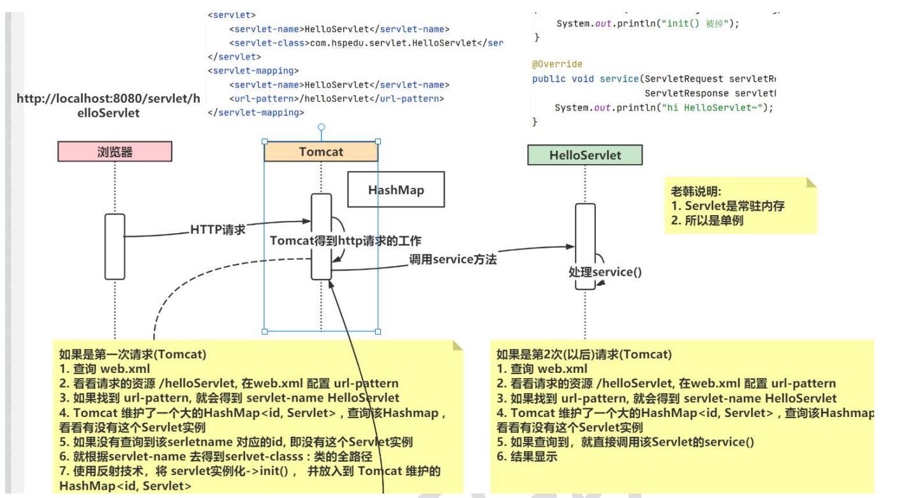

- Tomcat 不关心是哪个浏览器发来的请求，都是走一样的流程
- 执行 1 的时候，对包进行扫描，有@WebServlet，说明该类为Servlet，读取urlPatterns


### 1.3 生命周期

> 1. 执行Servlet 构造器方法
> 2. 执行init 初始化方法
> 3. 执行service 方法
> 4. 执行destroy 销毁方法


- Servlet 容器(比如: Tomcat)加载 Servlet，加载完成后，Servlet 容器会创建一个Servlet 实例并调用 **init()方法**，init()方法只会调用一次, Servlet 容器在下面的情况装载Servlet：
  1. Servlet 容器(Tomcat)启动时自动装载某些 servlet，实现这个需要在web.xml 文件中添加 `<load-on-startup>1</load-on-startup>` ，1 表示装载的顺序
  2. 在 Servlet 容器启动后，浏览器 **首次** 向 Servlet 发送请求
  3. Servlet 重新装载时(比如 **tomcat 进行 redeploy**【redeploy 会 **销毁所有的Servlet 实例**】)，浏览器再向 Servlet 发送请求的第 1 次
- 处理浏览器请求阶段(**service 方法**)：
  1. 每收到一个 http 请求，服务器就会产生一个新的线程去处理
  2. 创建一个用于封装 HTTP 请求消息的 ServletRequest 对象和一个代表HTTP 响应消息的ServletResponse 对象
  3. . 然后调用 Servlet 的 service()方法并将请求和响应对象作为参数传递进去
- 终止阶段 destory 方法
  1. 当web 应用被终止，或者Servlet 容器终止运行，或者Servlet 类重新装载时，会调用destroy()方法 , 比如重启 tomcat ,或者 redeploy web 应用


###  1.4 请求分发处理

```java
public class HelloServlet implements Servlet {
    
    /**
     * 1. service方法处理浏览器的请求(包括get/post)
     * 2. 当浏览器每次请求Servlet时，就会调用一次service
     * 3. 当tomcat调用该方法时，会把http请求的数据封装成实现ServletRequest接口的request对象
     * 4. 通过servletRequest 对象，可以得到用户提交的数据
     * 5. servletResponse 对象可以用于返回数据给tomcat->浏览器
     * @param servletRequest
     * @param servletResponse
     * @throws ServletException
     * @throws IOException
     */
    @Override
    public void service(ServletRequest servletRequest,
                        ServletResponse servletResponse) throws ServletException, IOException {

        //思考->从servletRequest对象来获取请求方式->
        //1. ServletRequest 没有得到提交方式的方法
        //2. ServletRequest 看看ServletRequest子接口有没有相关方法
        //3. 老师小技巧：ctrl+alt+b => 可以看到接口的子接口和实现子类
        //4. 把servletReqeust转成 HttpServletRequest引用
        //5. 仍然是Java基础的OOP
        HttpServletRequest httpServletRequest = (HttpServletRequest) servletRequest;
        String method = httpServletRequest.getMethod();
        if("GET".equals(method)) {
            doGet(); //用doGet() 处理GET请求
        } else if("POST".equals(method)) {
            doPost(); //用doPost() 处理POST请求
        }

    }

    /**
     * 用于响应get请求的
     */
    public void doGet() {
        System.out.println("doGet() 被调用..");
    }

    /**
     * 用于响应post请求的
     */
    public void doPost() {
        System.out.println("doPost() 被调用..");
    }

}

```

   

###  1.5 HttpServlet

在实际项目中，都是使用**继承** HttpServlet 类开发 Servlet 程序，更加方便

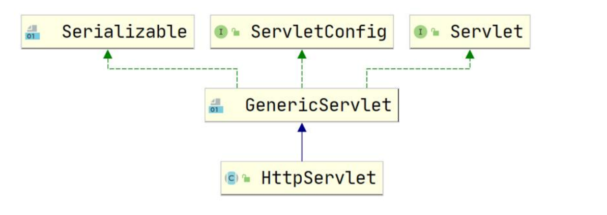

```java
public class HelloServlet2 extends HttpServlet {

  @Override
  protected void doGet(HttpServletRequest req,HttpServletResponse resp) throws ServletException, IOException {
 	业务代码
 	}

   @Override
   protected void doPost(HttpServletRequestreq,HttpServletResponseresp) throws ServletException, IOException {
 	业务代码
 	}
}
```

要在web.xml中配置servlet

==可以在IDEA中快速创建==


### 1.6 小节

::: tip

1. Servlet 是一个供其他 Java 程序（Servlet 引擎）调用的 Java 类，不能独立运行
2. 针对浏览器的多次 Servlet 请求，通常情况下，服务器只会创建一个Servlet 实例对象，也就是说 Servlet 实例对象一旦创建，它就会驻留在内存中，为后续的其它请求服务，直至web 容器退出/或者 redeploy 该 web 应用，servlet 实例对象才会销毁
3. . 在 Servlet 的整个生命周期内，init 方法只被调用一次。而对每次请求都导致Servlet 引擎调用一次 servlet 的 service 方法。
4. 对于每次访问请求，Servlet 引擎都会创建一个新的 HttpServletRequest 请求对象和一个新的 HttpServletResponse 响应对象，然后将这两个对象作为参数传递给它调用的Servlet的 service()方法，service 方法再根据请求方式分别调用 doXXX 方法
5. 如果在`<servlet>`元素中配置了一个`<load-on-startup>`元素，那么WEB 应用程序在启动时，就会装载并创建 Servlet 的实例对象、以及调用 Servlet 实例对象的init()方法

:::


## 2. 注解方式

### 2.1 快速入门

编写类去继承HttpServlet

注解方式配置, 一个Servlet支持配置多个urlPattern

```java
/**
 *  1. @WebServlet 是一个注解 => java基础->注解
 *  2. @WebServlet 源码 ctrl+b 进入
 *  3. urlPatterns 对应 web.xml 的 <url-pattern></url-pattern>
 *  4. {"/ok1", "/ok2"} 可以给OkServlet配置多个 url-pattern
 *  5. 相当于这个@WebServlet(urlPatterns = {"/ok1", "/ok2"}) 代替了 web.xml的配置
 *     底层使用了 反射+注解+IO+集合 来完成一个支撑
 *  6. 浏览器可以这样访问OkServlet时，可以 http://localhost:8080/servlet/ok1 或者
 *     http://localhost:8080/servlet/ok2
 *  7. 我们可以根据 @interface WebServlet 源码知道可以配置哪些
 *  web.xml init-param 在注解中，如何指定呢? 老师看了源码，老师搞定
 *          <init-param>
 *             <param-name></param-name>
 *             <param-value></param-value>
 *         </init-param>
 *  8. 注解方式开发Servlet和 web.xml配置servlet 流程机制是一样
 */
@WebServlet(urlPatterns = {"/ok1,/aa"}, initParams = {@WebInitParam(name ="xx",value = "yy"), @WebInitParam(name ="xx",value = "yy")})
public class OkServlet extends HttpServlet {

    @Override
    public void init(ServletConfig config) throws ServletException {
        System.out.println("注解方式 OkServlet init()被调用");
    }

    @Override
    protected void doPost(HttpServletRequest req, HttpServletResponse resp) throws ServletException, IOException {
        System.out.println("注解方式 OkServlet doPost()");

    }

    @Override
    protected void doGet(HttpServletRequest req, HttpServletResponse resp) throws ServletException, IOException {

        System.out.println(10/0);//报错
        System.out.println("注解方式 OkServlet doGet()");
        System.out.println(req.getRemoteAddr());
    }

}

```


### 2.2 模拟Tomcat通过注解装载Servlet

```java
/**
 * @author 韩顺平
 * @version 1.0
 * 模拟一把Tomcat是如果通过 @WebServlet(urlPatterns = {"/ok1", "/ok2"})
 * 来装载一个Servlet的
 */
public class TestAnnotationServlet {

    private static final HashMap<String, Object> hm = new HashMap<>();

    public static void main(String[] args) throws ClassNotFoundException, IllegalAccessException, InstantiationException {

        //1. 首先要得到扫描的包 路径 io, 进而得到类的全路径
        String classAllPath = "com.hspedu.servlet.annotation.OkServlet";
        //2. 得到 OkServlet的Class对象
        Class<?> aClass = Class.forName(classAllPath);
        //3. 通过class对象，得到Annotation
        WebServlet annotation = aClass.getAnnotation(WebServlet.class);
        System.out.println(annotation);
        String[] strings = annotation.urlPatterns();
        for (String url : strings) {
            System.out.println("url= " + url);
        }

        //如果匹配url,如果是第一次，tomcat就会创建一个OkServlet实例，放入到hashmap
        Object instance = aClass.newInstance();
        System.out.println("instance= " + instance);//OkServlet

        //简单的模拟，没有深入.
        hm.put("OkServlet", instance);

        System.out.println(hm);

    }
}

```


### 2.3 urlPattern匹配

**精确匹配**

```java
@WebServlet("/ok/zs")
// 访问 servlet: localhost:8080/servlet/ok/zs
```

**目录匹配**

```java
@WebServlet("/ok/*")
// 访问文件: localhost:8080/servlet/ok/aaa localhost:8080/servlet/ok/bbb
```

**扩展名匹配**

```java
@WebServlet("*.action")
// 访问文件: localhost:8080/hsp/zs.action localhost:8080/hsp/ls.action
```

**任意匹配**

```java
@WebServlet("/")
@WebServlet("/*")
// 访问文件: localhost:8080/hsp/aaa localhost:8080/hsp/bbb localhost:8080/hsp/ccc
```

<span style="color: red;">/ 和 /*的配置，会匹配所有的请求，这个比较麻烦，要避免</span>


### 2.4 注意事项和使用细节

1. 当 Servlet 配置了 `"/"`, 会**覆盖** tomcat 的 DefaultServlet, 当其他的utl-pattern**都匹配不上**时，都会走这个 Servlet , 这样可拦截到其它静态资源 **查看**：`tomcat/conf/web.xml` , 配置的 DefaultServlet，<span style="color: red;">这个默认的 servlet 是处理静态资源的，一旦拦截，静态资源不能处理</span>
2. 当 Servelt 配置了 `"/*"`, 表示可以匹配任意访问路径
3. 建议不要使用 / 和 /* , 建议尽量使用精确匹配
4. 优先级遵守: `精确路径 > 目录路径 > 扩展名路径 > /* > /`


## 3. HTTP

超文本传输协议 (HTTP，HyperText Transfer Protocol) 是互联网上应用广泛的一种网络协议。是工作在 tcp/ip 协议基础上的 , 所有的 WWW 文件都遵守这个标准。

- http1.0 短连接 http1.1 长连接
- http 是 TCP/IP 协议的一个应用层协议 , http 也是我们 web 开发的基础
- 当访问 test.html 页面时, 问浏览器发出几次 http 请求?
  - 第一次请求的 test.html
  - 当浏览器解析发现 test.html 中有 img 等
  - 会向服务器继续发请求


### 3.1 基本分析

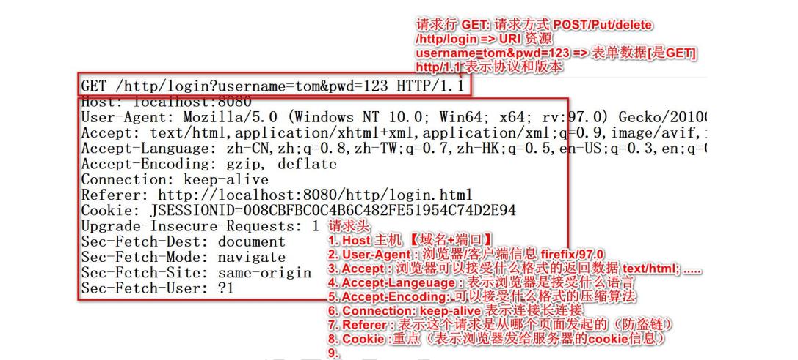

 [常见请求和响应头-说明.pdf](./img/HTTP常见请求和响应头-说明.pdf) 

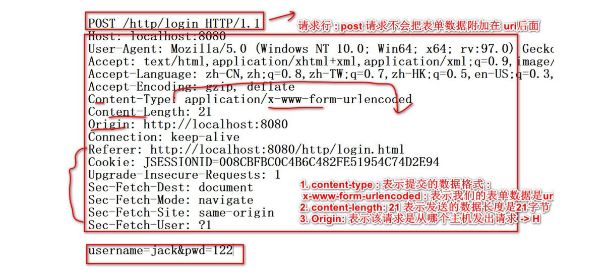


### 3.2 GET与POST

- **GET：请求行、请求头**
   1. form 标签 method=get	
   2. a 标签	
   3. link 标签引入 css	
   4. Script 标签引入 js 文件
   5. img 标签引入图片	
   6. iframe 引入 html 页面	
   7. 在浏览器地址栏中输入地址后敲回车

- **POST：请求行、请求头、请求体**
1. form 标签 method=post

**区别**：

1. get 传送的数据量较小。不能大于 2KB(不同浏览器不一样)。
2. post 传送的数据量较大。一般默认不受限制。
3. post 请求是会在浏览器上隐藏參数部分的，在安全要求的部分都会使用到POST 请求。如用户登录。数据增删改等等。都会把參数隐藏起来，这样就不会通过你的请求暴露你的參数格式。
4. 在向 server 传递数据较大的时候。使用 POST
5. 在前台页面展示，比如分页内容等，可以保留传递参数, 可用来非常好的分享和传播, 使用GET
6. get 方式的安全性较 Post 方式要差些。包括机密信息的话。建议用Post 数据提交方式
7. 在做数据查询时。建议用 Get 方式；而在做数据加入、改动或删除时，建议用Post 方式


### 3.3 HTTP响应

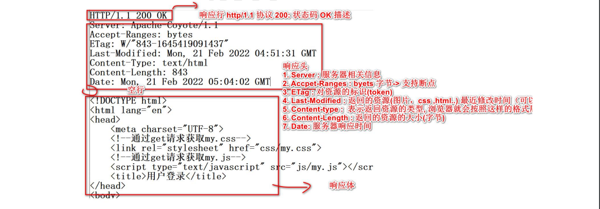

[HTTP响应状态码](./img/HTTP响应状态码说明.pdf)

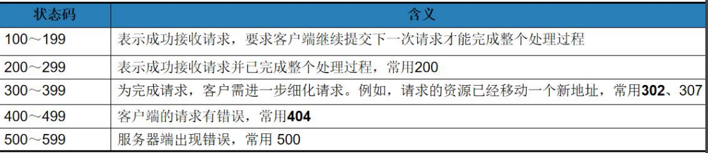


**302 重定向**

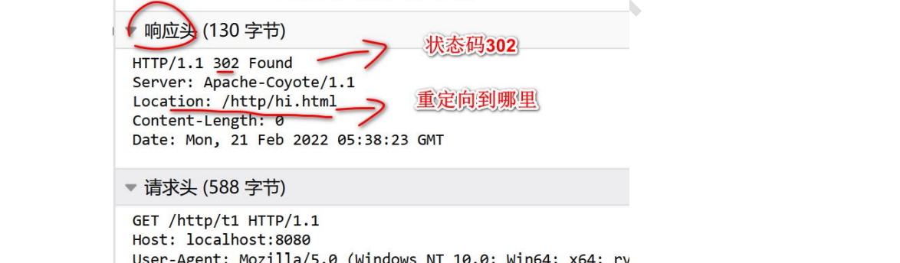

```java
public class T1Servlet extends HttpServlet {

    //这里我们把 doGet和doPost合并处理
    protected void doPost(HttpServletRequest request, HttpServletResponse response) throws ServletException, IOException {

        //如果有一个请求来
        //重定向到hi.html
        //(1) 返回302状态码 (2) 响应头Location:/hi.html
        //response.sendRedirect("/http/hi.html");
        response.sendRedirect("http://www.baidu.com");
    }

    protected void doGet(HttpServletRequest request, HttpServletResponse response) throws ServletException, IOException {
        doPost(request,response);
    }
}
```


**304 请求的资源未修改,不返回资源, 仍然使用缓存数据**

当我们请求资源的时，服务器会返回该资源的最近修改时间 `Last-Modified: Mon, 21 Feb 2022 04:51:31 GMT `

- 如果浏览器**禁用缓存**, 这个 Last-Modified: 信息就没有使用, 浏览器就每次要求返回该资源 
- 如果浏览器**没有禁用缓存**, 浏览器在请求时，就会 `If-Modified-Since: Mon, 21 Feb 2022 04:51:31 GMT`
  - (1)  告诉服务器我有该资源
  - (2) 该资源的最近修改时间是 Mon, 21 Feb 2022 04:51:31GM 
  - (3) 这时服务器就会比较时间，如果服务器的资源更新， 就会返回该资源, 如果发现没有修改，就返回 304 状态码(但是不会返回该资源) http 请求机制

<span style="color: red;">Tomcat不用重启也能刷新页面的根本原因</span>


### 3.4 GET 请求返回数据

```java
public class LoginServlet extends HttpServlet {
    protected void doPost(HttpServletRequest request, HttpServletResponse response) throws javax.servlet.ServletException, IOException {
        response.setContentType("text/html;charset=utf-8");
        PrintWriter writer = response.getWriter();
        writer.print("<h1>POST登录成功~~</h1>");
        writer.flush();
        writer.close();
    }

    protected void doGet(HttpServletRequest request, HttpServletResponse response) throws javax.servlet.ServletException, IOException {

        // 服务端输出
        System.out.println("LoginServlet doGet() 被调用");
        
        // 输出一句话, 返回给浏览器
        // 1. 通response 获取流 PrintWriter, 可以给浏览器回复数据
        //    实际是将浏览器打来的数据被Tomcat收到后, 该流将数据封装到http响应包,通过Tomcat响应数据
        // 2. 为了让浏览器显示中文，需要告诉浏览器，我们的编码是utf-8
        // 解读: (1) 给会送数据设置编码 (2) text/html这个是MIME即告诉浏览器返回的数据
        // 是 text类型下的html格式数据【MIME类型 大类型/小类型】(3)charset=utf-8数据编码
        // 小小细节: 设置编码格式要在 response.getWriter()!!
        response.setContentType("text/html;charset=utf-8");
        PrintWriter writer = response.getWriter();
        writer.print("<h1>GET()登录成功~~</h1>");

        // 为了确保数据返回，可以把 flush()和close()
        // flush() 方法表示将缓存的数据进行刷新
        writer.flush();
        // close() 表示关闭流,及时释放资源,  有些语言是 close() 有 flush()
        writer.close();
    }
}
```


### 3.5 MIME类型

MIME 是 HTTP 协议中数据类型。 MIME 的英文全称是"Multipurpose Internet Mail Extensions" **多功能 Internet 邮件扩充服务**，**格式**是 **“大类型/小类型”**，并与某一种文件的扩展名相对应

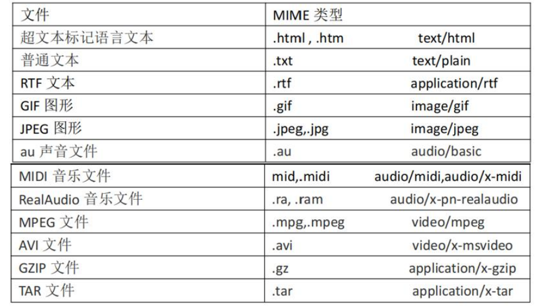


##  4. ServletConfig 类

  1. ServletConfig 类是为 Servlet 程序的配置信息的类
  2. Servlet 程序和 ServletConfig 对象都是由 Tomcat 负责创建
  3. Servlet 程序默认是第一次访问的时候创建，ServletConfig 是每个 Servlet 程序创建时，就创建一个对应的ServletConfig对象

作用：

- 获取 Servlet 程序的别名 servlet-name 的值
- 获取初始化参数 init-param
- 获取 ServletContext 对象

```java
public class DBServlet extends HttpServlet {


    /**
     * 梳理ServletConfig config 使用流程
     * 1. 当DBServlet对象初始化时, tomcat会同时创建一个 ServletConfig对象
     * 2. 这时如果DBServlet init() 方法中你调用 super.init(config);
     * 3. 调用 父类 GenericServlet
     * public void init(ServletConfig config) throws ServletException {
     * 	this.config = config;
     * 	this.init();
     * }
     * 这时就会把 Tomcat创建的 ServletConfig对象赋给 GenericServlet的属性 config
     * 4. 因此如果你重写init()方法，记住如果你想在其它方法通过 getServletConfig() 方法获取ServletConfig
     * , 则一定要记住 调用  super.init(config);
     * @param config
     * @throws ServletException
     */

    @Override
    public void init(ServletConfig config) throws ServletException {
        //ConcurrentHashMap, 是一个线程安全的容器.
        System.out.println("init" + config);
        super.init(config);
    }

    protected void doPost(HttpServletRequest request, HttpServletResponse response) throws ServletException, IOException {

        // 在DBServlet 执行 doGet()/doPost() 时，可以获取到web.xml配置的用户名和密码
        // DBServlet的父类GenericServlet有getServletConfig()
        /**
         * 1. getServletConfig() 方法是 GenericServlet
         * 2. 返回的 servletConfig对象是 GenericServlet private transient ServletConfig config;
         * 3. 当一个属性被 transient 修饰，表示该属性不会被串行化(有些重要信息，不希望保存到文件)
         */
        ServletConfig servletConfig = getServletConfig();
        System.out.println("doPost=" + servletConfig);
        String username = servletConfig.getInitParameter("username");
        System.out.println("初始化参数username= " + username);
    }

    protected void doGet(HttpServletRequest request, HttpServletResponse response) throws ServletException, IOException {
        doPost(request, response);
    }
}

```

```xml
<!--init-param 是初始化参数-->
<init-param>
	<param-name>username</param-name>
    <param-value>root</param-value>
</init-param>
```


##  5. ServletContext 类 

1. 是一个 **接口**，它表示 Servlet 上下文对象	
2. 一个 web 工程，只有 **一个** ServletContext 对象实例
3. 在 web 工程部署启动的时候**创建**，在 web 工程停止的时候**销毁**
4. 是一个**域对象**（域对象，是可以像 Map 一样存取数据的对象， 这里的域指的是存取数据的操作范围，整个 web 工程）
5. ServletContext 对象可以通过 `ServletConfig.getServletContext()` 方法获得，也可以通过 `this.getServletContext()`来获得

|        | 存数据         | 取数据         | 删除数据          |
| ------ | -------------- | -------------- | ----------------- |
| Map    | put()          | get()          | remove()          |
| 域对象 | setAttribute() | getAttribute() | removeAttribute() |


### 5.1 存在的意义

先看一个需求： 如果我们希望统计某个 web 应用的所有Servlet 被访问的次数

两种方案

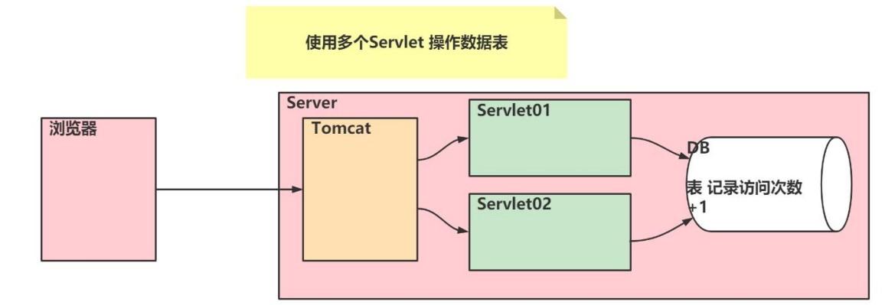

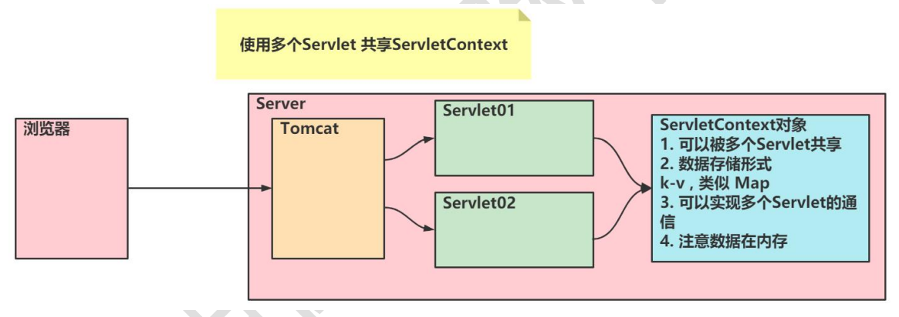


### 5.2 作用

- 获取 web.xml 中配置的上下文参数 context-param
- 获取当前的工程路径，格式:   ` /工程路径`
- 获取工程部署后在服务器硬盘上的绝对路径
- 像 Map 一样存取数据


### 5.3 应用

```java
protected void doGet(HttpServletRequest request, HttpServletResponse response) throwsServletException, IOException {
	// 1、获取 web.xml 中配置的上下文参数 context-param
	ServletContext context = getServletConfig().getServletContext();
	String username = context.getInitParameter("username");

	// 2、获取当前的工程路径，格式: /工程路径
    System.out.println( "当前工程路径:" + context.getContextPath() );
    
	// 3、获取工程部署后在服务器硬盘上的绝对路径
    //    表示项目发布后的根路径 ..out...
    // 拿到http://ip.port/工程名
	System.out.println("工程部署的路径是:" + context.getRealPath("/"));

    // 4、像 Map 一样存取数据
	context.setAttribute("key1", "value1");
	System.out.println("获取域数据 key1 的值是:"+ context.getAttribute("key1"));
}
```

```xml
<!--context-param 是上下文参数(它属于整个 web 工程)-->
<context-param>
	<param-name>username</param-name>
	<param-value>context</param-value>
</context-param>
```


```java
public class WebUtils {

    //这个方法就是对访问的次数累积，同时返回次数
    public static Integer visitCount(ServletContext servletContext) {
        //从servletContext获取 visit_count 属性 k-v
        Object visit_count = servletContext.getAttribute("visit_count");
        //判断visit_count是否为null
        if (visit_count == null) {//说明是第1次访问网站
            servletContext.setAttribute("visit_count", 1);
            visit_count = 1;
        } else { //是第二次或以后
            //取出visit_count属性的值+1
            visit_count = Integer.parseInt(visit_count + "") + 1;
            //放回到servletContext
            servletContext.setAttribute("visit_count", visit_count);
        }

        return Integer.parseInt(visit_count + "");
    }
}
```

```java
public class OrderServlet extends HttpServlet {
    protected void doPost(HttpServletRequest request, HttpServletResponse response) throws ServletException, IOException {

        //获取到ServletContext对象
        ServletContext servletContext = getServletContext();

        Integer visit_count = WebUtils.visitCount(servletContext);

        //输出显示
        response.setContentType("text/html;charset=utf-8");
        PrintWriter writer = response.getWriter();
        writer.print("<h1>新网站被访问的次数是" + visit_count + "</h1>");
        writer.flush();
        writer.close();
    }

    protected void doGet(HttpServletRequest request, HttpServletResponse response) throws ServletException, IOException {
        doPost(request, response);
    }
}
```


##  6. HttpServletRequest 类

每次只要有请求进入 Tomcat 服务器，Tomcat 服务器就会把请求过来的 HTTP 协议信息解析好封装到Request 对象中。然后传递到 service 方法（doGet 和 doPost）中给我们使用。我们可以通过 HttpServletRequest 对象，获取到所有请求的信息。

1. HttpServletRequest 对象代表客户端的请求
2. 当客户端/浏览器通过 HTTP 协议访问服务器时，HTTP 请求头中的所有信息都封装在这个对象中
3. 通过这个对象的方法，可以获得客户端这些信息。
4. 是一个域对象

### 6.1 常用方法

| 方法                      | 作用                                                         |
| ------------------------- | ------------------------------------------------------------ |
| getRequestURI()           | 获取请求的资源路径（`/工程名/路径`）                         |
| getRequestURL()           | 获取请求的统一资源定位符（`http://localhost:8080/工程名/路径`） |
| getRemoteHost()           | 获取客户端的主机                                             |
| getRemoteAddr()           | 获取客户端的 IP地址                                          |
| getHeader("请求头字段")   | 获取请求头                                                   |
| getParameter()            | 获取请求的参数                                               |
| getParameterValues()      | 获取请求的参数（多个值的时候使用）                           |
| getMethod()               | 获取请求的方式 GET 或 POST                                   |
| setAttribute(key, value); | 设置域数据                                                   |
| getAttribute(key);        | 获取域数据                                                   |
| getRequestDispatcher()    | 获取请求转发对象（"/路径"）                                  |


### 6.2 解决中文乱码

- doGet

  ```java
  // 获取请求参数
  String username = req.getParameter("username");
  
  // 先以 iso8859-1 进行编码
  // 再以 utf-8 进行解码
  username = new String(username.getBytes("iso-8859-1"), "UTF-8");
  ```

- doPost

  ```java
  // 设置请求体的字符集为 UTF-8，从而解决 post 请求的中文乱码问题
  req.setCharacterEncoding("UTF-8");
  
  // 获取请求内容必须在setCharacterEncoding后面
  String username = req.getParameter("username");
  ```


### 6.3 请求转发

服务器收到请求后，从一次资源跳转到另一个资源的操作叫请求转发

特点：

- 浏览器地址栏不变
- 一次请求
- 共享Request数据
- 可以转发到WEB-INF下
- 不可访问工程外的资源


==Servlet1==

```java
@Override
protected void doGet(HttpServletRequest req, HttpServletResponse resp) throws ServletException,IOException {
	// 获取请求的参数
	String username = req.getParameter("username");
	
	// 传递到Servlet2查看
	req.setAttribute("key1","柜台 1 的章");

	RequestDispatcher requestDispatcher = req.getRequestDispatcher("/servlet2");
    requestDispatcher.forward(req,resp);
	}
}
```

==Servlet2==

```java
@Override
protected void doGet(HttpServletRequest req, HttpServletResponse resp) throws 	ServletException,IOException {
	// 获取请求的参数
	String username = req.getParameter("username");
	
	// 查看
	Object key1 = req.getAttribute("key1");
	
	// 处理自己的业务
	}
}
```


### 6.4 斜杠在Web不同含义

> 在 web 中 / 斜杠 是一种绝对路径
>
> - 被浏览器解析，得到的地址是：http://ip:port/
>
> - 被服务器解析，得到的地址是：http://ip:port/工程路径
>
>   特殊情况： response.sendRediect(“/”); 把斜杠发送给浏览器解析。得到http://ip:port/


## 7. HttpServletResponse 类

HttpServletResponse 类和 HttpServletRequest 类一样。每次请求进来，Tomcat 服务器都会创建一个Response对象传递给 Servlet 程序去使用。HttpServletRequest 表示请求过来的信息，HttpServletResponse 表示所有响应的信息，我们如果需要设置返回给客户端的信息，都可以通过 HttpServletResponse 对象来进行设置

| 字节流 | getOutputStream(); | 常用于下载（传递二进制数据） |
| ------ | ------------------ | ---------------------------- |
| 字符流 | getWriter();       | 常用于回传字符串（常用）     |

- 两个流同时只能使用一个。


### 7.1 往客户端回传数据

```java
@Override
protected void doGet(HttpServletRequest req, HttpServletResponse resp) throws ServletException,IOException {
	// 要求 ： 往客户端回传 字符串 数据。
	PrintWriter writer = resp.getWriter();
	writer.write("response's content!!!");
	}
}
```


### 7.2 响应乱码解决

两种方案

```java
// 设置服务器字符集为 UTF-8
resp.setCharacterEncoding("UTF-8");
// 通过响应头，设置浏览器也使用 UTF-8 字符集
resp.setHeader("Content-Type", "text/html; charset=UTF-8");

// 它会同时设置服务器和客户端都使用 UTF-8 字符集，还设置了响应头
// 此方法一定要在获取流对象之前调用才有效
resp.setContentType("text/html; charset=UTF-8");
```


### 7.3 请求重定向

请求重定向，是指客户端给服务器发请求，然后服务器告诉客户端说。我给你一些地址。你去新地址访问。叫请求重定向（因为之前的地址可能已经被废弃）

特点：

- 浏览器地址栏会变
- 两次请求
- 不共享Request数据
- 不能访问WEB-INF下资源
- 可访问工程外的资源

两种方案

```java
// 设置响应状态码 302 ，表示重定向，（已搬迁）
resp.setStatus(302);
// 设置响应头，说明 新的地址在哪里
resp.setHeader("Location", "http://localhost:8080");

// 自动化设置
resp.sendRedirect("http://localhost:8080");
```


[^1]:所有通过 Java 语言编写可以通过浏览器访问的程序的总称
[^2]:Servlet、Filter、Listener

​                                                                                                                                                                                                                                                                                                                                                                                                                                                                                                                                                                                                                                                                                                                                                                                                                                                                                                                                                                                                                                                                                                                                                                                                                                                                                                                                                                                                                                                         