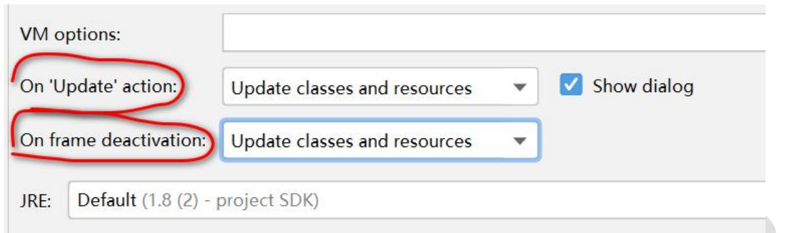

---
# 当前页面内容标题
title: Tomcat
# 当前页面图标
icon: /icon/tomcat.svg
author:
- name: Ahzy
# 分类
category:
  - 计算机
# 标签
tag:
  - javaweb
sticky: false
# 是否收藏在博客主题的文章列表中，当填入数字时，数字越大，排名越靠前。
star: false
# 是否将该文章添加至文章列表中
article: false
# 是否将该文章添加至时间线中
timeline: false
# 是否原创
isOriginal: true
headerDepth: 2

date: 2024-10-07

---


请求和响应是成对出现的，有请求就有响应。


## 1. Web基础

### 1.1 Web 资源的分类

> 静态资源： html、css、js、txt、mp4 视频 , jpg 图片 
>
> 动态资源： jsp 页面、Servlet 程序


### 1.2 常用的Web 服务器

Tomcat、Jboss、GlassFish、Resin、WebLogic


### 1.3 BS模式


- 兼容性差
- 安全性不易控制
- 易用性好，不用下载
- 拓展性统一，只需写Server 


### 1.4 Web服务本质

本质是一个 java程序，处理来自浏览器的HTTP请求


### 1.5 手写简单web服务

**暂时运行不了**

查看端口占用：`netstat -anp |more`

```java
/**
 * @author 
 * @version 
 * 这是我们自己写的一个web服务, 可以返回hello.html给浏览器
 */
public class MyTomcat {
    public static void main(String[] args) throws IOException {

        //1.在9999端口监听
        ServerSocket serverSocket = new ServerSocket(9999);

        //如果serverSocket 没有关闭，就等待连接, 不停的等待
        while (!serverSocket.isClosed()) {
            System.out.println("=====我的web服务在 9999端口监听=====");
            //2. 等待浏览器/客户端连接, 得到socket
            //   该socket用于通信
            Socket socket = serverSocket.accept();

            //3. 通过socket 得到 输出流，[]
            OutputStream outputStream = socket.getOutputStream();
            //   返回给浏览器/客户端
            //4. 读取 hello.html 文件返回即可=> 如何读取文件内容
            //   得到文件输入流(字符输入流), 和 src/hello.html
            BufferedReader bufferedReader =
                    new BufferedReader(new FileReader("src/hello.html"));
            String buf = "";
            //   循环读取hello.html
            while ((buf = bufferedReader.readLine()) != null) {
                outputStream.write(buf.getBytes());
            }

            outputStream.close();
            socket.close();
        }
        serverSocket.close();


    }
}
```


### 1. 6 版本的对应关系


## 2. Tomcat使用

解压即可使用


- **server.xml**：基本设置（端口、主机名）
- **wex.mxl**：运行时配置（serlvet....）


###  2.1 启动

> 1. bin 目录下的 startup.bat 文件，双击
> 2. cd 到 bin 下，执行catalina run


###  2.2 停止

> 1. 点击 tomcat 服务器窗口的 x 关闭按钮
> 2. 把 Tomcat 服务器窗口置为当前窗口，然后按快捷键 Ctrl+C
> 3. bin 目录下的 shutdown.bat，双击（<span style="color: red;">推荐</span>）


###  2.3 改端口

Tomcat默认端口8080，http默认端口80（可隐藏）

conf / server.xml 的connector 标签


###  2.4 部署

> 1. <span style="color: red;">拷贝工程</span>：webapps下一个目录等于一个工程
> 2. <span style="color: red;">映射</span>：conf / Catalina / localhost / xml 文件，**解决磁盘爆满**

```xml
<Context path="/网站名" docBase="E:\工程名" />
```


###  2.5 访问

`http://ip:port/ `                ====>>>>    没有工程名的时候，默认访问的是 ROOT 工程。

`http://ip:port/工程名/`    ====>>>>    没有资源名，默认访问 index.html 页面


## 3. UML时序图

浏览器访问web服务器文件的UML时序图


## 4. IDEA配置Tomcat 

[IDEA2020.2中开发JavaWeb工程.pdf](./img/IDEA2020.2中开发JavaWeb工程.pdf) 


### 4.1 热加载选项说明

- **on update action** : 表示当我们更新操作是, Tomcat 会自动更新类和资源(当jsp/html文件修改时，可以生效, 但是如果你修改的 java 文件, 需要 Redepoly 才会生效)
- **on frame deactivation** : 表示 IDEA 失去焦点(比如最小化), 也会导致jsp/html 发生更新 , 但是 java 修改了，还是需要 redeploy

**推荐配置**




### 4.2 端口修改


> 这里修改的端口， 只会 **影响到当前的项目**，而 <span style="color: red;">不会修改 server.xml</span>


### 4.3 out目录

当 tomcat 启动时，会生成 **out 目录**，该目录就是原项目资源的 **映射**，我们浏览器访问的资源是 out 目录

**rebuild** 意味着 删除 out目录 并 重新生成

当我们 **从外部拷贝 **资源到项目(图片, 文件, js , css 等), 如果出现404 不能访问错误, 解决方式 **rebulid project -> 重启 Tomcat**


### 4.4 javaweb工程目录


