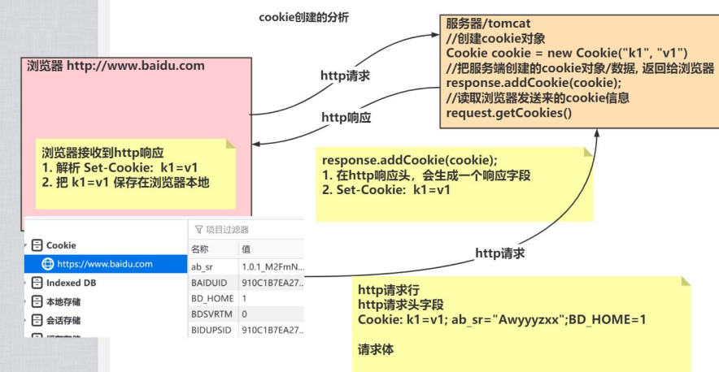

---
	# 当前页面内容标题
title: Cookie
author:
- name: 尚硅谷
- name: Ahzy
# 分类
category:
- 计算机
# 标签
tag:
- javaweb

sticky: false
# 是否收藏在博客主题的文章列表中，当填入数字时，数字越大，排名越靠前。
star: false
# 是否将该文章添加至文章列表中
article: false
# 是否将该文章添加至时间线中
timeline: false
# 是否原创
isOriginal: true
headerDepth: 2
---


## 会话

会话可简单理解为：用户开一个浏览器，点击多个超链接，访问服务器多个web资源，然后关闭浏览器，整个过程称之为一个会话。

每个用户在使用浏览器与服务器进行会话的过程中，不可避免各自会产生一些数据，服务器要想办法为每个用户保存这些数据。


## 1. Cookie

### 1.1 简介

Cookie (小甜饼) 是客户端技术，服务器把每个用户的数据以 cookie 的形式写给用户各自的浏览器。当用户使用浏览器再去访问服务器中的 web 资源时，就会带着各自的数据去。这样，web 资源处理的就是用户各自的数据了。

1. 服务器通知客户端保存键值对的一种技术
2. 客户端有了 Cookie 后，每次请求都发送给服务器
3. 每个 Cookie 的大小不能超过 4kb


### 1.2 场景

1. 保存上次登录时间
2. 保存用户名....
3. 网站的个性化


### 1.3 创建Cookie



```java
protected void createCookie(HttpServletRequest req, HttpServletResponse resp) throws ServletException,IOException {
    //1 创建 Cookie 对象
    Cookie cookie = new Cookie("key4", "value4");
    //2 通知客户端保存 Cookie
    resp.addCookie(cookie);
    //1 创建 Cookie 对象
    Cookie cookie1 = new Cookie("key5", "value5");
    //2 通知客户端保存 Cookie
    resp.addCookie(cookie1);
    resp.getWriter().write("Cookie 创建成功");
}
```


### 1.4 服务器获取Cookie


**工具类**

```java
public class CookieUtils {
    /**
    * 查找指定名称的 Cookie 对象
    * @param name
    * @param cookies
    * @return
    */
    public static Cookie findCookie(String name , Cookie[] cookies){
        if (name == null || cookies == null || cookies.length == 0) {
        	return null;
        }
        for (Cookie cookie : cookies) {
        	if (name.equals(cookie.getName())) {
        		return cookie;
        	}
        }
        return null;
    }
}
```

```java
protected void getCookie(HttpServletRequest req, HttpServletResponse resp) throwsServletException,IOException {
    Cookie[] cookies = req.getCookies();
    for (Cookie cookie : cookies) {
        // getName 方法返回 Cookie 的 key（名）
        // getValue 方法返回 Cookie 的 value 值
        resp.getWriter().write("Cookie[" + cookie.getName() + "=" + cookie.getValue()+"]<br/>");
    }
    
    Cookie iWantCookie = CookieUtils.findCookie("key1", cookies);
    // for (Cookie cookie : cookies) {
    // 	if ("key2".equals(cookie.getName())) {
    // 		iWantCookie = cookie;
    // 		break;
    // 	 }
    // }
    
    // 如果不等于 null，说明赋过值，也就是找到了需要的 Cookie
    if (iWantCookie != null) {
    resp.getWriter().write("找到了需要的 Cookie");
    }
}
```

JSEESIONID：用来区分不同的会话


### 1.5 修改Cookie

**方法一**

> 1. 先创建一个要修改的同名（指的就是 key）的 Cookie 对象
> 2. 在构造器，同时赋于新的 Cookie 值
> 3. 调用 response.addCookie( Cookie );

```
Cookie cookie = new Cookie("key1","newValue1");
resp.addCookie(cookie);
```


**方法二**

> 1. 先查找到需要修改的 Cookie 对象
> 2. 调用 setValue()方法赋于新的 Cookie 值
> 3. 调用 response.addCookie()通知客户端保存修改

```
Cookie cookie = CookieUtils.findCookie("key2", req.getCookies());
if (cookie != null) {
	cookie.setValue("newValue2");
	resp.addCookie(cookie);
}
```


### 1.6 Cookie生命控制

> Cookie 的生命控制指的是如何管理 Cookie 什么时候被销毁（删除）
>
> Cookie 无效后，浏览器发送http请求时不会携带 Cookie

**setMaxAge()**

- 正数，表示在指定的秒数后过期 
- 负数，表示浏览器一关，Cookie 就会被删除<span style="color:red;">（默认值是 -1） </span>
- 零，表示马上删除 Cookie

```java
/**
* 设置存活 1 个小时的 Cooie
* @param req
* @param resp
* @throws ServletException
* @throws IOException
*/
protected void life3600(HttpServletRequest req, HttpServletResponse resp) throws ServletException,IOException {
    Cookie cookie = new Cookie("life3600", "life3600");
    cookie.setMaxAge(60 * 60); // 设置 Cookie 一小时之后被删除。无效
    resp.addCookie(cookie);
    resp.getWriter().write("已经创建了一个存活一小时的 Cookie");
}
/**
* 马上删除一个 Cookie
* @param req
* @param resp
* @throws ServletException
* @throws IOException
*/
protected void deleteNow(HttpServletRequest req, HttpServletResponse resp) throws ServletException,IOException {
    // 先找到你要删除的 Cookie 对象
    Cookie cookie = CookieUtils.findCookie("key4", req.getCookies());
    if (cookie != null) {
        // 调用 setMaxAge(0);
        cookie.setMaxAge(0); // 表示马上删除，都不需要等待浏览器关闭
        // 调用 response.addCookie(cookie);
        resp.addCookie(cookie);
        resp.getWriter().write("key4 的 Cookie 已经被删除");
	}
}
/**
* 默认的会话级别的 Cookie
* @param req
* @param resp
* @throws ServletException
* @throws IOException
*/
protected void defaultLife(HttpServletRequest req, HttpServletResponse resp) throws ServletException,IOException {
    Cookie cookie = new Cookie("defalutLife","defaultLife");
    cookie.setMaxAge(-1);//设置存活时间
    resp.addCookie(cookie);
}
```


### 1.7 有效路径Path的设置

> Cookie 的 path 属性可以有效的过滤哪些 Cookie 可以发送给服务器。哪些不发。path 属性是通过请求的地址来进行有效的过滤

CookieA path=/工程路径 
CookieB path=/工程路径/abc

`http://ip:port/工程路径/a.html` 				CookieA 发送 CookieB 不发送
`http://ip:port/工程路径/abc/a.html`		 CookieA 发送 CookieB 发送


```java
protected void testPath(HttpServletRequest req, HttpServletResponse resp) throws ServletException,IOException {
    Cookie cookie = new Cookie("path1", "path1");
    // getContextPath() ===>>>> 得到工程路径
    cookie.setPath( req.getContextPath() + "/abc" ); // ===>>>> /工程路径/abc
    resp.addCookie(cookie);
    resp.getWriter().write("创建了一个带有 Path 路径的 Cookie");
}
```


## 2. Session

### 简介

1. Session 是一个接口（HttpSession）
2. Session 是会话，用来维护一个客户端和服务器之间关联的一种技术
3. 每个客户端都有自己的一个 Session 会话
4. Session 会话中，我们经常用来保存用户登录之后的信息


### 创建Session

| 方法                 | 功能                                                         |
| -------------------- | ------------------------------------------------------------ |
| request.getSession() | 第一次调用是创建 Session 会话。之后调用都是获取前面创建好的 Session 会话对象 |
| isNew()              | 判断到底是不是刚创建出来的                                   |
| getId()              | 得到 Session 的会话 id 值                                    |

每个会话都有一个身份证号。也就是 ID 值。而且这个 ID 是<span style="color:red;">唯一</span>的。


### Session域数据的存取

```java
/**
* 往 Session 中保存数据
* @param req
* @param resp
* @throws ServletException
* @throws IOException
*/
protected void setAttribute(HttpServletRequest req, HttpServletResponse resp) throws ServletException,IOException {
    req.getSession().setAttribute("key1", "value1");
    resp.getWriter().write("已经往 Session 中保存了数据");
    }
/**
* 获取 Session 域中的数据
* @param req
* @param resp
* @throws ServletException
* @throws IOException
*/
protected void getAttribute(HttpServletRequest req, HttpServletResponse resp) throws ServletException,IOException {
    Object attribute = req.getSession().getAttribute("key1");
    resp.getWriter().write("从 Session 中获取出 key1 的数据是：" + attribute);
}
```


### Session生命周期

<span style="color:red;">setMaxInactiveInterval(int interval)</span>设置 Session 的超时时间（以秒为单位），超过指定的时长，Session就会被销毁。

- 值为正数的时候，设定 Session 的超时时长
- 负数表示永不超时（极少使用），否则一直不被销毁

| 方法                     | 功能                            |
| ------------------------ | ------------------------------- |
| invalidate()             | 让当前 Session 会话马上超时无效 |
| getMaxInactiveInterval() | 获取 Session 的超时时间         |

Session <span style="color:red;">默认的超时时间</span> 为 30 分钟

> 因为在 Tomcat 服务器的配置文件 web.xml中默认有以下的配置，它就表示配置了当前Tomcat 服务器下所有的Session超时配置默认时长为：30 分钟
>
> ```xml
> <session-config>
> 	<session-timeout>30</session-timeout>
> </session-config>
> ```

设置 web工程，默认的 Session 的超时时长为其他时长，在<span style="color: red;">web.xml </span>配置

```xml
<!--表示当前 web 工程。创建出来 的所有 Session 默认是 20 分钟 超时时长-->
<session-config>
	<session-timeout>20</session-timeout>
</session-config>
```

只修改个别 Session 的超时时长，使用 <span style="color: red;">setMaxInactiveInterval(int interval) </span>来进行单独的设置


```java
protected void life3(HttpServletRequest req, HttpServletResponse resp) throws ServletException,IOException {
    // 先获取 Session 对象
    HttpSession session = req.getSession();
    // 设置当前 Session3 秒后超时
    session.setMaxInactiveInterval(3);
    
    resp.getWriter().write("当前 Session 已经设置为 3 秒后超时");
}

protected void deleteNow(HttpServletRequest req, HttpServletResponse resp) throws ServletException,IOException {
    // 先获取 Session 对象
    HttpSession session = req.getSession();
    // 让 Session 会话马上超时
    session.invalidate();
    
    resp.getWriter().write("Session 已经设置为超时（无效）");
}
```


### 底层原理

Session 技术，底层其实是基于 Cookie 技术来实现的

