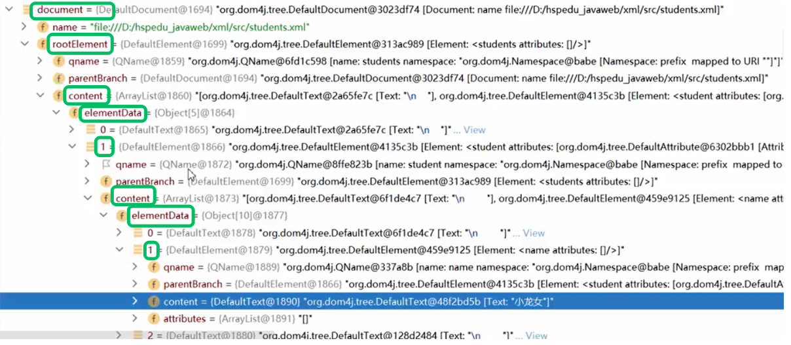

## 1. 简介

xml 是可扩展的标记性语言。

作用：数据传输（现在一般用 **json**）、**配置文件**、充当小型数据库

1. 两个程序间进行数据通信
2. 给一台服务器做配置文件
3. spring中的ioc配置文件
4. 储存复杂的数据关系


## 2. 语法	

### 声明

```xml
<?xml version="1.0" encoding="UTF-8"?>
```

- xml：表示该文件类型是 **xml**
- version：版本
- encoding：文件编码
- 在xml文件的第一行
- <span style="color: red;">根元素只能有一个</span>


###  注释

```
<!-- 内容 -->
```

- 注释不能嵌套
- 注释内容不能出现 `- -`
- 不能放标签中，例： `<cat <!--注释--> ></cat>`


###  xml元素

标签 = 元素 = 节点  

**元素** 是指从开始标签到结束标签的内容。

**标签体** 指标签包含的内容

例如：`\<title>java 编程思想 \</title>`，java 编程思想 为标签体

也有单标签和双标签


### 命名规则

>1. 区分大小写，可以含字母、数字以及其他的字符
>2. 不能以数字或者标点符号开始
>3. 不能包含空格
>4. 名字中间不能包含冒号


### 属性

1. 属性值能用 **单引** 或 **双引**
2. 一个元素可有 **多个** 属性
3. 同一属性名在同一标签中只能 **出现一次**
4. 属性值不能包含 **&**


### 文本区域（CDATA区）

CDATA 语法可以告诉 xml 解析器，我 CDATA 里的文本内容，只是纯文本，不需要xml 语法解析

```
<![CDATA[ 文本 ]]>
```

- 不能嵌套


## 3. 规则

>1. 所有xml元素需闭合
>
>2. 需正确嵌套
>
>3. 必须有根元素（根元素就是顶级元素， 没有父标签的元素，叫顶级元素），且==唯一==
>
>4. 一个标签上可以书写多个属性，每个属性的值必须使用 ==引号== 引起来。
>
>5. 特殊字符特殊处理
>
>   | 转义符   | 符号 |
>   | -------- | ---- |
>   | `&lt;`   | <    |
>   | `&gt;`   | >    |
>   | `&amp;`  | &    |
>   | `&quot;` | "    |
>   | `&apos;` | '    |
>
>   


## 4. xml解析

早期 JDK 为我们提供了两种 xml 解析技术 **DOM** 和 **Sax**（sun 公司在 JDK5 版本对 dom 解析技术进行升级，不会创建大量的 dom 对象）

- jdom 对 dom  封装
- dom4j  对 jdom  封装
- pull 用于 Android 手机开发，与Sax类似，用事件机制解析xml


### 原理

xml 文件加载到内存映射为 xml dom 对象，之后可用相关java技术解析

document对象表示整个文档	


### dom4j 解析技术

 dom4j 它不是 sun 公司的技术，而属于第三方公司的技术，我们需要使用dom4j 就需要到dom4j 官网下载dom4j的 jar 包。

[官网链接](https://dom4j.github.io/)

**获取Document三种方式**

```java
// 1. 读取xml, 获得document
SAXReader reader = new SAXReader(); // 创建一个解析器
Document document = reader.read(new File("xml路径")); // XML Docuemnt

// 2. 解析xml形式的文本, 获得document
String text = "<cats></cats>"
Document document = DocumentHelper.parseText(text);

// 3. 主动创建document
Document document = DocumentHelper.createDocument(); // 创建根节点
Element root = document.addElement("cats")
```




**一层一层获取**

```java
// 通过 Document 对象。拿到 XML 的根元素对象
Element root = document.getRootElement();
	
// 通过根元素对象。获取所有的 cat 标签对象
List<Element> cats = root.elements("cat");
	
// 遍历每个 cat 标签对象
for (Element cat : cats) {	
    // 获取cat的id属性
    String id = cat.attributeValue("id");
    
	// 拿到 cat 下面的 name 元素对象
	Element name = cat.element("name");
    Element color = cat.element("color");
    System.out.println("名字:" + name.getText() + "颜色:" + color.getText())
}
```

>1. Element.asXML() ：将当前元素转换成为 String 对象
>2. getText() ：拿到起始标签和结束标签之间的文本内容
>3. Element.attributeValue("属性名")：获取标签内属性值


**dom4j + xpath：** 一步到位，可以通过根节点，直接拿到层层包含指定的内容


### 拓展：增删改

```java
/**
 * 加元素(要求: 添加一个学生到xml中) [不要求，使用少，了解]
 * @throws Exception
 */
@Test
public void add() throws Exception {
	//1.得到解析器
	SAXReader saxReader = new SAXReader();
    //2.指定解析哪个xml文件
    Document document = saxReader.read(new File("src/students.xml"));

    //首先我们来创建一个学生节点对象，给元素添加属性
    Element newStu = DocumentHelper.createElement("student");
    newStu.addAttribute("id", "04");
    
    // 创建name元素
    Element newStu_name = DocumentHelper.createElement("name");
    newStu_name.setText("宋江");
    //创建age元素
    Element newStu_age = DocumentHelper.createElement("age");
    newStu_age.setText("23");

    //把三个子元素（节点）加到 newStu下
    newStu.add(newStu_name);
    newStu.add(newStu_age);
    
    //再把newStu节点加到根元素
    document.getRootElement().add(newStu);
    
    //直接输出会出现中文乱码:
    OutputFormat output = OutputFormat.createPrettyPrint();
    output.setEncoding("utf-8");//输出的编码utf-8

    //把我们的xml文件更新
    // lets write to a file
    //new FileOutputStream(new File("src/myClass.xml"))
    //使用到io编程 FileOutputStream 就是文件字节输出流
    XMLWriter writer = new XMLWriter(
                new FileOutputStream(new File("src/students.xml")), output);
    writer.write(document);
    writer.close();
    }

/**
 * //删除元素(要求：删除第一个学生) 使用少，了解
 * @throws Exception
 */
@Test
public void del() throws Exception {
    //1.得到解析器
    SAXReader saxReader = new SAXReader();
    //2.指定解析哪个xml文件
    Document document = saxReader.read(new File("src/students.xml"));
    
    //找到该元素第一个学生
    Element stu = (Element) document.getRootElement().elements("student").get(0);
    //删除元素
    stu.getParent().remove(stu);
    //删除元素的某个属性
    stu.remove(stu.attribute("id"));
    
    //更新xml
    //直接输出会出现中文乱码:
    OutputFormat output = OutputFormat.createPrettyPrint();
    output.setEncoding("utf-8");//输出的编码utf-8
    
    //把我们的xml文件更新
    XMLWriter writer = new XMLWriter(
                new FileOutputStream(new File("src/students.xml")), output);
    writer.write(document);
    writer.close();
    System.out.println("删除成功~");
}


/**
 * 更新元素(要求把所有学生的年龄+3) 使用少，了解
 * @throws Exception
 */
@Test
public void update() throws Exception {
	//1.得到解析器
    SAXReader saxReader = new SAXReader();
    //2.指定解析哪个xml文件
    Document document = saxReader.read(new File("src/students.xml"));
    
    //得到所有学生的年龄
    List<Element> students = document.getRootElement().elements("student");
    //遍历, 所有的学生元素的age+3
    for (Element student : students) {
        //取出年龄
        Element age = student.element("age");
        // + ""，目的是转成字符串
        age.setText((Integer.parseInt(age.getText()) + 3) + "");
    }

    //更新
    //直接输出会出现中文乱码:
    OutputFormat output = OutputFormat.createPrettyPrint();
    output.setEncoding("utf-8");//输出的编码utf-8

    //把我们的xml文件更新
    XMLWriter writer = new XMLWriter(
                new FileOutputStream(new File("src/students.xml")), output);
    writer.write(document);
    writer.close();
    System.out.println("更新成功~");
}
```


