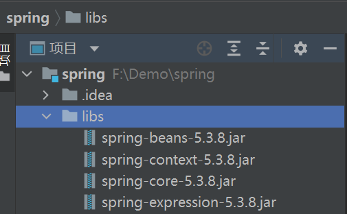
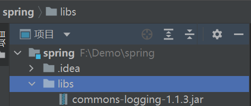
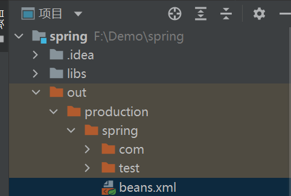

---
# 当前页面内容标题
title: Spring概述

# 分类
category:
- 计算机
# 标签
tag:
- Spring

sticky: false
# 是否收藏在博客主题的文章列表中，当填入数字时，数字越大，排名越靠前。
star: false
# 是否将该文章添加至文章列表中
article: false
# 是否将该文章添加至时间线中
timeline: false

date: 2024-11-07

headerDepth: 2

---


<br>


## 1. Spring 框架概述

1 、Spring是轻量级的开源的JavaEE框架（是一个管理框架的框架）

2 、Spring可以解决企业应用开发的复杂性

3 、Spring特点  

（ 1 ）方便解耦，简化开发  

（ 2 ）Aop编程支持  

（ 3 ）方便程序测试  

（ 4 ）方便和其他框架进行整合  

（ 5 ）方便进行事务操作  

（ 6 ）降低API开发难度  

 


## 2. 入门案例

1. 下载 **Spring** [下载地址](https://repo.spring.io/release/org/springframework/spring/)

2. 创建普通 **Java** 工程

3. 导入 **Spring** 基本 **jar** 包于 `libs` 下  

   

4. 导入 **日志** 相关 **jar** 包于 `libs` 下  

   

5. 定义一个类

   ```java
   public class Cat {
       private String name;
       private int age;
   
       public Cat(String name, int age) {
           this.name = name;
           this.age = age;
       }
       public Cat() {}
   
       public String getName() {
           return name;
       }
   
       public void setName(String name) {
           this.name = name;
       }
   
       public int getAge() {
           return age;
       }
   
       public void setAge(int age) {
           this.age = age;
       }
   
       @Override
       public String toString() {
           return "Cat{" +
                   "name='" + name + '\'' +
                   ", age=" + age +
                   '}';
       }
   }
   
   ```
   
6. 写 **xml文件** 

   ```XML
   <?xml version="1.0" encoding="UTF-8"?>
   <beans xmlns="http://www.springframework.org/schema/beans"
          xmlns:xsi="http://www.w3.org/2001/XMLSchema-instance"
          xsi:schemaLocation="http://www.springframework.org/schema/beans http://www.springframework.org/schema/beans/spring-beans.xsd">
   
       <!-- class: 全类名 id: 对象名-->
   	<bean id="cat1" class="com.ahzy.spring.bean.Cat">
           <property name="name" value="橘猫"/>
           <property name="age" value="10"/>
       </bean>
   </beans>
   ```

7. 测试

   ```java
   public class test01 {
   
   
       @Test
       public void test02() {
           // 使用ApplicationContext接口
           ApplicationContext context = new ClassPathXmlApplicationContext("beans.xml");
           
           // Object cat1 = context.getBean("cat1");
           // 编译类型: Object 运行类型: Cat
           // 不强转无法通过 cat1.getName 获得属性
           // 以下效果一致
           //Cat cat1 = context.getBean("cat1", Cat.class);
           Cat cat1 = (Cat)context.getBean("cat1");
           
           System.out.println("cat1: "+ cat1 +" name: "+ cat1.getName());
       }
   }
   
   ```
   
   ::: important 细节
   
   为什么能识别 `beans.xml`
   答：ClassPathXmlApplicationContext 默认类加载路径为
   
   ```java
   File f = new File(this.getclass().getResource("/").getPath());
   // 输出: F:\Demo\spring\out\production\spring
   ```

   实际读取的是 `out` 中的 `beans.xml`
   




