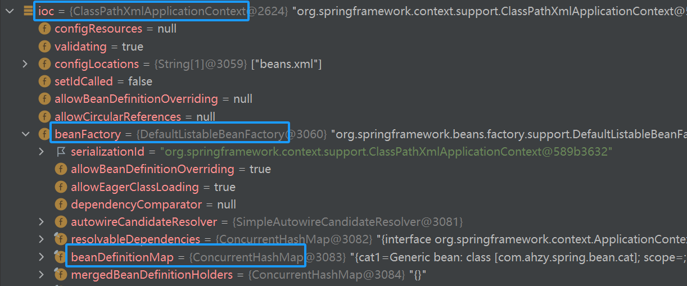
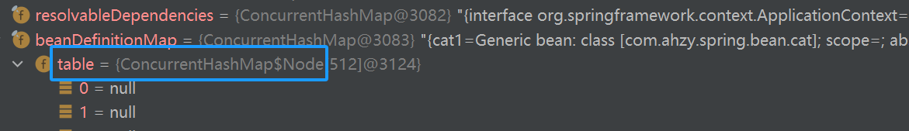
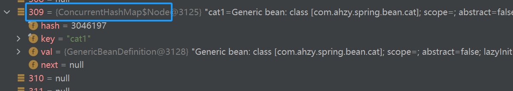
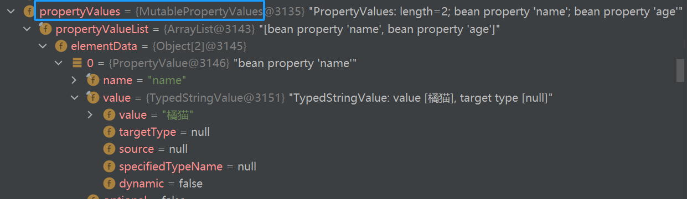
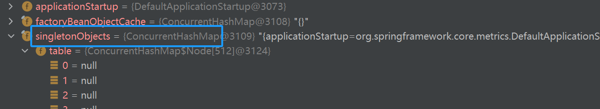
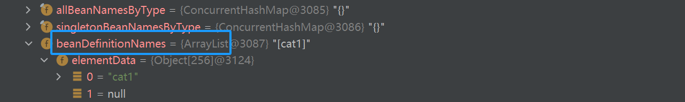
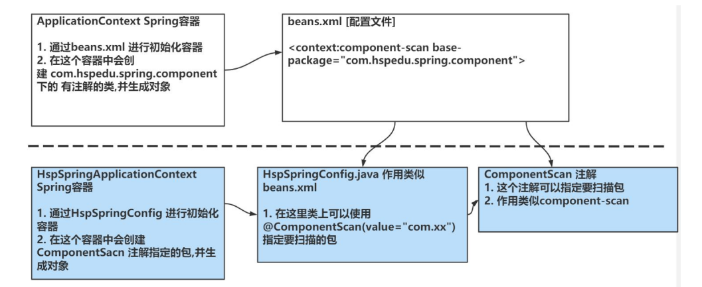
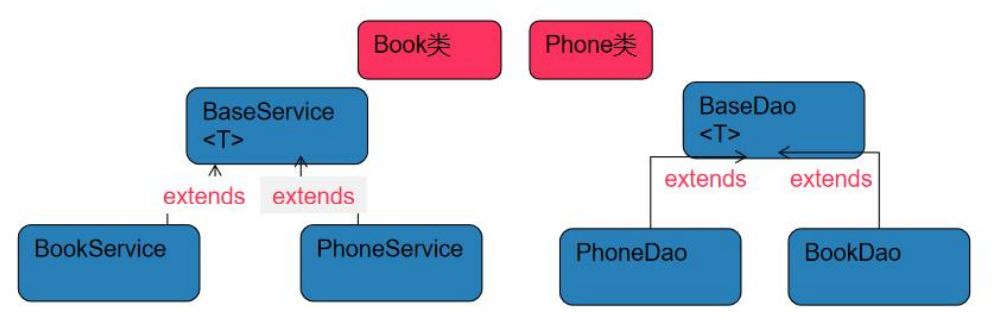

---
# 当前页面内容标题
title: IOC

# 分类
category:
- 计算机
# 标签
tag:
- Spring

sticky: false
# 是否收藏在博客主题的文章列表中，当填入数字时，数字越大，排名越靠前。
star: false
# 是否将该文章添加至文章列表中
article: false
# 是否将该文章添加至时间线中
timeline: false

date: 2024-12-18
headerDepth: 2

---

<br>


## 1. 原生容器结构









- **beanDefinitionMap** 用 **ConcurrentHashMap** 集合存放 `beans.xml ` 中 bean节点 配置的 bean对象 信息
- **ConcurrentHashMap** 有 **table** 属性，类型是 **ConcurrentHashMap$Node**，是一个数组，初始化为512，会自动扩容
- 通过 **hash算法** 我们的 **cat1对象** 的信息保存在 **index-309** 位置，保存是以 **ConcurrentHashMap$Node** 类型保存
  - **key** 就是`beans.xml` 中配置的 `id="cat1"`
  - **val** 就是 cat1 对象的信息 "如属性 / 属性值 / 类信息 / 是否懒加载"
    - **propertyValues** 记录 `beanx.xml` 中配置的 cat1对象 的属性名属性值





- **ioc** ⇒ **beanFactory** ⇒ **singletonObjects** 类型为 **ConcurrentHashMap**
- 有个 **table** 属性，类型是 **ConcurrentHashMap$Node**，如果在 `beans.xml` 文件中配置的对象是 **单例** 的就会初始化放在tabel中




- **ioc** ⇒ **beanFactory** ⇒ **beanDefinitionNames** 类型为 **ArrayList集合** 通过 **数组** 记录了我们在 `beans.xml` 中 **bean的名称（id）**

```java
// 快速查找ioc容器的bean对象
String[] str = ioc.getBeanDefinitionNames();
for (String string : str) {
	System.out.println("bean对象为: " + string);
}
```


## 2. 模拟容器机制

::: tip 思路分析

1. 创建 AhzyApplicationContext 容器，属性包含 singletonObjects （ConcurrentHashMap类型 ）
1. 解析beans.xml ⇒ Dom4j
2. 得到bean的信息 ⇒ id，class，属性，属性值
3. 使用 **反射** 生成对象，并赋值 ( 需要bean有 **无参构造器** 和 **setter方法** )
4. 将创建好的bean对象，放入到 singletonObjects 集合
5. 提供 getBean(id) 返回对应的bean对象

:::

```java
public class AhzyAplicationContext {

    // 自动将单例对象放入singletonObjects中
    private ConcurrentHashMap<String, Object> singletonObjects = new ConcurrentHashMap<>();

    public AhzyAplicationContext(String xmlFile) throws Exception {
        // 解析xml文件
        SAXReader reader = new SAXReader();
        // 通过传入的xml文件路径，创建File对象
        File file = new File(xmlFile);
        // 通过reader对象，读取file对象，得到Document对象
        Document document = reader.read(file);

        // 通过 Document 对象, 拿到 XML 的根元素对象
        Element root = document.getRootElement();

        //通过根元素对象, 获取所有的 bean 标签对象
        List<Element> beans = root.elements("bean");

       for (Element bean : beans) {
           // 拿到bean的id和class属性值
           String id = bean.attributeValue("id");
           String fullPath = bean.attributeValue("class");

           // 拿到bean的所有property标签
           List<Element> property = bean.elements("property");

           // 使用反射创建 bean 实例，并放入到 singletonObjects 中
           Class<?> cls = Class.forName(fullPath);
           // 初始化出一个对象, 此时值为null
           cat instance = (cat)cls.newInstance();
           
           // 遍历每个property标签的 name 和 value
           for (Element property1 : property) {
               String name = property1.attributeValue("name");
               String value = property1.attributeValue("value");

               if(name.equals("name")){
                   instance.setName(value);
               }
               if(name.equals("age")){
                   instance.setAge(Integer.parseInt(value));
               }
           }
           singletonObjects.put(id, instance);
       }
    }


    public Object getBean(String id) {
        return singletonObjects.get(id);
    }

}

```

```java
public class iocTest {

    @Test
    public void test() throws Exception {
        
        AhzyAplicationContext ioc = new AhzyAplicationContext("src/beans.xml");
        
        cat cat1 = (cat)ioc.getBean("cat1");
        System.out.println(cat1.getName()+" " + cat1.getAge()+"岁");
        
        System.out.println("===============================");
        
        cat cat2 = (cat)ioc.getBean("cat2");
        System.out.println(cat2.getName()+" " + cat2.getAge()+"岁");

    }

}
```


⚠️注意事项

```xml
<bean  class="com.ahzy.spring.bean.Cat">
    <property name="name" value="黑猫"/>
    <property name="age" value="20"/>
</bean>
```

```java
@Test
public void test03(){
    ApplicationContext ioc = new ClassPathXmlApplicationContext("beans.xml");
    Cat cat = ioc.getBean("com.ahzy.spring.bean.Cat#0", Cat.class);
	System.out.println("cat: "+ cat);
}
```

> 若 bean 不指定 id，默认以 `全类名#0、全类名#1 .....` 的 方式获取


## 3. IOC获取与配置Bean

### 3.1 通过id获取

```
ApplicationContext ioc = new ClassPathXmlApplicationContext("beans.xml");
Cat cat = ioc.getBean("cat01", Cat.class);
```


### 3.2 通过类型获取

```
ApplicationContext ioc = new ClassPathXmlApplicationContext("beans.xml");
Cat cat = ioc.getBean(Cat.class);
```

- ioc 容器中的 **同一个类** 的 bean **只能有一个**，否则抛出 `NoUniqueBeanDefinitionException`
- 适用于 controller、service ，在一个线程中只需一个单例对象


### 3.3 通过构造器配置

其他的是通过反射的无参构造生成对象，再识别出property的值，通过setter方法赋值

这种利用了有参构造

```xml
<!-- 通过 index 将值传到对应参数上 -->
<bean id="cat01" class="com.ahzy.spring.bean.Cat">
	<constructor-arg value="橘猫" index="0"/>
	<constructor-arg value="20" index="1"/>
</bean>

<!-- 通过 type 将值传到对应参数上 -->
<bean id="cat02" class="com.ahzy.spring.bean.Cat">
	<constructor-arg value="黑猫" type="java.lang.String"/>
	<constructor-arg value="30" type="java.lang.Integer"/>
</bean>

<!-- 通过 name 将值传到对应参数上 -->
<bean id="cat03" class="com.ahzy.spring.bean.Cat">
	<constructor-arg value="白猫" name="name"/>
	<constructor-arg value="25" name="age"/>
</bean>
```


### 3.4 通过p名称空间配置

```xml
<bean id="cat01" class="com.ahzy.spring.bean.Cat"
      p:name="橘猫" 
      p:age="20"
/>
```

- `alt` + `enter` 添加上 `xmlns:p="http://www.springframework.org/schema/p"`


### 3.5 引用/注入其他bean

```xml
<bean  class="com.ahzy.spring.dao.demoDAO" id="demoDAO"/>

<bean  class="com.ahzy.spring.service.demoServiceImpl" id="demoServiceImpl">
    <property name="demoDAO" ref="demoDAO"/>
</bean>
```

- 拿到配置文件扫描整个xml文件，将bean关系梳理清楚，存入 **beanDefinitionMap** ，因此这两个bean **顺序** 无要求
- 体现了 <span style="color: red;">依赖注入</span>


### 3.6 引用/注入内部bean

```xml
<!-- 不用ref引用其他bean，而是自己配一个 -->
<bean  class="com.ahzy.spring.service.demoServiceImpl">
    <property name="demoDAO">
    	<bean  class="com.ahzy.spring.dao.demoDAO"/>
    </property>
</bean>
```


### 3.8 引用/注入集合/数组

```java
public class Cat {
	private String name;
	private List<Dog> dogList;
    private Set<Dog> dogSet;
	private Map<String, Dog> dogMap;
	private String[] dogName;
    private Properties pros;
    
    // 省略............
}
```

```xml
<bean id="cat01" class="com.ahzy.spring.beans.Cat">
	
    <!-- 给 bean 对象的 name 赋值 -->
    <property name="name" value="橘猫"/>
    
    <!-- 给 bean 对象的 list 集合赋值 -->
	<property name="dogList">
		<list>
			<ref bean="dog01"/>
			<ref bean="dog02"/>
            <bean class="com.ahzy.spring.beans.Dog">
            	<property name="name" value="黄狗"/>
            </bean>
		</list>
	</property>
                                                
    <!-- 给 bean 对象的 set 集合赋值 -->
	<property name="dogSet">
		<set>
			<ref bean="dog01"/>
			<ref bean="dog02"/>
            <bean class="com.ahzy.spring.beans.Dog">
            	<property name="name" value="黄狗"/>
            </bean>
		</set>
	</property>
	
    <!-- 给 bean 对象的 map 集合赋值 -->
	<property name="dogMap">
		<map>
			<entry>
				<key>
					<value>dog01</value>
				</key>
				<ref bean="dog01"/>
			</entry>
			<entry>
				<key>
					<value>dog02</value>
				</key>
				<ref bean="dog02"/>
			</entry>
		</map>
	</property>
    
    <!-- 给 bean 对象的数组属性注入值 -->
	<property name="dogName">
		<array>
			<value>白狗</value>
			<value>黑狗</value>
		</array>
	</property>
    
	<!-- 给 bean 对象的 properties 集合赋值 -->
	<property name="pros">
		<props>
			<prop key="username">ahzy</prop>
			<prop key="password">123456</prop>
		</props>
	</property>
    
</bean>
```


### 3.9 通过util名称空间创建list

```xml
<util:list id="myListBook">
	<value>三国演义</value>
	<value>西游记</value>
	<value>红楼梦</value>
	<value>水浒传</value>
</util:list>

<bean id="book" class="com.ahzy.spring.beans.Book">
	<property name="bookList" ref="myListBook"/>
</bean>

<!-- 等同于如下 -->
<bean id="book2" class="com.ahzy.spring.beans.Book">
	<property name="bookList">
		<list>
			<value>三国演义</value>
			<value>西游记</value>
			<value>红楼梦</value>
			<value>水浒传</value>
		</list>
	</property>
</bean>
```


### 3.10 级联属性赋值

ioc 容器可以给 **对象属性的属性** 赋值，即级联属性赋值

```xml
<bean  class="com.ahzy.spring.beans.dept" id="dept01"/>

<bean  class="com.ahzy.spring.beans.emp" id="emp01">
    <property name="name" value="ahzy"/>
    <property name="dept" ref="dept01"/>
    <property name="dept.name" value="技术部"/>
</bean>
```


### 3.11 静态工厂获取bean

```java
public class MyStaticFactory {
    private static Map<String, Monster> monsterMap;

    static  {
        monsterMap = new HashMap<>();
        monsterMap.put("monster01", new Monster(100,"牛魔王","芭蕉扇"));
        monsterMap.put("monster02", new Monster(200,"狐狸精","美人计"));
    }

    //提供一个方法,返回Monster对象
    public static Monster getMonster(String key) {
        return monsterMap.get(key);
    }

}
```

```xml
<!-- 通过静态工厂来获取 bean 对象 -->
<bean id="my_monster" class="com.hspedu.spring.factory.MyStaticFactory" factory-method="getMonster">
    <!-- constructor-arg 标签提供 key -->
    <constructor-arg value="monster01"/>
</bean>
```

### 3.12 实例工厂获取bean

```java
public class MyInstanceFactory {
    private Map<String, Monster> monster_map;

    {
        monster_map = new HashMap<>();
        monster_map.put("monster03", new Monster(300, "牛魔王~", "芭蕉扇~"));
        monster_map.put("monster04", new Monster(400, "狐狸精~", "美人计~"));
    }

    //写一个方法返回Monster对象
    public Monster getMonster(String key) {
        return monster_map.get(key);
    }
}
```

```xml
<!-- 通过实例工厂来获取 bean 对象 -->
<bean id="myInstanceFactory" class="com.hspedu.spring.factory.MyInstanceFactory"/>
<bean id="my_monster2" factory-bean="myInstanceFactory" factory-method="getMonster">
    <constructor-arg value="monster03"/>
</bean>
```

### 3.13 FactoryBean获取bean

```java
public class MyFactoryBean implements FactoryBean<Monster> {
  private String keyVal;
  private Map<String, Monster> monster_map;

  {
    monster_map = new HashMap<String, Monster>();
    monster_map.put("monster_01", new Monster(100, "黄袍怪", "一阳指"));
    monster_map.put("monster_02", new Monster(200, "九头金雕", "如来神掌"));
  }

  public void setKeyVal(String keyVal) {
    this.keyVal = keyVal;
  }
  
  @Override
  public Monster getObject() throws Exception {
    // TODO Auto-generated method stub
    return this.monster_map.get(keyVal);
  }
  
  @Override
  public Class getObjectType() {
    // TODO Auto-generated method stub
    return Monster.class;
  }
  
  @Override
  public boolean isSingleton() {
    // TODO Auto-generated method stub
    return true;
  }
```

```xml
<!--1. 通过 FactoryBean 来获取 bean 对象 -->
<!--2. name="keyVal" 就是 MyFactoryBean 定义的 setKeyVal 方法3. value="monster_01" ，就是给 keyVal 的值-->
<bean id="myFactoryBean" class="com.hspedu.spring.factory.MyFactoryBean">
    <property name="keyVal" value="monster_01"/>
</bean>
```


## 4. Bean配置信息重用

```xml
<!-- 继承的方式来实现 bean 配置信息的重用 -->
<bean id="monster10" class="com.hspedu.spring.beans.Monster">
    <property name="monsterId" value="10"/>
    <property name="name" value="蜈蚣精"/>
    <property name="skill" value="蜇人"/>
</bean>

<!-- parent="monster10" 就是继承使用了 monster10 的配置信息-->
<bean id="monster11" class="com.hspedu.spring.beans.Monster" parent="monster10"/>

<!-- 当我们把某个bean设置为 abstract="true" 这个bean只能被继承，而不能实例化了-->
<bean id="monster12" class="com.hspedu.spring.beans.Monster" abstract="true"><property name="monsterId" value="12"/>
    <property name="name" value="美女蛇"/>
    <property name="skill" value="吃人"/>
</bean>
```


## 5. Bean的创建顺序

```xml
<!-- 在 spring 的 ioc 容器, 默认是按照配置的顺序创建 bean 对象 -->
<!-- 会先创建 student01 这个 bean 对象，然后创建 department01 这个bean 对象   -->
<bean id="student01" class="com.hspedu.bean.Student" />
<bean id="department01" class="com.hspedu.bean.Department" />

<!-- 会先创建 department01 对象，再创建 student01 对象.-->
<bean id="student01" class="com.hspedu.bean.Student" depends-on="department01"/>
<bean id="department01" class="com.hspedu.bean.Department" />
```


## 6. Bean对象的单例与多例

1. 默认是单例 singleton, 在启动容器时, 默认就会创建 , 并放入到singletonObjects 集合

2. 当 `<bean scope="prototype" >` 设置为多实例机制后, 该bean 是在 **getBean()** 时才创建

3. 如 果 是 单 例 singleton, 同时希望在 getBean 时才创建, 可以指定懒加载 lazy-init="true" (**默认是 false**)

4. 通常情况下, lazy-init 就使用默认值 false , 在开发看来, 用空间换时间是值得的, 除非有特殊的要求 

5. 如果 scope="prototype" 这时你的 lazy-init 属性的值不管是ture, 还是false都是在getBean 时候，才创建对象


## 7. Bean的生命周期

bean 对象创建是由 JVM 完成的，然后执行如下方法

1. 执行构造器

2. 执行 set 相关方法

3. 调用 bean 的初始化的方法（需要配置）

4. 使用 bean

5. 当容器关闭时候，调用 bean 的销毁方法（需要配置）
   
```java
@Test
public void beanLife() {
  // ApplicationContext 为编译类型，ClassPathXmlApplicationContext 为运行类型
  ApplicationContext ioc = new ClassPathXmlApplicationContext("beans.xml");
  House house = ioc.getBean("house", House.class);
  System.out.println(house);
  //关闭容器
  ((ConfigurableApplicationContext) ioc).close();
  
  // ClassPathXmlApplicationContext ioc = new ClassPathXmlApplicationContext("beans.xml");
  // ioc.close();
}
```

```java
public class House {
  private String name;
  
  public House() {
    System.out.println("House() 构造器");
  }
  
  public String getName() {
    return name;
  }
  
  public void setName(String name) {
    System.out.println("House setName()...");
    this.name = name;
  }
  
  public void init() {
    System.out.println("House init()..");
  }
  
  public void destory() {
    System.out.println("House destory()..");
  }
}
```

```xml
<!-- 配置 bean 的初始化方法和销毁方法 -->
<bean id="house" class="com.hspedu.spring.beans.House" init-method="init" destroy-method="destory">
    <property name="name" value="北京豪宅"/>
</bean>
```


## 8. Bean的后置处理器

在 spring 的 ioc 容器,可以配置 bean 的后置处理器

该处理器/对象会在 bean <span style="color: red;">初始化方法</span> 调用前和初始化方法调用后被调用

程序员可以在后置处理器中编写自己的代码

```java
public class MyBeanPostProcessor implements BeanPostProcessor {
    /** 
    * 在 bean 初始化之前完成某些任务
    * @param bean : 就是 ioc 容器返回的 bean 对象, 如果这里被替换会修改，则返回的 bean 对象也会被修改
    * @param beanName: 就是 ioc 容器配置的 bean 的名称
    * @return Object: 就是返回的 bean 对象
    */
    public Object postProcessBeforeInitialization(Object bean, String beanName) throws BeansException {
        // TODO Auto-generated method stub
        System.out.println("postProcessBeforeInitialization 被调用" + beanName+"bean= " + bean.getClass());
        return bean;
    }
    
    /**
    * 在 bean 初始化之后完成某些任务
    * @param bean : 就是 ioc 容器返回的 bean 对象, 如果这里被替换会修改，则返回的 bean 对象也会被修改
    * @param beanName: 就是 ioc 容器配置的 bean 的名称
    * @return Object: 就是返回的 bean 对象
    */
    public Object postProcessAfterInitialization(Object bean, String beanName) throws BeansException {
        System.out.println("postProcessAfterInitialization 被调用" + beanName +" bean="+ bean.getClass());
        return bean;
    }
}
```

```xml
<!-- 配置 bean 的初始化方法和销毁方法 -->
<bean id="house" class="com.hspedu.spring.beans.House" init-method="init" destroy-method="destory">
    <property name="name" value="北京豪宅"/>
</bean>

<bean id="myBeanPostProcessor" class="com.hspedu.spring.beans.MyBeanPostProcessor" />
```

细节：

- 怎么执行到这个方法? => 使用 AOP(反射+动态代理+IO+容器+注解)

- 有什么用？ => 可以对 IOC 容器中所有的对象进行统一处理，比如日志处理/权限的校验/安全的验证/事务管理

- 针对容器的 **所有对象** => 切面编程特点

## 9. 属性文件配置Bean

```property
name=\u9EC4\u888D\u602A
id=10
skill=sad
```

```xml
  <!--指定属性文件
      1. 先把这个文件修改成提示All Problem
      2. 提示错误，将光标放在context 输入alt+enter 就会自动引入namespace
      3. location="classpath:my.properties" 表示指定属性文件的位置
      4. 提示，需要带上 classpath
      5. 属性文件有中文，需要将其转为unicode编码-> 使用工具
      -->
  <context:property-placeholder location="classpath:my.properties"/>
  <!--配置Monster对象
  1.通过属性文件给monster对象的属性赋值
  2. 这时我们的属性值通过${属性名}
  3. 这里说的 属性名 就是 my.properties文件中的 k=v 的k
  -->
  <bean class="com.hspedu.spring.bean.Monster" id="monster1000">
    <property name="monsterId" value="${monsterId}"/>
    <property name="skill" value="${skill}"/>
    <property name="name" value="${name}"/>
  </bean>
```

- 如果是中文，property 中改为 unicode编码

## 10. 自动装配Bean

```xml
<?xml version="1.0" encoding="UTF-8"?>
<beans xmlns="http://www.springframework.org/schema/beans"
       xmlns:xsi="http://www.w3.org/2001/XMLSchema-instance"
       xmlns:context="http://www.springframework.org/schema/context"
       xsi:schemaLocation="http://www.springframework.org/schema/beans http://www.springframework.org/schema/beans/spring-beans.xsd http://www.springframework.org/schema/context https://www.springframework.org/schema/context/spring-context.xsd">

    <!--配置OrderDao对象-->
    <bean class="com.hspedu.spring.dao.OrderDao" id="orderDao"/>
    <!--配置OrderService对象
        1. autowire="byType" 表示 在创建 orderService时
           通过类型的方式 给对象属性 自动完成赋值/引用
        2. 比如OrderService 对象有 private OrderDao orderDao
        3. 就会在容器中去找有没有 OrderDao类型对象
        4. 如果有，就会自动的装配, 老师提示如果是按照 byType 方式来装配, 这个容器中，不能有两个
          的OrderDao类型对象
        5. 如果你的对象没有属性,  autowire就没有必要写
        6. 其它类推..

        7. 如果我们设置的是 autowire="byName" 表示通过名字完成自动装配
        8. 比如下面的 autowire="byName" class="com.hspedu.spring.service.OrderService"
           1) 先看 OrderService 属性 private OrderDao orderDao
           2) 再根据这个属性的setXxx()方法的 xxx 来找对象id
           3) public void setOrderDao() 就会找id=orderDao对象来进行自动装配
           4) 如果没有就装配失败

    -->
    <bean autowire="byName" class="com.hspedu.spring.service.OrderService"
          id="orderService"/>

    <!--配置OrderAction-->
    <bean autowire="byName" class="com.hspedu.spring.web.OrderAction" id="orderAction"/>
</beans>
```

## 11. Spring EI 表达式配置Bean

1. Spring Expression Language，Spring 表达式语言，简称 SpEL。支持运行时查询并可以操作对象

2. 和 EL 表达式一样，SpEL 根据 JavaBean 风格的 getXxx()、setXxx()方法定义的属性访问对象

3. SpEL 使用 `#{…}` 作为定界符，所有在大框号中的字符都将被认为是SpEL 表达式

```xml
<!-- spring el 表达式 -->
<bean id="spELBean" class="com.hspedu.spring.beans.SpELBean">
    <!-- sp el 给字面量 -->
    <property name="name" value="#{'韩顺平教育'}"/>
    韩顺平Java 工程师<!-- sp el 引用其它 bean -->
    <property name="monster" value="#{monster01}"/>
    <!-- sp el 引用其它 bean 的属性值 -->
    <property name="monsterName" value="#{monster02.name}"/>
    <!-- sp el 调用普通方法 赋值, 通过方法返回的值赋给该属性 -->
    <property name="crySound" value="#{spELBean.cry('喵喵的..')}"/>
    <!-- sp el 调用静态方法 赋值 -->
    <property name="bookName" value="#{T(com.hspedu.spring.beans.SpELBean).read(' 天龙八部')}"/>
    <!-- sp el 通过运算赋值 -->
    <property name="result" value="#{89*1.2}"/>
</bean>
```

## 12. 注解配置Bean

基于注解的方式配置 bean, 主要是项目开发中的组件，比如Controller、Service、和Dao

1. **@Component** 表示当前注解标识的是一个组件

2. **@Controller** 表示当前注解标识的是一个控制器，通常用于Servlet

3. **@Service** 表示当前注解标识的是一个处理业务逻辑的类，通常用于Service 类

4. **@Repository** 表示当前注解标识的是一个持久化层的类，通常用于Dao 类

### 12.1 快速入门

1. 引入 `spring-aop-5.3.8.jar`

2. 创建 UserAction.java UserService.java, UserDao.java MyComponent.java，分别加上注解

3. 配置 beans.xml
   ```xml
    <!-- 配置自动扫描的包，注意需要加入 context 名称空间 -->
    <context:component-scan base-package="com.hspedu.spring.component" />
   ```
   
### 12.2 注意事项和细节说明

- 需要导入 `spring-aop-5.3.8.jar`

- 必须在 Spring 配置文件中指定"自动扫描的包"，IOC 容器才能够检测到当前项目中哪些类被标识了注解， 注意导入 context 名称空间
  ```
  <context:component-scan base-package="com.hspedu.spring.component" />
  ```
  可以使用通配符 * 来指定 ，比如 `com.hspedu.spring.*` 表示
  扫描的是component及其子包

- Spring 的 IOC 容器不能检测一个使用了@Controller 注解的类到底是不是一个真正的控制器。注解的名称是用于程序员自己识别当前标识的是什么组件。其它的@Service @Repository 也是一样的道理
  也就是说 spring 的 IOC 容器只要检查到注解就会生成对象，但是这个注解的含义 spring 不会识别，注解是给程序员编程方便看的

- 表示只扫描满足要求的类
  ```
    <context:component-scan base-package="com.hspedu.spring.component" resource-pattern="User*.class" />
  ```
  
    


- `<context:exclude-filter>` 放在 `<context:component-scan>` 内，表示扫描过滤掉当前包的某些类  
    `type="annotation"` 按照注解类型进行过滤  
    expression: 就是注解的全类名  
    下面表示过滤掉 `com.hspedu.spring.component` 包下，加入了 @Service 注解的类  
    ```xml 
  <context:component-scan base-package="com.hspedu.spring.component" >
        <context:exclude-filter type="annotation" expression="org.springframework.stereotype.Service"/>
  </context>
  ```

- `use-default-filters="false"` 不再使用默认的过滤机制   
  `context:include-filter` 表示只是扫描指定的注解的类
  `expression="org.springframework.stereotype.Controller"` 注解的全类名  
  下面表示指定自动扫描哪些注解类
    ```xml 
    <context:component-scan base-package="com.hspedu.spring.component" use-default-filters="false">
        <context:include-filter type="annotation" expression="org.springframework.stereotype.Service"/>
        <context:include-filter type="annotation" expression="org.springframework.stereotype.Controller"/>
    </context:component-scan>
    ```
  
- 默认情况：标记注解后，类名首字母小写作为 id 的值。也可以使用注解的value属性指定 id 值，并且 value 可以省略
  ```
  @Controller(value="userAction01")
  @Controller("userAction01")
  ```
  
### 12.3 手动实现

简单模拟 Spring 基于注解配置的程序



```java
/**
 * 1. @Target(ElementType.TYPE)指定我们的ComponentScan注解可以修饰 Type程序元素
 * 2. @Retention(RetentionPolicy.RUNTIME) 指定ComponentScan注解 保留范围
 * 3. String value() default ""; 表示ComponentScan 可以传入 value
 */
@Target(ElementType.TYPE)
@Retention(RetentionPolicy.RUNTIME)
public @interface ComponentScan {
    String value() default "";
}

```

```java
/**
 * 这是一个配置类, 作用类似我们原生spring的 beans.xml 容器配置文件
 */
@ComponentScan(value = "com.hspedu.spring.component")
public class HspSpringConfig {
}
```

```java 
/**
 * HspSpringApplicationContext 类的作用类似Spring原生ioc容器
 */
public class HspSpringApplicationContext {
    private Class configClass;
    //ioc我存放的就是通过反射创建的对象(基于注解方式)
    private final ConcurrentHashMap<String, Object> ioc =
            new ConcurrentHashMap<>();

    //构造器
    public HspSpringApplicationContext(Class configClass) {

        this.configClass = configClass;
        //System.out.println("this.configClass=" + this.configClass);
        //获取要扫描的包
        //1. 先得到HspSpringConfig配置的的@ComponentScan(value = "com.hspedu.spring.component")
        ComponentScan componentScan =
                (ComponentScan) this.configClass.getDeclaredAnnotation(ComponentScan.class);
        //2. 通过componentScan的value=> 即要扫描的包
        String path = componentScan.value();
        System.out.println("要扫描的包= " + path);

        //得到要扫描的包下的所有资源(类 .class)
        //1.得到类的加载器
        ClassLoader classLoader =
                HspApplicationContext.class.getClassLoader();
        //2. 通过类的加载器获取到要扫描的包的资源 url=》类似一个路径
        path = path.replace(".", "/");//一定要把. 替换成 /
        URL resource =
                classLoader.getResource(path);
        System.out.println("resource=" + resource);
        //3. 将要加载的资源(.class) 路径下的文件进行遍历=>io
        File file = new File(resource.getFile());
        if (file.isDirectory()) {
            File[] files = file.listFiles();
            for (File f : files) {
                System.out.println("=====================");
                System.out.println("=" + f.getAbsolutePath());
                //D:\hspedu_spring\spring\out\production\spring\com\hspedu\spring\component\UserService.class
                //获取到 com.hspedu.spring.component.UserService
                String fileAbsolutePath = f.getAbsolutePath();

                //这里我们只处理.class文件
                if (fileAbsolutePath.endsWith(".class")) {

                    //1. 获取到类名
                    String className =
                            fileAbsolutePath.substring(fileAbsolutePath.lastIndexOf("\\") + 1, fileAbsolutePath.indexOf(".class"));
                    //System.out.println("className=" + className);
                    //2. 获取类的完整的路径(全类名)
                    //老师解读 path.replace("/",".") => com.hspedu.spring.component.
                    String classFullName = path.replace("/", ".") + "." + className;
                    //System.out.println("classFullName=" + classFullName);

                    //3. 判断该类是不是需要注入容器, 就看该类是不是有注解 @Component @Service..
                    try {
                        //这时，我们就得到老该类的Class对象
                        //Class clazz = Class.forName(classFullName)
                        //老师说一下
                        //1. Class clazz = Class.forName(classFullName) 可以反射加载类
                        //2. classLoader.loadClass(classFullName); 可以反射类的Class
                        //3. 区别是 : 上面方式后调用来类的静态方法, 下面方法不会
                        //4. aClass.isAnnotationPresent(Component.class) 判断该类是否有 @Component
                        Class<?> aClass = classLoader.loadClass(classFullName);
                        if (aClass.isAnnotationPresent(Component.class) ||
                                aClass.isAnnotationPresent(Controller.class) ||
                                aClass.isAnnotationPresent(Service.class) ||
                                aClass.isAnnotationPresent(Repository.class)) {

                            //这里老师演示一个Component注解指定value,分配id
                            //老师就是演示了一下机制.
                            if(aClass.isAnnotationPresent(Component.class)) {
                                //获取到该注解
                                Component component = aClass.getDeclaredAnnotation(Component.class);
                                String id = component.value();
                                if(!"".endsWith(id)) {
                                    className = id;//替换
                                }
                            }

                            //这时就可以反射对象，并放入到容器中
                            Class<?> clazz = Class.forName(classFullName);
                            Object instance = clazz.newInstance();
                            //放入到容器中, 将类名的首字母小写作为id
                            //StringUtils

                            ioc.put(StringUtils.uncapitalize(className) , instance);
                        }
                    } catch (Exception e) {
                        e.printStackTrace();
                    }
                }
            }
        }

    }

    //编写方法返回对容器中对象
    public Object getBean(String name) {
        return ioc.get(name);
    }
}

```

### 12.4 自动装配

基于注解配置 bean，也可实现自动装配，使用的注解是：`@AutoWired` 或者 `@Resource`

#### 12.4.1 @AutoWired

1. 在 IOC 容器中查找待装配的组件的类型，如果有唯一的bean 匹配，则使用该bean装配

2. 如待装配的类型对应的 bean 在 IOC 容器中有多个，则使用待装配的属性的 **属性名作为id值** 再进行查找, 找到就装配，找不到就抛异常

3. @Autowired 也可以进行指定id组装使用，等价于 `@Resource(name = "")`
    ```java
    @Autowired
    @Qualifier(value = "")
    ```

#### 12.4.2 @Resource

1. @Resource 有两个属性是比较重要的，分是 <span style="color: red;">name 和 type</span>，Spring 将@Resource注解的name 属性解析为 bean 的名字，而 type 属性则解析为 bean 的类型。所以如果使用name属性，则使用 byName 的自动注入策略，而使用 type 属性时则使用byType 自动注入策略
   ```java
    @Resource(name = "")
    @Resource(type = xxx.class)
   ```

2. 如果@Resource 没有指定 name 和 type ，则先使用byName注入策略，如果匹配不上，再使用 byType 策，如果都不成功，就会报错

### 12.5 泛型依赖注入

为了更好的管理有继承和相互依赖的 bean 的自动装配，spring 还提供基于泛型依赖的注入机制

在继承关系复杂情况下，泛型依赖注入就会有很大的优越性



传统方法是将 PhoneDao /BookDao 自动装配到 BookService/PhoneSerive 中，当这种继承关系多时，就比较麻烦，可以使用 spring 提供的泛型依赖注入

```java 
public abstract class BaseDao<T> {
    public abstract void save();
}

```

```java
public class BaseService<T> {
    @Autowired
    private BaseDao<T> baseDao;
    public void save() {
        baseDao.save();
    }
}
```


```java 
@Repository
public class BookDao extends BaseDao<Book>{
    @Override
    public void save() {
        System.out.println("BookDao 的 save()..");
    }
}
```

```java 
@Service
public class BookService extends BaseService<Book>{
    //并没有写属性
}
```

