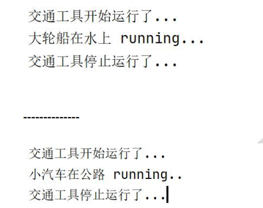
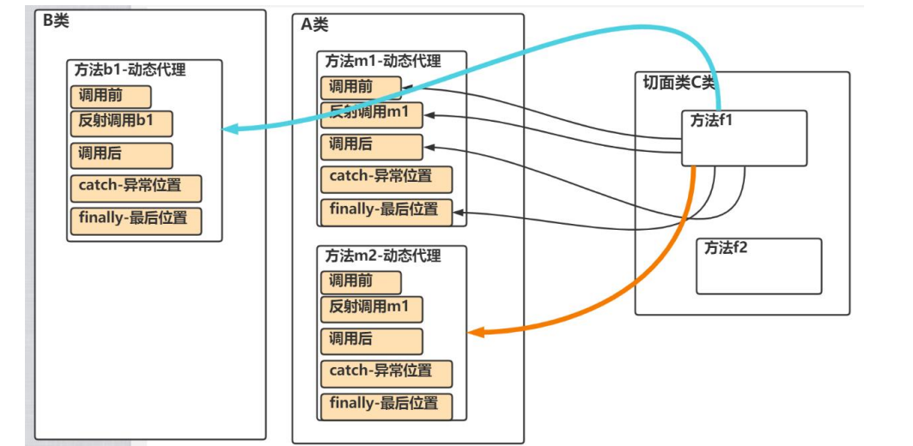
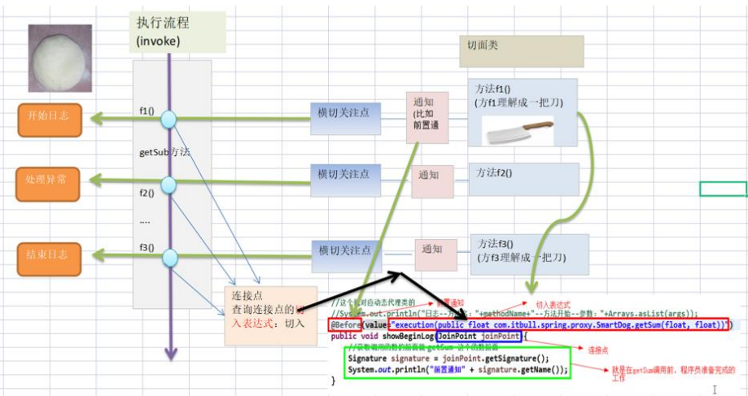
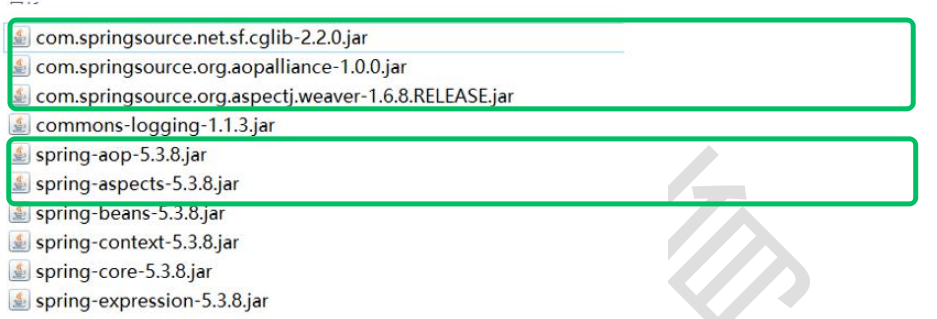
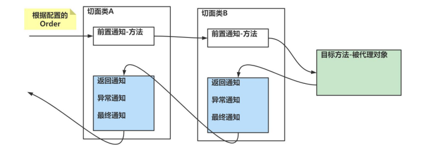

---

# 当前页面内容标题
title: AOP

# 分类
category:
- 计算机
# 标签
tag:
- Spring

sticky: false
# 是否收藏在博客主题的文章列表中，当填入数字时，数字越大，排名越靠前。
star: false
# 是否将该文章添加至文章列表中
article: false
# 是否将该文章添加至时间线中
timeline: false

date: 2024-12-20

headerDepth: 2

---

<br>

## 1. 动态代理

### 1.1 需求

有 Vehicle(交通工具接口, 有一个 run 方法), 下面有两个实现类Car 和Ship

当运行 Car 对象 的 run 方法和 Ship 对象的 run 方法时，输入如下内容, 注意观察前后有统一的输出

 

动态代理就是拿来解决代码的冗余，并能更好维护

OOP => AOP 思想的转换

### 1.2 入门案例

```java
package com.hspedu.spring.proxy2;


import java.lang.reflect.InvocationHandler;
import java.lang.reflect.Method;
import java.lang.reflect.Proxy;

/**
 * VehicleProxyProvider 该类可以返回一个代理对象.
 */
public class VehicleProxyProvider {

    //定义一个属性
    //target_vehicle 表示真正要执行的对象
    //该对象实现了Vehicle接口
    private Vehicle target_vehicle;

    //构造器，传入的值必须是实现了接口的对象
    public VehicleProxyProvider(Vehicle target_vehicle) {
        this.target_vehicle = target_vehicle;
    }

    //编写一个方法，可以返回一个代理对象, 该代理对象可以通过反射机制调用到被代理对象（目标对象）的方法
    public Vehicle getProxy() {

        //得到类加载器
        ClassLoader classLoader =
                target_vehicle.getClass().getClassLoader();

        //得到要代理的对象/被执行对象 的接口信息,底层是通过接口来完成调用
        Class<?>[] interfaces = target_vehicle.getClass().getInterfaces();


        //创建InvocationHandler 对象
        //因为 InvocationHandler 是接口，所以我们可以通过匿名对象的方式来创建该对象
        /**
         *
         * public interface InvocationHandler {
         *  public Object invoke(Object proxy, Method method, Object[] args)
         *         throws Throwable;
         * }
         * invoke 方法是将来执行我们的target_vehicle的方法时，会调用到
         *
         */

        InvocationHandler invocationHandler = new InvocationHandler() {
            /**
             * invoke 方法是将来执行我们的target_vehicle的方法时，会调用到
             * @param o 表示代理对象
             * @param method 就是通过代理对象调用方法时，的哪个方法 代理对象.run()
             * @param args : 表示调用 代理对象.run(xx) 传入的参数
             * @return 表示 代理对象.run(xx) 执行后的结果.
             * @throws Throwable
             */
            @Override
            public Object invoke(Object o, Method method, Object[] args)
                    throws Throwable {

                System.out.println("交通工具开始运行了....");
                //这里是我们的反射基础 => OOP
                //method 是？: public abstract void com.hspedu.spring.proxy2.Vehicle.run()
                //target_vehicle 是? Ship对象
                //args 是null
                //这里通过反射+动态绑定机制，就会执行到被代理对象的方法
                //执行完毕就返回
                Object result = method.invoke(target_vehicle, args);
                System.out.println("交通工具停止运行了....");
                return result;
            }
        };

        /*

          public static Object newProxyInstance(ClassLoader loader,
                                          Class<?>[] interfaces,
                                          InvocationHandler h)

          老师解读
          1. Proxy.newProxyInstance() 可以返回一个代理对象
          2. ClassLoader loader: 类的加载器.
          3. Class<?>[] interfaces 就是将来要代理的对象的接口信息
          4. InvocationHandler h 调用处理器/对象 有一个非常重要的方法invoke
         */
        Vehicle proxy =
                (Vehicle)Proxy.newProxyInstance(classLoader, interfaces, invocationHandler);

        return proxy;
    }
}

```

```java
package com.hspedu.spring.proxy2;

import org.junit.jupiter.api.Test;

public class TestVehicle {

    @Test
    public void run() {
        //OOP基础=>java基础
        Vehicle vehicle = new Ship();
        //动态绑定
        vehicle.run();
    }

    @Test
    public void proxyRun() {
        //创建Ship对象
        Vehicle vehicle = new Car();

        //创建VehicleProxyProvider对象, 并且我们传入的要代理的对象
        VehicleProxyProvider vehicleProxyProvider =
                new VehicleProxyProvider(vehicle);

        //获取代理对象, 该对象可以代理执行方法
        //老师解读
        //1. porxy 编译类型 Vehicle
        //2. 运行类型 是代理类型 class com.sun.proxy.$Proxy9

        Vehicle proxy = vehicleProxyProvider.getProxy();

        System.out.println("proxy的编译类型是 Vehicle");
        System.out.println("proxy的运行类型是 " + proxy.getClass());
        //下面老韩就要给大家解读/debug怎么 执行到 代理对象的 public Object invoke(Object o, Method method, Object[] args)
        //梳理完毕. proxy的编译类型是 Vehicle, 运行类型是 class com.sun.proxy.$Proxy9
        //所以当执行run方法时，会执行到 代理对象的invoke
        //如何体现动态 [1. 被代理的对象 2. 方法]
        //proxy.run();
        String result = proxy.fly(10000);
        System.out.println("result=" + result);
    }
}

```


### 1.3 引出横切关注点概念

```java
package com.hspedu.spring.aop.proxy;

import java.lang.reflect.InvocationHandler;
import java.lang.reflect.InvocationTargetException;
import java.lang.reflect.Method;
import java.lang.reflect.Proxy;
import java.util.Arrays;

/**
 * 可以返回一个动态代理对象, 可以执行SmartDog对象的方法
 */
public class MyProxyProvider {

    //定义我们要执行的目标对象, 该对象需要实现SmartAnimalable
    private SmartAnimalable target_obj;

    //构造器
    public MyProxyProvider(SmartAnimalable target_obj) {
        this.target_obj = target_obj;
    }

    //方法, 可以返回代理对象，该代理对象可以执行目标对象
    public SmartAnimalable getProxy() {

        //1. 先到的类加载器/对象
        ClassLoader classLoader = target_obj.getClass().getClassLoader();

        //2. 得到要执行的目标对象的接口信息
        Class<?>[] interfaces = target_obj.getClass().getInterfaces();

        //3. 创建InvocationHandler
        InvocationHandler invocationHandler = new InvocationHandler() {
            @Override
            public Object invoke(Object proxy, Method method, Object[] args) throws Throwable {
                Object result = null;
                try {
                    System.out.println("方法执行前-日志-方法名-" + method.getName() + "-参数 "
                            + Arrays.asList(args)); //这里从AOP看，就是一个横切关注点-前置通知
                    //使用反射调用方法
                    result = method.invoke(target_obj, args);
                    System.out.println("方法执行正常结束-日志-方法名-" + method.getName() + "-结果result= "
                            + result);//从AOP看, 也是一个横切关注点-返回通知

                } catch (Exception e) {
                    e.printStackTrace();
                    //如果反射执行方法时，出现异常,就会进入到catch{}
                    System.out.println("方法执行异常-日志-方法名-" + method.getName()
                            + "-异常类型=" + e.getClass().getName());//从AOP看, 也是一个横切关注点-异常通知
                } finally {//不管你是否出现异常,最终都会执行到finally{}
                    //从AOP的角度看, 也是一个横切关注点-最终通知
                    System.out.println("方法最终结束-日志-方法名-" + method.getName());
                }

                return result;
            }
        };

        //创建代理对象
        SmartAnimalable proxy =
                (SmartAnimalable)Proxy.newProxyInstance(classLoader, interfaces, invocationHandler);
        return proxy;
    }
}

```


### 1.4 动态代理局限性

 在 `MyProxyProvider.java` 中, 我们的输出语句功能比较弱，在实际开发中，我们希望以一个方法的形式，嵌入到真正执行的目标方法前后

但是为了解耦，将方法写到另一个类（该类称为切面类）中

```java
package com.hspedu.spring.aop.proxy3;

import java.lang.reflect.Method;
import java.util.Arrays;

/**
 * 我们自己编写一个一个极简的AOP类
 */
public class HspAOP {

    //我们一个方法,在目标对象执行前执行
    public static void before(Object proxy, Method method, Object[] args) {
        System.out.println("HspAOP-方法执行前-日志-方法名-" + method.getName() + "-参数 "
                + Arrays.asList(args)); //这里从AOP看，就是一个横切关注点-前置通知
    }

    //我们一个方法,在目标对象执行后执行
    public static void after(Method method, Object result) {
        System.out.println("HspAOP-方法执行正常结束-日志-方法名-" + method.getName() + "-结果result= "
                + result);//从AOP看, 也是一个横切关注点-返回通知
    }
}

```

```java
package com.hspedu.spring.aop.proxy3;

import java.lang.reflect.InvocationHandler;
import java.lang.reflect.Method;
import java.lang.reflect.Proxy;
import java.util.Arrays;

/**
 * @author 韩顺平
 * @version 1.0
 * 可以返回一个动态代理对象, 可以执行SmartDog对象的方法
 */
public class MyProxyProvider {

    //定义我们要执行的目标对象, 该对象需要实现SmartAnimalable
    private SmartAnimalable target_obj;

    //构造器
    public MyProxyProvider(SmartAnimalable target_obj) {
        this.target_obj = target_obj;
    }

    //我们一个方法,在目标对象执行前执行
    //public void before(Object proxy, Method method, Object[] args) {
    //    System.out.println("before-方法执行前-日志-方法名-" + method.getName() + "-参数 "
    //            + Arrays.asList(args)); //这里从AOP看，就是一个横切关注点-前置通知
    //}

    ////我们一个方法,在目标对象执行后执行
    //public void after(Method method, Object result) {
    //    System.out.println("after-方法执行正常结束-日志-方法名-" + method.getName() + "-结果result= "
    //            + result);//从AOP看, 也是一个横切关注点-返回通知
    //}

    //方法, 可以返回代理对象，该代理对象可以执行目标对象
    public SmartAnimalable getProxy() {

        //1. 先到的类加载器/对象
        ClassLoader classLoader = target_obj.getClass().getClassLoader();

        //2. 得到要执行的目标对象的接口信息
        Class<?>[] interfaces = target_obj.getClass().getInterfaces();

        //3. 创建InvocationHandler
        InvocationHandler invocationHandler = new InvocationHandler() {
            @Override
            public Object invoke(Object proxy, Method method, Object[] args) throws Throwable {
                Object result = null;
                try {

                    //before(proxy, method, args);
                    HspAOP.before(proxy, method, args);

                    //使用反射调用方法
                    result = method.invoke(target_obj, args);

                    //after(method, result);
                    HspAOP.after(method, result);

                } catch (Exception e) {
                    e.printStackTrace();
                    //如果反射执行方法时，出现异常,就会进入到catch{}
                    System.out.println("方法执行异常-日志-方法名-" + method.getName()
                            + "-异常类型=" + e.getClass().getName());//从AOP看, 也是一个横切关注点-异常通知
                } finally {//不管你是否出现异常,最终都会执行到finally{}
                    //从AOP的角度看, 也是一个横切关注点-最终通知
                    System.out.println("方法最终结束-日志-方法名-" + method.getName());
                }

                return result;
            }
        };

        //创建代理对象
        SmartAnimalable proxy =
                (SmartAnimalable) Proxy.newProxyInstance(classLoader, interfaces, invocationHandler);
        return proxy;
    }
}

```

### 1.5 简易AOP的局限

1. 不灵活（一下子控制了所有的方法）
2. 复用性差（接口类型也被写死了）
3. 还是一种硬编码 (因为没有注解和反射支撑)
4. Spring AOP 闪亮登场-底层是 ASPECTJ


## 2. AOP介绍

AOP 的全称(aspect oriented programming) ，面向切面编程






## 3. 快速入门

导入 AOP 编程需要的包



在切面类声明通知

1. 前置通知@Before
2. 返回通知@AfterReturning
3. 异常通知@AfterThrowing
4. 后置通知@After
5. 环绕通知@Around

```java
public interface SmartAnimalable {
	float getSum(float i, float j);
	float getSub(float i, float j);
}
```

```java
@Component
public class SmartDog implements SmartAnimalable {
	@Override
	public float getSum(float i, float j) {
		float result = i + j;
		System.out.println("getSum() 方法内部打印 result= " + result);
		return result;
	}
	@Override
	public float getSub(float i, float j) {
		float result = i - j;
		System.out.println("getSub() 方法内部打印 result= " + result);
	return result;
	}
}
```

```java
/**
 * 使用切面编程来替代原来的动态代理类，机制是一样的. * @author Administrator
 */
@Aspect //表示这个类是一个切面类
@Component //需要加入到 IOC 容器
public class SmartAnimalAspect {
	//这个就对应动态代理类的
	//System.out.println(" 日 志 -- 方 法 名 ： "+methodName+"-- 方法开始-- 参数："+Arrays.asList(args));
	@Before(value = "execution(public float com.hspedu.spring.aop.springaop.SmartDog.getSum(float ,float))")
	public void showBeginLog(JoinPoint joinPoint) {
		System.out.println("前置通知");
		Signature signature = joinPoint.getSignature();
		// 1. 在调用目标方法之前打印“方法开始”日志
		System.out.println("日志--方法名：" + signature.getName() + "--方法开始--参数：" + Arrays.asList(joinPoint.getArgs()));
	}

    //这个就对应动态代理类的
	//System.out.println("日志--方法名："+methodName+"-- 方法正常结束--结果：result="+result);
	@AfterReturning(value = "execution(public float com.hspedu.spring.aop.springaop.SmartDog.getSum(float ,float))")
	public void showSuccessEndLog(JoinPoint joinPoint) {
		System.out.println("返回通知");
		Signature signature = joinPoint.getSignature();
		// 3. 在目标方法结束后打印“方法结束”日志
		System.out.println("日志--方法名：" + signature.getName() + "--方法正常结束--~");
	}

    //这个就对应动态代理类的
	//System.out.println("日志--方法名："+methodName+"--方法抛出异常--异常类型："+e.getClass().getName());
	@AfterThrowing(value = "execution(public float com.hspedu.spring.aop.springaop.SmartDog.getSum(float ,float))")
	public void showExceptionLog() {
		System.out.println("异常通知");
	}

	//这个就对应动态代理类的
	//System.out.println("日志--方法名："+methodName+"--方法最终结束");
	@After(value = "execution(public float com.hspedu.spring.aop.springaop.SmartDog.getSum(float ,float))")
	public void showFinallyEndLog() {
		System.out.println("最终通知");
	}
}
```

```xml
<!-- 配置自动扫描的包,根据实际情况配置即可 -->
<context:component-scan base-package="com.hspedu.spring.aop.aspectj"/>
<!-- 开启基于注解的 AOP 功能 -->
<aop:aspectj-autoproxy/>
```

```java
public class AopAspectjTest {
/**
 * spring aop 方式切入前置 before 和 后置 after 方法
 */
@Test
public void smartDogTestByProxy() {
	ApplicationContext ioc = new ClassPathXmlApplicationContext("beans6.xml");
	//通过接口来获取
	SmartAnimalable bean = ioc.getBean(SmartAnimalable.class);
	float sum = bean.getSum(101.0f, 11.2f);
	System.out.println("sum= " + sum);
	//getSub 没有 AOP 注解，所以就是普通调用
	//bean.getSub(30.6f, 43.2f);
	System.out.println("-----------------");
	}
}

```


### 3.1 注意事项

1. 关于切面类方法命名可以自己规范一下, 比如 showBeginLog() 、 showSuccessEndLog()、showExceptionLog()、showFinallyEndLog()
2. 切入表达式的更多配置，比如使用模糊配置 `@Before(value="execution(* com.hspedu.aop.proxy.SmartDog.*(..))")`

3. 表示所有访问权限，所有包的下所有有类的所方法，都会被执行该前置通知方法 `@Before(value="execution(* *.*(..))")`

4. 当 spring 容器开启了  , 我们获取注入的对象, 需要以接口的类型来获取, 因为你注入的对象.getClass() 已经是代理类型了
5. 当 spring 容器开启了  , 我们获取注入的对象, 也可以通过 id 来获取, 但是也要转成接口类型


## 4.  切入表达式

### 4.1 作用

通过表达式的方式定位一个或多个具体的连接点

### 4.2 语法

```java
execution([权限修饰符] [返回值类型] [简单类名/全类名][方法名]([参数列表]))
```

### 4.3 举例

`execution(com.sina.spring.ArithmeticCalculator.*(..))`

- ArithmeticCalculator 接口中声明的所有方法
- 第一个`*` ，代表任意修饰符及任意返回值
- 第二个`*` ，代表任意方法
- `..` 匹配任意数量、任意类型的参数
- 若目标类、接口与该切面类在同一个包中可以 **省略包名**


`execution(* *.add(int,..)) || execution(* *.sub(int,..))`

- 在 AspectJ 中，切入点表达式可以通过 `|| && !` 等操作符结合起来。

- 任意类中第一个参数为 int 类型的 add 方法或 sub 方法


### 4.4 细节

1. 切入表达式也可以指向类的方法, 这时切入表达式会对该类/对象生效
2. 切入表达式也可以指向接口的方法, 这时切入表达式会对实现了接口的类/对象生效
3. 切入表达式也可以对没有实现接口的类，进行切入


### 4.5 两种代理方式

```java
Car car = ioc.getBean(Car.class);
```

若Car类没有实现接口，此处返回的仍然为代理对象，只不过不是 jdk 的 Proxy，而是Spring 的 CGlib的代理对象

动态代理 jdk 的 Proxy 与 Spring 的 CGlib区别 [原文出处](https://www.cnblogs.com/threeAgePie/p/15832586.html)  [文档](./img/daili.pdf)


## 5. JoinPoint 连接点

实际是一个连接点对象，通过 JoinPoint 可以获取到调用方法的签名

```java
public void beforeMethod(JoinPoint joinPoint){
	Signature signature = joinPoint.getSignature();
}
```

| 方法                               | 作用                                             |
| ---------------------------------- | ------------------------------------------------ |
| getName()                          | 获取目标方法名                                   |
| getDeclaringType().getSimpleName() | 获取目标方法所属类的简单类名                     |
| getDeclaringTypeName()             | 获取目标方法所属类的类名                         |
| getModifiers()                     | 获取目标方法声明类型(public、private、protected) |
| getArgs()                          | 获取传入目标方法的参数，返回一个数组             |
| getTarget()                        | 获取被代理的对象                                 |
| getThis()                          | 获取代理对象自己                                 |


## 6. 返回通知获取结果

```java
@AfterReturning(value = "execution(public floatcom.hspedu.spring.aop.joinpoint.SmartDog.getSum(float, float))", returning = "res")
public void showSuccessEndLog(JoinPoint joinPoint, Object res) {
	System.out.println("返回通知" + "--结果是--" + res );
}
```

- returning = "res", Object res **名称保持一致**
- res 调用 getSum() 返回的结果


## 7. 异常通知中获取异常

```java
@AfterThrowing(value = "execution(public floatcom.hspedu.spring.aop.joinpoint.SmartDog.getSum(float, float))", throwing = "throwable")
public void showExceptionLog(JoinPoint joinPoint, Throwable throwable) {
	System.out.println("异常通知 -- 异常信息--" + throwable);
}
```


## 8. 环绕通知

环绕通知可以完成其它四个通知要做的事情

```java
@Aspect //表示是一个切面类[底层切面编程的支撑(动态代理+反射+动态绑定...)]
@Component //会注入SmartAnimalAspect2到容器
public class SmartAnimalAspect2 {

    //1. @Around: 表示这是一个环绕通知[完成其它四个通知的功能]
    //2. value = "execution(public float com.hspedu.spring.aop.aspectj.SmartDog.getSum(float, float)) 切入点表达式
    //3. doAround 表示要切入的方法 - 调用结构 try-catch-finally
    @Around(value = "execution(public float com.hspedu.spring.aop.aspectj.SmartDog.getSum(float, float))")
    public Object doAround(ProceedingJoinPoint joinPoint) {
        Object result = null;
        String methodName = joinPoint.getSignature().getName();
        try {
            //1.相当于前置通知完成的事情
            Object[] args = joinPoint.getArgs();
            List<Object> argList = Arrays.asList(args);
            System.out.println("AOP环绕通知[-前置通知]" + methodName + "方法开始了--参数有：" + argList);
            //在环绕通知中一定要调用joinPoint.proceed()来执行目标方法
            result = joinPoint.proceed();
            //2.相当于返回通知完成的事情
            System.out.println("AOP环绕通知[-返回通知]" + methodName + "方法结束了--结果是：" + result);
        } catch (Throwable throwable) {
            //3.相当于异常通知完成的事情
            System.out.println("AOP环绕通知[-异常通知]" + methodName + "方法抛异常了--异常对象：" + throwable);
        } finally {
            //4.相当于最终通知完成的事情
            System.out.println("AOP环绕通知[-后置通知]" + methodName + "方法最终结束了...");
        }
        return result;
    }
}
```

`result = joinPoint.proceed();` 这个就对应动态代理类的 `Object result = method.invoke(target_vehicle, args);`


## 9. 切入点表达式

为了统一管理切入点表达式，可以使用切入点表达式重用技术

```java
@Aspect //表示这个类是一个切面类
@Component //需要加入到 IOC 容器
public class SmartAnimalAspect {

    
	@Pointcut(value = "execution(public floatcom.hspedu.spring.aop.joinpoint.SmartDog.getSum(float, float))")
	public void myPointCut() {
	}
    
    @AfterThrowing(value = "myPointCut()", throwing = "throwable")
	public void showExceptionLog(JoinPoint joinPoint, Throwable throwable) {
		System.out.println("异常通知 -- 异常信息--" + throwable);
	}   
}
```


## 10. 切面优先级问题

@order(value=n) 来控制 n 值越小，优先级越高

```java
@Aspect //表示这个类是一个切面类
@Order(value = 2)
@Component //需要加入 IOC 容器
public class SmartAnimalAspect2 {
}
```




## 11. 基于 XML 配置 AOP

```xml
<?xml version="1.0" encoding="UTF-8"?>
<beans xmlns="http://www.springframework.org/schema/beans"
       xmlns:xsi="http://www.w3.org/2001/XMLSchema-instance"
       xmlns:context="http://www.springframework.org/schema/context"
       xmlns:aop="http://www.springframework.org/schema/aop"
       xsi:schemaLocation="http://www.springframework.org/schema/beans http://www.springframework.org/schema/beans/spring-beans.xsd http://www.springframework.org/schema/context https://www.springframework.org/schema/context/spring-context.xsd http://www.springframework.org/schema/aop https://www.springframework.org/schema/aop/spring-aop.xsd">

    <!--使用XML配置，完成AOP编程-->
    <!--配置一个切面类对象-bean-->
    <bean class="com.hspedu.spring.aop.xml.SmartAnimalAspect" id="smartAnimalAspect"/>
    <!--配置一个SmartDog对象-bean-->
    <bean class="com.hspedu.spring.aop.xml.SmartDog" id="smartDog"/>
    <!--配置切面类, 细节一定要引入 xmlns:aop-->
    <aop:config>
        <!--配置切入点-->
        <aop:pointcut id="myPointCut" expression="execution(public float com.hspedu.spring.aop.xml.SmartDog.getSum(float, float)))"/>
        <!--配置切面的前置，返回, 异常, 最终通知-->
        <aop:aspect ref="smartAnimalAspect" order="10">
            <!--配置前置通知-->
            <aop:before method="showBeginLog" pointcut-ref="myPointCut"/>
            <!--返回通知-->
            <aop:after-returning method="showSuccessEndLog" pointcut-ref="myPointCut" returning="res"/>
            <!--异常通知-->
            <aop:after-throwing method="showExceptionLog" pointcut-ref="myPointCut" throwing="throwable"/>
            <!--最终通知-->
            <aop:after method="showFinallyEndLog" pointcut-ref="myPointCut"/>
            <!--配置环绕通知-->
            <!--<aop:around method=""/>-->
        </aop:aspect>
    </aop:config>
</beans>
```

- 配好` <aop:pointcut>` 才能配`<aop:aspect`
- 一定要引入 `xmlns:aop`