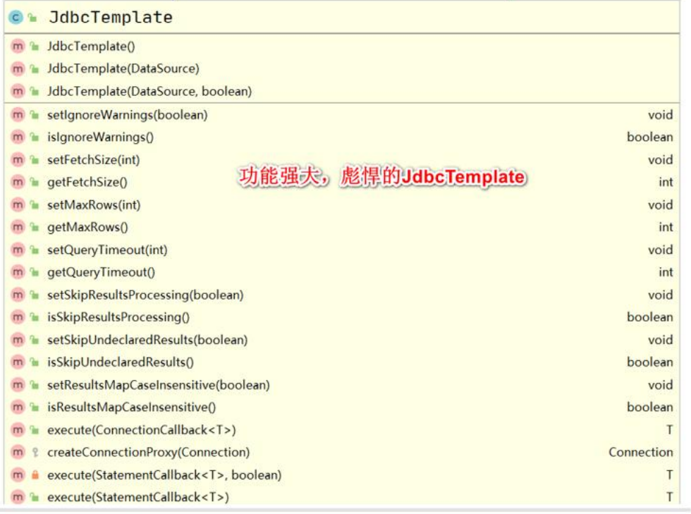

---
# 当前页面内容标题
title: JDBCTemplate

# 分类
category:
- 计算机
# 标签
tag:
- Spring

sticky: false
# 是否收藏在博客主题的文章列表中，当填入数字时，数字越大，排名越靠前。
star: false
# 是否将该文章添加至文章列表中
article: false
# 是否将该文章添加至时间线中
timeline: false

date: 2024-12-22

headerDepth: 2

---


## 1. 概念和准备 

### 1.1 实际需求

如果程序员就希望使用 spring 框架来做项目，spring 框架如何处理对数据库的操作呢?

1. 使用前面做项目开发的 JdbcUtils 类
2. 其实 spring 提供了一个操作数据库(表)功能强大的类JdbcTemplate 。我们可以同ioc 容器来配置一个 jdbcTemplate 对象，使用它来完成对数据库表的各种操作

### 1.2 基本介绍

通过 Spring 可以配置数据源，从而完成对数据表的操作

JdbcTemplate 是 Spring 提供的访问数据库的技术。可以将 JDBC 的常用操作封装为模板方法




### 1.3 准备工作

1. 引入相关jar包

 

2. 创建配置文件 src/jdbc.properties

```properties
jdbc.userName=root
jdbc.password=hsp
jdbc.driverClass=com.mysql.jdbc.Driver
jdbc.url=jdbc:mysql://localhost:3306/spring
```

3. 创建配置文件 src/JdbcTemplate_ioc.xml

```xml
<!-- 引入外部属性文件 -->
<context:property-placeholder location="classpath:jdbc.properties"/>
<!-- 配置数据源 -->
<bean id="dataSource" class="com.mchange.v2.c3p0.ComboPooledDataSource">
    <property name="user" value="${jdbc.userName}"></property>
	<property name="password" value="${jdbc.password}"></property>
	<property name="driverClass" value="${jdbc.driverClass}"></property>
	<property name="jdbcUrl" value="${jdbc.url}"></property>
</bean>
```

4. 测试是否可以正确得到数据源

```java
@Test
public void testDataSourceByJdbcTemplate() throws SQLException {
	ApplicationContext ioc = newClassPathXmlApplicationContext("JdbcTemplate_ioc.xml");
	DataSource dataSource = ioc.getBean(DataSource.class);
	Connection connection = dataSource.getConnection();
	System.out.println("connection= " + connection);
	connection.close();
	}
}
```

5. 配置 JdbcTemplate_ioc.xml

```xml
<!-- 配置 JdbcTemplate -->
<bean id="jdbcTemplate" class="org.springframework.jdbc.core.JdbcTemplate">
	<!-- 将上面的数据源分配给 jdbcTemplate -->
	<property name="dataSource" ref="dataSource"/>
</bean>
```


## 2. 添加数据

1. execute
2. update

```java
@Test
public void addDataByJdbcTemplate() {
	ApplicationContext ioc = newClassPathXmlApplicationContext("JdbcTemplate_ioc.xml");
	//得到 JdbcTemplate bean
	JdbcTemplate bean = ioc.getBean(JdbcTemplate.class);
    
	// 1. 添加方式 1
	String sql = "INSERT INTO monster VALUES(400, '红孩儿', '枪法厉害')";
	bean.execute(sql);
    
	//2. 添加方式 2, 绑定参数
	String sql = "INSERT INTO monster VALUES(?, ?, ?)";
	int affected = bean.update(sql, 700, "红孩儿 2", "枪法厉害2");
	System.out.println("add ok affected= " + affected);
}
```


## 3. 修改数据

```java
@Test
public void updateDataByJdbcTemplate() {
	ApplicationContext ioc = new ClassPathXmlApplicationContext("JdbcTemplate_ioc.xml");
	//得到 JdbcTemplate bean
	JdbcTemplate bean = ioc.getBean(JdbcTemplate.class);
    
	String sql = "UPDATE monster SET skill = ? WHERE id=?";
	int affected = bean.update(sql, "美女计", 300);
	System.out.println("affected= " + affected);
}
```

::: warning

修改不会判断进行判断，意味着就算修改后与原来数据一样，affected仍不为0

:::


##  4. 批量处理

```java
@Test
public void addBatchDataByJdbcTemplate() {
    ApplicationContext ioc = new ClassPathXmlApplicationContext("JdbcTemplate_ioc.xml");
    //得到JdbcTemplate bean
    JdbcTemplate jdbcTemplate = ioc.getBean(JdbcTemplate.class);//添加..

    //1. 先确定,猜测API名称 batchUpdate[如果出现问题，才重新玩]
    //public int[] batchUpdate(String sql, List<Object[]> batchArgs){}
    //2. 准备参数
    String sql = "INSERT INTO monster VALUES(?, ?, ?)";
    List<Object[]> batchArgs = new ArrayList<>();
    batchArgs.add(new Object[]{600, "老鼠精", "偷吃粮食"});
    batchArgs.add(new Object[]{700, "老猫精", "抓老鼠"});
    //3. 调用
    //说明：返回结果是一个数组，每个元素对应上面的sql语句对表的影响记录数
    int[] ints = jdbcTemplate.batchUpdate(sql, batchArgs);
    //输出
    for (int anInt : ints) {
        System.out.println("anInt=" + anInt);
    }
    System.out.println("batch add ok..");
}
```


## 5. 查询后封装成对象

```java
@Test
public void selectDataByJdbcTemplate() {
    ApplicationContext ioc = new ClassPathXmlApplicationContext("JdbcTemplate_ioc.xml");
    //得到JdbcTemplate bean
    JdbcTemplate jdbcTemplate = ioc.getBean(JdbcTemplate.class);
    //组织SQL
    //通过BeanPropertyRowMapper获取rowmapper 是一个接口，可以将查询的结果，封装到你指定的Monster对象中.

    //1. 确定API ： queryForObject()
    //public <T> T queryForObject(String sql, RowMapper<T> rowMapper, @Nullable Object... args)
    //2.准备参数
    String sql = "SELECT id AS monsterId, NAME, skill FROM monster WHERE id = 100";
    //使用RowMapper 接口来对返回的数据，进行一个封装-》底层使用的反射->setter
    //这里有一个细节: 你查询的记录的表的字段需要和 Monster的对象字段名保持一致
    RowMapper<Monster> rowMapper = new BeanPropertyRowMapper<>(Monster.class);
    //jdbcTemplate
    Monster monster = jdbcTemplate.queryForObject(sql, rowMapper);
    System.out.println("monster= " + monster);
    System.out.println("查询ok");
}
```


## 6.  查询后封装成对象集合

```java
@Test
public void selectMulDataByJdbcTemplate() {
    ApplicationContext ioc = new ClassPathXmlApplicationContext("JdbcTemplate_ioc.xml");
    //得到JdbcTemplate bean
    JdbcTemplate jdbcTemplate = ioc.getBean(JdbcTemplate.class);
    //组织SQL
    //通过BeanPropertyRowMapper获取rowmapper 是一个接口，可以将查询的结果，封装到你指定的Monster对象中.

    //1. 确定API
    //public <T> T query(String sql, RowMapper<T> rowMapper, Object... args){}
    //2. 组织参数
    String sql = "SELECT id AS monsterId, NAME, skill FROM monster WHERE id >= ?";
    RowMapper<Monster> rowMapper = new BeanPropertyRowMapper<>(Monster.class);
    //3. 调用
    List<Monster> monsterList = jdbcTemplate.query(sql, rowMapper, 100);
    for (Monster monster : monsterList) {
        System.out.println("monster= " + monster);
    }
}
```


## 7. 返回单行单列

```java
@Test
public void selectScalarByJdbcTemplate() {
    ApplicationContext ioc = new ClassPathXmlApplicationContext("JdbcTemplate_ioc.xml");
    //得到JdbcTemplate bean
    JdbcTemplate jdbcTemplate = ioc.getBean(JdbcTemplate.class);

    //1. 确定API
    //public <T> T queryForObject(String sql, Class<T> requiredType)
    //2. 提供参数
    String sql = "SELECT NAME FROM monster WHERE id = 100";
    //Class<T> requiredType 表示你返回的单行单列的数据类型

    String name = jdbcTemplate.queryForObject(sql, String.class);
    System.out.println("返回name= " + name);
}
```


## 8. 具名参数

```xml
<!-- 配置 NamedParameterJdbcTemplate,支持具名参数 -->
<bean id="namedParameterJdbcTemplate" class="org.springframework.jdbc.core.namedparam.NamedParameterJdbcTemplate">
    <!-- 这里需要使用构造器关联数据源 -->
	<constructor-arg name="dataSource" ref="dataSource"/>
</bean>
```

```java
 @Test
public void testDataByNamedParameterJdbcTemplate() {
    ApplicationContext ioc = new ClassPathXmlApplicationContext("JdbcTemplate_ioc.xml");
    //得到NamedParameterJdbcTemplate bean
    NamedParameterJdbcTemplate namedParameterJdbcTemplate = ioc.getBean(NamedParameterJdbcTemplate.class);

    //1. 确定使用API
    //public int update(String sql, Map<String, ?> paramMap)
    
    //2. 准备参数 [:my_id, :name, :skill] 要求按照规定的名字来设置参数
    String sql = "INSERT INTO monster VALUES(:id, :name, :skill)";
    Map<String, Object> paramMap = new HashMap<>();
    //给paramMap填写数据
    paramMap.put("id", 800);
    paramMap.put("name", "蚂蚁精");
    paramMap.put("skill", "喜欢打洞");
    
    //3. 调用
    int affected = namedParameterJdbcTemplate.update(sql, paramMap);
    System.out.println("add ok affected=" + affected);
}
```

- 这种方式与？？？的区别在于，这种方式在别人没有表的情况下，大概也能知道填什么参数


## 9. sqlparametersoruce

使用sqlparametersoruce 来封装具名参数

```java
@Test
public void operDataBySqlparametersoruce() {
    ApplicationContext ioc = new ClassPathXmlApplicationContext("JdbcTemplate_ioc.xml");
    //得到NamedParameterJdbcTemplate bean
    NamedParameterJdbcTemplate namedParameterJdbcTemplate = ioc.getBean(NamedParameterJdbcTemplate.class);

    //确定API
    //public int update(String sql, SqlParameterSource paramSource)
    //public BeanPropertySqlParameterSource(Object object)
    //准备参数
    String sql = "INSERT INTO monster VALUES(:monsterId, :name, :skill)";
    Monster monster = new Monster(900, "大象精", "搬运木头");
    SqlParameterSource sqlParameterSource = new BeanPropertySqlParameterSource(monster);
    //调用
    int affected = namedParameterJdbcTemplate.update(sql, sqlParameterSource);
    System.out.println("add ok affected= " + affected);
}
```


## 10. DAO使用JdbcTemplate

```xml
<!--配置要扫描包-->
<context:component-scan base-package="com.hspedu.spring.jdbctemplate.dao"/>
```

```java
@Repository //将MonsterDao 注入到spring容器
public class MonsterDao {

    //注入一个属性
    @Resource
    private JdbcTemplate jdbcTemplate;

    //完成保存任务
    public void save(Monster monster) {
        //组织sql
        String sql = "INSERT INTO monster VALUES(?,?,?)";
        int affected = jdbcTemplate.update (sql, monster.getMonsterId(), monster.getName(), monster.getSkill());
        System.out.println("affected= " + affected);
    }
}
```

```java
@Test
public void monsterDaoSave() {
    ApplicationContext ioc = new ClassPathXmlApplicationContext("JdbcTemplate_ioc.xml");

    MonsterDao monsterDao = ioc.getBean(MonsterDao.class);
    Monster monster = new Monster(1000, "小鸭精", "吃鱼");
    monsterDao.save(monster);
    System.out.println("MonsterDAO保存 ok ..");
}
```

