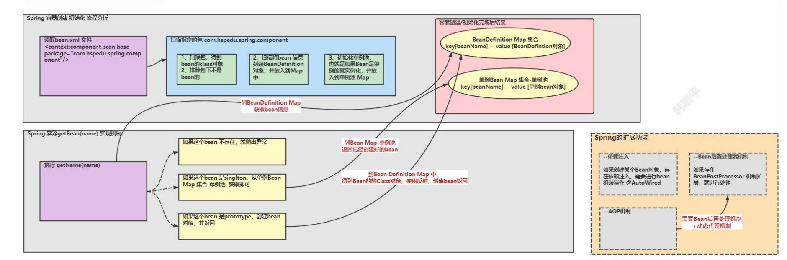

## 1. 基础

- `@Scope(value = "prototype")`：默认单例，加上后创建的是多例的对象
- `@PostConstruct`：通过注解指定在构造器完成后执行的方法，即完成初始化任务
- `@EnableAspectJAutoProxy`：AOP 实现 Spring 可以通过给加了这个注解的类

:::tip

1. AOP 底层是基于 BeanPostProcessor 机制的
2. 即在 Bean 创建好后，根据是否需要 AOP 处理，决定返回代理对象，还是原生Bean
3. 在返回代理对象时，就可以根据要代理的类和方法来返回
4. 其实这个机制并不难，本质就是在 BeanPostProcessor 机制+ 动态代理技术
5. 

:::

## 2. Spring 底层实现 AOP

### 2.1 整体架构分析

