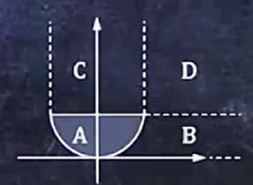
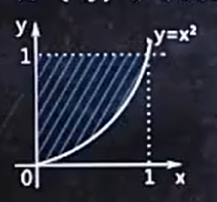
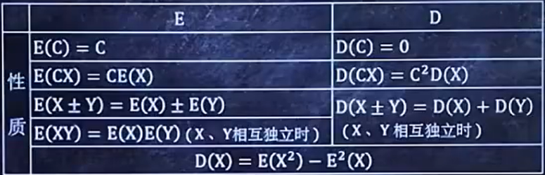
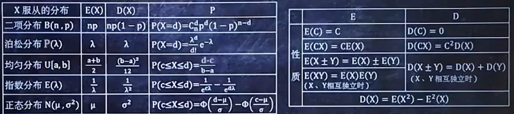
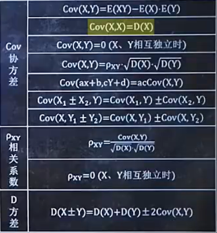

---
# 当前页面内容标题
title: 概率论
# 当前页面图标
icon: "/icon/gll.svg"

# 分类
category:
  - 数学
# 标签
tag:
  - 概率论
sticky: false
# 是否收藏在博客主题的文章列表中,  当填入数字时,  数字越大,  排名越靠前。
star: false
# 是否将该文章添加至文章列表中
article: false
# 是否将该文章添加至时间线中
timeline: false
# 是否原创
isOriginal: true

date: 2024-10-25
---

## 1. 事件的概率

### 基础公式

::: tip 思路
$\Large C_n^m = \frac{n!}{m! \cdot (n - m)!}$  
$\Large 0!= 1$
:::

### 无放回类题目

::: info 例题 1
隔壁山头共有 11 只母猴儿, 其中有 5 只美猴儿、6 只丑猴儿, 在大黑天看起来是一样的。今儿月黑风高, 我小弟冒死为我掳来 5 只, 问天亮后, 发现有 2 只美猴儿、3 只丑猴儿的概率是多少?
:::

::: tip 思路
$\huge P = \frac{C_{\text{条件一总}}^{{\text{条件一取}}} \times C_{\text{条件二总}}^{{\text{条件二取}}} \times \cdots \times C_{\text{条件N总}}^{{\text{条件N取}}}} { C_{\text{总}}^{{\text{取}}}}$
:::

> $\Large P = \frac{C_5^2 \times C_6^3}{C_{11}^5}$

### 有放回类题目

::: info 例题 2
在小弟为我抓回的 5 只母猴儿中, 有 2 美 3 丑, 每天我都随机挑一只母猴儿来, 为她抓虱子就这样, 过去了 101 天, 抓了 101 次虱子, 问这 101 次中, 为美猴儿服务 50 次、丑猴儿服务 51 次的概率是多少?
:::

::: tip 思路

1. K 种颜色的球, 代号分别为 A~1~、A ~2~… A~k~

2. 抽一次, 出现的概率分别为 P~1~、P~2~…P~k~

3. 抽一次, 出现的概率分别为 P~1~、P~2~…P~k~

4. $\Large P = \frac{(n_1 + n_2 + \cdots + n_k)!}{n_1! \,   n_2! \,   \cdots \,   n_k!} P_1^{n_1} P_2^{n_2} \cdots P_k^{n_k}$
   :::

> 1. 两种母猴儿, 代号分别为 美、丑
>
> 2. 选一只, 出现概率分别为 $\large \frac{2}{5}$、$\large \frac{3}{5}$
>
> 3. 求为两种种服务次数分别为 50、51
>
> 4. P = $\large \frac{(50 + 51)!}{50! \,   51!} \left(\frac{2}{5}\right)^{50} \left(\frac{3}{5}\right)^{51}$

### 图形类题目

::: info 例题 3
已知小明会在 0 点之后 1 点之前到教室, 小刚也是, 问小明比小刚晚到的概率是多少?  
设小明到教室时间为 x, 小刚为 y  
就能转化为  
已知 0<x<1, 0<y<1, 求 x>y 的概率是多少?  
已知-1<x<1, -1<y<1, 求 x2+y2<1 的概率是多少?
:::

::: tip 思路

1. 表现已知条件
2. 表现待求概率的条件
3. 找出 1, 2 重合的部分
4. 概率为 $\large p=\frac{\text{步}3}{\text{步}1}$
   :::

::: left
&nbsp;
:::

> S 圆 = π × 1^2^ = π  
> S 正 = 2^2^ = 4  
> $\large p=\frac{π}{4}$

### 条件概率

::: info 例题 4
某地区今年会发生洪水的概率是 80%, 今明两年至少有一年会发生洪水的概率是 85%, 假如今年没有发生洪水, 那么明年发生洪水的概率是多少?
:::

::: tip 思路
$\huge P(B|A) = \frac{P(AB)}{P(A)}$
:::

> 设事件 A：今年没有发生洪水,
>
> 事件 B：明年发生洪水  
> P(B|A)：今年没有发生洪水的情况下, 明年发洪水的概率  
> P(AB)：今年没发洪水, 但明年发了的概率  
> P(A)：今年没发洪水
>
> > - 今年发, 明年发
> > - 今年发, 明年不发
> > - 今年不发, 明年发
> > - 今年不发, 明年不发
>
> 前两条概率：80%；前三条概率：85%
>
> 因此 P(AB)今年不发, 明年发概率：5%
>
> $P(B|A)=\frac{1}{4}$

### 全概率公式

::: info 例题 5
又到了交配的季节, 主人过两天就拉你去隔壁村找母驴配种, 隔壁村有三头母驴, 分别是白驴、黑驴和棕驴。她仨得你宠幸的概率分别是 50%、20%、30%。小白屁股大能生, 她能怀上你孩子的概率是 80%。小黑太瘦小, 能怀孕的概率是 20%。小棕中规中矩, 能下惠的概率是 50%。那么你能喜当爹的概率是多少?
:::

::: tip 思路
A、B…等个体均可能发生某事  
$\large P(\text{发生某事}) = P(A\text{出现}) \cdot P(A\text{发生某事}) + P(B\text{出现}) \cdot P(B\text{发生某事}) \cdots$
:::

> P = 50% × 80% + 20% × 20% + 30% × 50%

### 贝叶斯公式

::: info 例题 6
猴博士公司有猴博士与傻狍子两个员工, 老板要抽其中一个考核, 抽中猴博士与傻狍子的概率都是 50%, 猴博士考核通过的概率是 100%, 傻狍子考核通过的概率是 1%, 求抽中的员工通过考核时, 被抽中的员工是傻狍子的概率。
:::

::: tip 思路
A、B…等个体均可能发生某事  
$\large P(\text{已知有个体发生某事时,  是A发生的}) = \frac{P(A\text{出现}) \cdot P(A\text{发生某事})}{P(\text{发生某事})}$
:::

> $\large P(\text{已知有员工通过考核,  是傻狍子通过的}) = \frac{P(A\text{傻狍子出现}) \cdot P(A\text{傻狍子通过})}{P(\text{抽中的员工通过考核})}$  
> P(抽中的员工通过考核) = 全概率求得

## 2. 一维随机变量

### 已知 Fx()与 fx()中的一项, 求另一项

::: info 例题 1
设 X 的分布函数$F_X(x) = \begin{cases}
0,   & x < 1 \\
\ln x,   & 1 \leq x < e \\
1,   & x \geq e
\end{cases}$, 求 X 的密度函数$f_X(x)$
:::

::: info 例题 2
设 X 的密度函数$f_X(x) = \begin{cases}
-\frac{1}{2}x + 1,   & 0 \leq x \leq 2 \\
0,   & \text{其他}
\end{cases}$, 求 X 的分布函数$F_X(x)$。
:::

::: tip 思路
$\large f_X(x) = F_X'(x)$  
$\large F_X(x) = \int_{-\infty}^{x} f_X(x) \,   dx$
:::

> $f_X(x) = F_X'(x) = \begin{cases}
> 0',   & x < 1 \\
> (\ln x)',   & 1 \leq x < e \\
> 1',   & x \geq e
> \end{cases} = \begin{cases}
> 0,   & x < 1 \\
> \frac{1}{x},   & 1 \leq x < e \\
> 0,   & x \geq e
> \end{cases} = \begin{cases}
> \frac{1}{x},   & 1 \leq x < e \\
> 0,   & \text{其他}
> \end{cases}$

 
 

> 转化为设 X 的密度函数$f_X(x) = \begin{cases}
> 0,   & x < 0 \\
> -\frac{1}{2}x + 1,   & 0 \leq x \leq 2 \\
> 0,   & x > 2  
> \end{cases}$, 求 X 的分布函数$F_X(x)$。  
>  
> x > 2 时,   
>  
> $\large F_X(x) = \int_{-\infty}^{x} f_X(x) \,   dx$  
>   $\large =\int_{-\infty}^{0} f_X(x) \,   dx + \int_{0}^{2} f_X(x) \,   dx + \int_{2}^{x} f_X(x) \,   dx$  
>   $\large =\int_{-\infty}^{0} 0 \,   dx + \int_{0}^{2} \left(-\frac{1}{2}x + 1\right) \,   dx + \int_{2}^{x} 0 \,   dx$  
>   $\large = 0 + 1 + 0$  
>  
> 另外两个范围类似  
> 解得答案 $F_X(x) = \begin{cases}
> 0,   & x < 0 \\
> -\frac{x^2}{4} + x,   & 0 \leq x \leq 2 \\
> 1,   & x > 2
> \end{cases}$

### 已知 F()与 f()中的一种, 求 P

::: info 例题 3
设 X 的分布函数$F_X(x) = \begin{cases}
0,   & x < 1 \\
\ln x,   & 1 \leq x < e \\
1,   & x \geq e
\end{cases}$, 求概率$P(x^2 < 4)$。
:::

::: info 例题 4
设 X 的密度函数$f_X(x) = \begin{cases}
-\frac{1}{2}x + 1,   & 0 \leq x \leq 2 \\
0,   & \text{其他}
\end{cases}$, 求概率$P(-1 < x < 2)$。
:::

::: tip 思路
取值范围无论大于等于小于等于都成立  
$\large P(a < X < b) = F_X(b) - F_X(a) = \int_a^b f_X(x) \,   dx$
:::

> $P(x^2 < 4) = P(-2 < x < 2) = F_X(2) - F_X(-2) = ln2$

> $P(-1 < x < 2) = \int_{-1}^{2} f_X(x) \,   dx = \int_{-1}^{0} f_X(x) \,   dx + \int_{0}^{2} f_X(x) \,   dx = 0 + 1 =1$

### Fx(x)或 fx(x)含未知数, 求未知数

::: info 例题 5
设 X 的分布函数$F_X(x) = \begin{cases} 0,   & x \leq 0 \\ a + be^{-\lambda x},   & x > 0 \end{cases} (\lambda > 0)$, 求 a 和 b
:::

::: info 例题 6
设 X 的密度函数$f_X(x) = \begin{cases} ax+1,   & 0 \leq x \leq 2 \\ 0,   & \text{其他} \end{cases}$, 求常数$a$
:::

::: tip 思路
对 Fx(x)要满足：$F_X(-\infty) = 0 \quad F_X(+\infty) = 1 \quad F_{\text{上}}(\text{分段点}) = F_{\text{下}}(\text{分段点})$  
对 fx(x)要满足：$\int_{-\infty}^{+\infty} f_X(x) \,   dx = 1$
:::

> $F_X(+\infty) = 1$ 则 $\Large a + be^{-\lambda(+ \infty)} = 1$
>
> $\Large a + be^{-\infty} = 1$ > $\Large a + \frac{b}{e^{+\infty}} = 1$  
> $\large a = 1$  
>   $F_{\text{上}}(0) = F_{\text{下}}(0)$则 $0 = a + be^{-\lambda(0)}$  
>   $0 = a + be^{0}$  
> $a + b = 0$  
> $b = -1$

 
 

> $\large \int_{-\infty}^{+\infty} f_X(x) \,   dx = 1$  
>   $\large \int_{-\infty}^{0} f_X(x) \,   dx + \int_{0}^{2} f_X(x) \,   dx + \int_{2}^{+\infty} f_X(x) \,   dx = 1$  
>   $\large  a = -\frac{1}{2}$

### 分布律

::: info 例题 7
从编号为 1、2、3、4、5、6 的 6 只球中任取 3 只, 用 X 表示从中取出的最大号码, 求其分布律
:::

> 1. 列出 x 可能取值 3, 4, 5, 6
> 2. 求 P(x=3), P(x=4), P(x=5), P(x=6)
>
>    示范一个：$\Large P(x=4) = \frac{C_3^2 C_1^1 C_2^0}{C_6^3} = \frac{3}{20}$
>
> 3. |  x  |           3           |           4           |           5           |          6           |
>    | :-: | :-------------------: | :-------------------: | :-------------------: | :------------------: |
>    |  P  | $\large \frac{1}{20}$ | $\large \frac{3}{20}$ | $\large \frac{3}{20}$ | $\large \frac{1}{2}$ |

### 已知含有未知数分布列, 求未知数

::: info 例题 8
已知分布列如下, 求 k  
| x | 3 | 4 | 5 | 6 |
| :-: | :-------------------: | :-------------------: | :-------------------: | :-: |
| P | $\large \frac{1}{20}$ | $\large \frac{3}{20}$ | $\large \frac{3}{20}$ | k |
:::

::: tip 思路
P 相加 = 1
:::

## 3. 一维随机变量函数

### 已知 X 分布列, 求 Y 分布列

::: info 例题 1
已知 X 的分布列为$
\begin{array}{c|ccc}
X & -2 & 0 & 2 \\
\hline
P & 0.4 & 0.3 & 0.3 \\
\end{array}$ , 求 $Y = X^2 + 1$的分布列

:::

::: tip 思路

1.&nbsp;&nbsp;根据 X 的所有取值, 计算 Y 的所有取值  
2.&nbsp;&nbsp;将表格里 X 那一列对应换成 Y
:::

> $Y = (-2)^2 + 1 = 5$ &nbsp;&nbsp;&nbsp;&nbsp;  
> $Y = 0^2 + 1 = 1$ &nbsp;&nbsp;&nbsp;&nbsp;  
> $Y = 2^2 + 1 = 5$ >     $
\begin{array}{c|ccc}
Y & 5 & 1 & 5 \\
\hline
P & 0.4 & 0.3 & 0.3 \\
\end{array}$ $\quad \longrightarrow \quad$ $\begin{array}{c|cc}
Y & 1 & 5 \\
\hline
P & 0.3 & 0.7 \\
\end{array}
$

**两种表现形式**

1.$
\begin{array}{c|cccc}
Y & 5 & 7 & 9 & 11 \\
\hline
P & \frac{1}{20} & \frac{3}{20} & \frac{3}{10} & \frac{1}{2} \\
\end{array}$

2.$Y \sim \left( \begin{array}{cccc}
5 & 7 & 9 & 11 \\
\frac{1}{20} & \frac{3}{20} & \frac{3}{10} & \frac{1}{2} \\
\end{array} \right)$

 
 
 

### 已知 F~X~(x), 求 F~Y~(y)

::: info 例题 2
$\text{设} X \text{的分布函数为} F_X(x) = \begin{cases}
0,   & x \leq 0 \\
x^2,   & 0 < x < 1 \\
1,   & x \geq 1
\end{cases},   \text{求} Y = 2X \text{的分布函数。}$
:::

::: tip 思路
1.&nbsp;&nbsp;X = ?Y  
2.&nbsp;&nbsp;?Y 替换 $F_X(x)$ 的 x, 结果为 $F_X(?y)$  
3.&nbsp;&nbsp;判断 ?y 是否负数  
 &nbsp;&nbsp;&nbsp;&nbsp;&nbsp;正数: $F_Y(y) = F_X(?y)$  
&nbsp;&nbsp;&nbsp;&nbsp;&nbsp;负数: $F_Y(y) = 1 - F_X(?y)$  
:::

> $Y = 2X$ &nbsp; &nbsp;&nbsp;$X = \frac{Y}{2}$  
>   $F_X\left(\frac{Y}{2}\right) = \begin{cases}
0,   & \frac{Y}{2} \leq 0 \\
\left(\frac{Y}{2}\right)^2,   & 0 < \frac{Y}{2} < 1 \\
1,   & \frac{Y}{2} \geq 1
\end{cases}$ >     $F_Y(y) = F_X\left(\frac{y}{2}\right) = \begin{cases}
0,   & y \leq 0 \\
\frac{y^2}{4},   & 0 < y < 2 \\
1,   & y \geq 2
\end{cases}$

 
 
 

### 已知 f~X~(x), 求 f~Y~(y)

::: info 例题 3
$\text{设} X \text{的密度函数为} f_X(x) = \begin{cases}
1,   & 0 < x < 1 \\
0,   & \text{其他}
\end{cases},   \text{求} Y = 2X \text{的密度函数。}$
:::

::: tip 思路
1.&nbsp;&nbsp;X = ?Y  
2.&nbsp;&nbsp;?Y 替换 $f_X(x)$ 的 x, 结果为 $f_X(?y)$  
3.&nbsp;&nbsp;$f_Y = \left(?y\right)' \cdot f_X\left(?y\right)$  
4.&nbsp;&nbsp;判断 ?y 是否负数  
&nbsp;&nbsp;&nbsp;&nbsp;&nbsp;正数: $f_Y(y) = f_Y$  
&nbsp;&nbsp;&nbsp;&nbsp;&nbsp;负数: $f_Y(y) = -f_Y$  
:::

> $Y = 2X$ &nbsp; &nbsp;&nbsp;$X = \frac{Y}{2}$  
>   $f_X\left(\frac{y}{2}\right) = \begin{cases}
1,   & 0 < y < 2 \\
0,   & \text{其他}
\end{cases}$ >   $f_Y = \left(\frac{y}{2}\right)' \cdot f_X\left(\frac{y}{2}\right) = \frac{1}{2} \cdot f_X\left(\frac{y}{2}\right) = \begin{cases}
\frac{1}{2},   & 0 < y < 2 \\
0,   & \text{其他}
\end{cases}$ >   $f_Y(y) = f_Y = \begin{cases}
\frac{1}{2},   & 0 < y < 2 \\
0,   & \text{其他}
\end{cases}$

 
 
 

## 4. 五种常见分布

### 均匀分布 U[a, b]

::: info 例题 1
设 X 在[2, 5]上服从均匀分布, 求 X 的取值大于 3 的概率
:::

::: tip 思路
1.&nbsp;&nbsp;$\large P = \frac{\text{满足要求长度}}{\text{总长度}}$  
:::

::: left
&nbsp;
:::

> 总长度 : 3  
> 大于 3 的长度 : 2  
> $P_{(\text{X的取值大于}3)} = \frac{2}{3}$

 
 
 

### 泊松分布 P[λ]

::: info 例题 2
某电话交换台每分钟接到的呼叫数服从参数为 5 的泊松分布, 求在一分钟内呼叫次数为 2 次的概率
:::

::: tip 思路
x~B[n, p] , 柏松定理得 λ= np

x~P[λ] λ>0

$\Large P(X = x) = \frac{\lambda^x e^{-\lambda}}{x!}$ x=0, 1, 2.........

$f(x) = \begin{cases}
\frac{1}{b-a},   &  a < x < b \\
0,   & \text{其他}
\end{cases}$

X~ U[a, bJ 且 [c, d] ⊂ [a, b]

P{ c ≤ x ≤ d } = $\int_{c}^{d} \frac{1}{b-a} dt = \frac{d-c}{b-a}$
:::

> X 表示一分钟接到呼叫的次数  
>   $\large P(X = 2) = \frac{5^2}{2!} e^{-5} = 0.0842$

 
 
 

### 二项分布 B[n, p]

::: info 例题 3
重复投 5 次硬币, 求正面朝上次数为 3 次的概率
:::

::: tip 思路
$\Large P(X = x) = C_n^x p^x (1 - p)^{n - x}$
:::

> $\large P(x = 3) = C_5^3 \left(\frac{1}{2}\right)^3 \left(1 - \frac{1}{2}\right)^{5 - 3} = \frac{5}{16}$

 
 
 

### 指数分布 E(λ)

::: info 例题 4
某种电子元件的使用寿命 X (单位:小时) 服从 $λ = \frac{1}{2000}$ 的指数分布,  
求 : (1)一个元件能正常使用 1000 小时以上的概率  
&nbsp;&nbsp;&nbsp;&nbsp;&nbsp; (2)一个元件能正常使用 1000 小时到 2000 小时之间的概率
:::

::: tip 思路
$f(x) = \begin{cases}
\lambda e^{-\lambda x},   & x > 0 \\
0,   & x \leq 0
\end{cases}$ &nbsp;&nbsp;&nbsp;&nbsp;&nbsp;&nbsp; $\begin{cases}
P(a_1 < X < a_2) = \int_{a_1}^{a_2} f(x) \,   dx \\
P(X < a) = \int_{-\infty}^{a} f(x) \,   dx \\
P(X > a) = \int_{a}^{+\infty} f(x) \,   dx
\end{cases}$
:::

> X 的密度函数为 $\large f(x) = \begin{cases}
\frac{1}{2000} e^{-\frac{x}{2000}},   & x > 0 \\
0,   & x \leq 0
\end{cases}$  
>   $\large P(X > 1000) = \int_{1000}^{+\infty} f(x) \,   dx = \int_{1000}^{+\infty} \frac{1}{2000} e^{-\frac{x}{2000}} \,   dx = e^{-0.5}$  
>   $\large P(1000 < X < 2000) = \int_{1000}^{2000} f(x) \,   dx = \int_{1000}^{2000} \frac{1}{2000} e^{-\frac{x}{2000}} \,   dx = -e^{-1} + e^{-0.5}$

 
 
 

### 正态分布 N(μ, σ^2^)

::: info 例题 5
设随机变量 X 服从正态分布 N(1.5, 4) , 求：  
(1) P(1.5 < X < 3.5)；  
(2) P(X < 3.5)。  
其中: $\phi(0) = 0.5,   \quad \phi(0.75) = 0.7734,   \quad \phi(1) = 0.8413,   \quad \phi(2.25) = 0.9878$
:::

::: tip 思路
$\large \left\{
\begin{array}{l}
P(a < X < b) = \phi\left(\frac{b - \mu}{\sigma}\right) - \phi\left(\frac{a - \mu}{\sigma}\right) \\
P(X < a) = \phi\left(\frac{a - \mu}{\sigma}\right) \\
P(X > b) = 1 - \phi\left(\frac{b - \mu}{\sigma}\right)
\end{array}
\right.$

 
标准正态分布 N(0,  1)

在正态分布中, Φ(x) = 1 - Φ(-x)
:::

> (1) $\large P(1.5 < X < 3.5) = \phi\left(\frac{3.5 - 1.5}{2}\right) - \phi\left(\frac{1.5 - 1.5}{2}\right) = \phi(1) - \phi(0) = 0.3413$  
>  
> (2) $\large P(X < 3.5) = \phi\left(\frac{3.5 - 1.5}{2}\right) = \phi(1) = 0.8413$

**注意事项** 

1. 图像关于 μ 对称
2. 面积表示概率, 总面积为 1
3. σ 越小, 图像越陡

 
 
 

## 5. 离散型二维变量与连续性二维变量

### 已知二维离散型分布律

::: info 例题 1
已知二维随机变量 X, Y 的分布律如下表, 求:  
 
$\begin{array}{c|ccc}
X \backslash Y & 1 & 2 & 3 \\
\hline
0 & 0.2 & 0.1 & 0.1 \\
1 & 0.3 & 0.2 & 0.1 \\
\end{array}$  
 
(1)P(X=0), P(Y=2)

(2)P(X<1, Y≤2)

(3)P(X+Y=2)

(4)X, Y 的(边缘)分布律

(5)Z=X+Y 的分布律

(6)求在 X =1 的条件下, 关于 Y 的条件分布律

(7)设 Z=max{X, Y}, 求 Z 的分布律
:::

::: tip
条件分布 $P(Y=y \mid X=x)$ 定义为:
$\large P(Y=y \mid X=x) = \frac{P(X=x,   Y=y)}{P(X=x)}$
:::

> (1) P(X=0)=0.2+0.1+0.1=0.4  
>  &nbsp;&nbsp;&nbsp;&nbsp;&nbsp;P(Y=2)=0.1+0.2=0.3  
> (2) P(X<1, Y≤2)=0.2+0.1=0.3  
> (3) P(X+Y=2)=0.1+0.3=0.4  
>  
> (4) $\begin{array}{c|cc}
X & 0 & 1 \\
\hline
P & 0.4 & 0.6 \\
\end{array}$ &nbsp;&nbsp;&nbsp;&nbsp;&nbsp;&nbsp;&nbsp;&nbsp;&nbsp;$\begin{array}{c|ccc}
Y & 1 & 2 & 3 \\
\hline
P & 0.5 & 0.3 & 0.2 \\
\end{array}$    
> (5) P(Z = 1) &= P(X = 0, Y = 1) = 0.2  
> &nbsp;&nbsp;&nbsp;&nbsp;&nbsp;P(Z = 2)  = P(X = 0, Y = 2) + P(X = 1, Y = 1) = 0.1 + 0.3 = 0.4  
> &nbsp;&nbsp;&nbsp;&nbsp;&nbsp;P(Z = 3)  = P(X = 0, Y = 3) + P(X = 1, Y = 2) = 0.1 + 0.2 = 0.3  
> &nbsp;&nbsp;&nbsp;&nbsp;&nbsp;P(Z = 4)  = P(X = 1, Y = 3) = 0.1  
>   &nbsp;&nbsp;&nbsp;&nbsp;$\begin{array}{c|cccc}
Z & 1 & 2 & 3 & 4 \\
\hline
P & 0.2 & 0.4 & 0.3 & 0.1 \\
\end{array}$  
>  
> (6) $\begin{array}{c|ccc}
Y & 1 & 2 & 3 \\
\hline
P & \frac {1}{2} & \frac {1}{2} & \frac {1}{6} \\
\end{array}$  
>  
> (7) $\begin{array}{c|ccc}
Z=max{X,  Y} & 1 & 2 & 3 \\
\hline
P & 0.5 & 0.3 & 0.2 \\
\end{array}$

### 已知二维离散型分布律, 判断独立性

::: info 例题 2
已知二维随机变量 X, Y 的分布律如下表,  
 
$\begin{array}{c|ccc}
X \backslash Y & 1 & 2 & 3 \\
\hline
0 & 0.2 & 0.1 & 0.1 \\
1 & 0.3 & 0.2 & 0.1 \\
\end{array}$  
 
判断其独立性
:::

::: tip 思路
如果任意 x, y; 均满足 P(X=x, Y=y¡)=P(X=x¡)·P(Y=y)  
那么 X、Y 相互独立  
否则 X、Y 不相互独立  
:::

> P(X=0, Y=3) = 0.1  
> P=(X=0) · P(Y=3) = 0.4 × 0.2 = 0.08  
> XY 不相互独立

### 已知 F(x, y) 求 f(x, y)

::: info 例题 3
已知二维随机变量的联合分布函数
$\large F(x,   y) = \begin{cases}
\frac{1}{2} x^2 y + \frac{1}{2} xy^2 & 0 < x < 1,   0 < y < 1 \\
\frac{1}{2} y + \frac{1}{2} y^2 & x \geq 1,   0 < y < 1 \\
\frac{1}{2} x^2 + \frac{1}{2} x & 0 < x < 1,   y \geq 1 \\
1 & x \geq 1,   y \geq 1 \\
0 & \text{其他}
\end{cases}$ , 求 f(x, y)
:::

::: tip 思路
$\Large f(x,   y) = \frac{\partial^2 F(x,   y)}{\partial x \partial y}$
:::

> 1.&nbsp;&nbsp;&nbsp;$
\text{当 } 0 < x < 1 \text{ 且 } 0 < y < 1 \text{ 时,  } 
f(x,   y) = \frac{\partial^2 \left( \frac{1}{2} x^2 y + \frac{1}{2} xy^2 \right)}{\partial x \partial y}  
= \frac{\partial \left[ \frac{\partial \left( \frac{1}{2} x^2 y + \frac{1}{2} xy^2 \right)}{\partial x}  \right] }{\partial y} 
= \frac{\partial \left( xy + \frac{1}{2} y^2 \right) }{\partial y} 
= x + y$  
>   2.$
\text{当 } x \geq 1 \text{ 且 } 0 < y < 1 \text{ 时,  } 
f(x,   y) = \frac{\partial^2 \left( \frac{1}{2} y + \frac{1}{2} y^2 \right) }{\partial x \partial y} 
= \frac{\partial \left[ \frac{\partial \left( \frac{1}{2} y + \frac{1}{2} y^2 \right)}{\partial x}  \right] }{\partial y} 
= \frac{\partial (0)}{\partial y}  
= 0
$ >     3.$
\text{当 } 0 < x < 1 \text{ 且 } y \geq 1 \text{ 时,  } 
f(x,   y) = \frac{\partial^2 \left( \frac{1}{2} x^2 + \frac{1}{2} x \right) }{\partial x \partial y} 
= \frac{\partial \left[ \frac{\partial \left( \frac{1}{2} x^2 + \frac{1}{2} x \right)}{\partial x}  \right]}{\partial y}  
= \frac{\partial \left( x + \frac{1}{2} \right) }{\partial y} 
= 0
$ >    
> 4.$
\text{当 } x \geq 1 \text{ 且 } y \geq 1 \text{ 时,  } 
f(x,   y) = \frac{\partial^2 (1) }{\partial x \partial y} 
= \frac{\partial \left[ \frac{\partial (1)}{\partial x}  \right] }{\partial y} 
= \frac{\partial (0)}{\partial y}  
= 0
$ >     5.$
\text{当 } x,   y \text{ 属于其他情况时,  } 
f(x,   y) = \frac{\partial^2 (0) }{\partial x \partial y} 
= \frac{\partial \left[ \frac{\partial (0)}{\partial x}  \right] }{\partial y} 
= \frac{\partial(0)}{\partial y}  
= 0
$ >    
> 综上所述:
> $f(x,   y) = \begin{cases}
x + y & 0 < x < 1,   0 < y < 1 \\
0 & \text{其他}
\end{cases}$

 

### 已知 f(x, y) 求 F(x, y)

::: info 例题 4
已知二维随机变量的联合密度函数
$f(x,   y) = \begin{cases}
\frac{21}{4} x^2 y,   & x^2 \leq y \leq 1 \\
0 & \text{其他}
\end{cases}$ &nbsp;&nbsp; 求: f(x, y)
:::

::: tip 思路

1. 找出 f(x, y)不等于零时 x 的范围和 y 的范围  
    
2. $\text{计算 } \int_{g_1(y)}^x du \int_{h_1(u)}^y f(u,   v) dv$ 结果记为 a

- g~1~(y)为 x 的左边界
- h~1~(u)为将 y 的下边界中的 x 替换为 u 后的式子
- f(u, v)为将 f(x, y)中的 x 替换为 u、y 替换为 v 后的式子

3. $\text{将 } x = g_2(y),    y = h_2(x)$ 分别代入 a 中 结果依次记为 b c

- g~2~(y)为 x 的右边界
- h~2~(x)为 y 的上边界

4. 画出 f(x, y)不等于零的区域, 记为区域 A

- A 右侧的区域记为 B
- A 上侧的区域记为 C
- A 右上方的区域记为 D  
  $F(x,   y) =
  \begin{cases}
  a,   & \text{  A 区域} \\
  b,   & \text{  B 区域} \\
  c,   & \text{  C 区域} \\
  1,     &  \text{    D 区域} \\
  0,    & \text{其他情况}
  \end{cases}$
  :::

> 1. x 的范围: $x^2 \leq y \Rightarrow -\sqrt{y} \leq x \leq \sqrt{y}$
>
>    y 的范围: $x^2 \leq y \leq 1$
>
> 2. $g_1(y) = -\sqrt{y},   \quad h_1(u) = u^2,   \quad f(u,   v) = \frac{21}{4} u^2 v$
>
>    ① $= \int_{-\sqrt{y}}^x du \int_{u^2}^y \frac{21}{4} u^2 dv = \frac{7}{8} x^3 y^2 - \frac{3}{8} x^7 + \frac{1}{2} y^{\frac{7}{2}}$
>
> 3. $g_2(y) = \sqrt{y}$ , 将 $x = \sqrt{y}$ 带入 ①
>
>    ② $= y^\frac{7}{2}$
>
>    h~2~(x)=1 , 将 y=1 带入 ①
>
>    ③ $= \frac{7}{8} x^3 - \frac{3}{8} x^7 + \frac{1}{2}$

::: left
&nbsp;
:::

> $
\text{A 区域:} \quad x^2 \leq y \leq 1 \\
\text{B 区域:} \quad x > \sqrt{y},   \quad 0 \leq y \leq 1 \\
\text{C 区域:} \quad -1 \leq x \leq 1,   \quad y > 1 \\
\text{D 区域:} \quad x > 1,   \quad y > 1
$  
>   $F(x,   y) =
\begin{cases}
\frac{7}{8}x^3y^2 - \frac{3}{8}x^7 + \frac{1}{2}y^{\frac{7}{2}},   & \text{如果 } x^2 \leq y \leq 1 \\
y^{\frac{7}{2}},   & \text{如果 } x > \sqrt{y},   \ 0 \leq y \leq 1 \\
\frac{7}{8}x^3 - \frac{3}{8}x^7 + \frac{1}{2},   & \text{如果 } -1 \leq x \leq 1,   \ y > 1 \\
1,   & \text{如果 } x > 1,   \ y > 1 \\
0,   & \text{其他}
\end{cases}$

### 已知 F(x, y) 求 P

::: info 例题 5
已知二维随机变量的联合分布函数
$F(x,   y) =
\begin{cases}
\frac{1}{2}x^2y + \frac{1}{2}xy^2,   & \text{如果 } 0 < x < 1,   \ 0 < y < 1 \\
\frac{1}{2}y + \frac{1}{2}y^2,   & \text{如果 } x \geq 1,   \ 0 < y < 1 \\
\frac{1}{2}x^2 + \frac{1}{2}x,   & \text{如果 } 0 < x < 1,   \ y \geq 1 \\
1,   & \text{如果 } x \geq 1,   \ y \geq 1 \\
0,   & \text{其他}
\end{cases}$  
求 $P\left(X \leq \frac{1}{2},   Y > \frac{1}{2}\right)$
:::

::: tip 思路
$P(X \leq x_0,   Y \leq y_0) = F(x_0,   y_0)$
:::

> $P\left(X \leq \frac{1}{2}\right) = P\left(X \leq \frac{1}{2},   Y > \frac{1}{2}\right) + P\left(X \leq \frac{1}{2},   Y \leq \frac{1}{2}\right)$  
>   $P\left(X \leq \frac{1}{2},   Y > \frac{1}{2}\right) = P\left(X \leq \frac{1}{2}\right) - P\left(X \leq \frac{1}{2},   Y \leq \frac{1}{2}\right)$  
>  $= P\left(X \leq \frac{1}{2},   Y \leq +\infty\right) - P\left(X \leq \frac{1}{2},   Y \leq \frac{1}{2}\right)$  
>   $= F\left(\frac{1}{2},   +\infty\right) - F\left(\frac{1}{2},   \frac{1}{2}\right)$  
>   $= \frac{3}{8} - \frac{1}{8} = \frac{1}{4}$

 

### 已知 f(x, y) 求 P

::: info 例题 6
已知二维随机变量的联合密度函数
$f(x,   y) =
\begin{cases}
1,   & \text{如果 } 0 < x < 1,   \ 0 < y < 1 \\
0,   & \text{其他}
\end{cases}$
:::

::: tip 思路

1. 找出 f(x, y)不等于零时 x 的范围和 y 的范围
2. 找出要求概率的范围, 添到上一步的范围里 (要保证至少有一个未知数的上下限都是纯数字)
3. 如果 x 的上下限都是纯数字
   $P = \int_{a}^{b} \int_{c}^{d} f(x,   y) \,   dy \,   dx$
4. 如果 x 的上下限都是纯数字
   $P = \int_{c}^{d} \int_{a}^{b} f(x,   y) \,   dx \,   dy$
   :::

> x 的范围:0<x<1  
> y 的范围:0<y<1  
> $\text{x 的范围：} \begin{cases}
0 < x < 1 \\
x \leq \frac{1}{2}
\end{cases} \Rightarrow 0 < x \leq \frac{1}{2}$  
> $\text{y 的范围：} \begin{cases}
0 < y < 1 \\
y \leq \frac{1}{3}
\end{cases} \Rightarrow 0 < y \leq \frac{1}{3}$  
>   $P\left(X \leq \frac{1}{2},   Y \leq \frac{1}{3}\right) = \int_{0}^{\frac{1}{2}} \int_{0}^{\frac{1}{3}} 1 \,   dy \,   dx = \frac{1}{6}$

 

### 求 F(x, y)或 f(x, y)中含有的未知数

::: info 例题 7
设二维随机变量的联合密度函数
$f(x,   y) =
\begin{cases}
kxy,   & \text{如果 } 0 \leq x \leq 1,   \ x^2 \leq y \leq 1 \\
0,   & \text{其他}
\end{cases}$ , 求 k
:::

::: tip 思路

1. F(+∞, +∞)=1 &nbsp;&nbsp;&nbsp;
   F(-∞, -∞)=0&nbsp;&nbsp;&nbsp;
   F(x, -∞)=0&nbsp;&nbsp;&nbsp;
   F(-∞, y)=0
2. $\int_{-\infty}^{+\infty} \int_{-\infty}^{+\infty} f(x,   y) \,   dx \,   dy = 1$
   :::

> $\int_{0}^{1} \int_{x^2}^{1} kxy \,   dy \,   dx = 1$&nbsp;&nbsp;&nbsp;&nbsp;&nbsp;&nbsp;&nbsp;k = 6

### 求均匀分布的 f(x, y)与 P

::: info 例题 8
设二维随机变量(x, y)在区域
$D = \{(x,   y) | x \geq 0,   y \geq 0,   x + y \leq 1\}$上服从均匀分布

1. 求$f(x,  y)$
2. 求$P(X + Y \leq \frac{1}{2})$
   :::

::: tip 思路
$P[(X,   Y) \in D_1] = \frac{A_1}{A}$ (A~1~, 为区域 D~1~与 D 重合部分的面积)  
$f(x,   y) =
\begin{cases}
\frac{1}{A},   & \text{当 } (x,   y) \in D \text{ （其中 } A \text{ 为区域 } D \text{ 的面积）} \\
0,   & \text{其他}
\end{cases}$
:::

::: left
&nbsp;
:::

> $A = \frac{1}{2}$ &nbsp;&nbsp;&nbsp; $A_1 = \frac{1}{8}$  
>   $f(x,   y) =
\begin{cases}
2,   & \text{当 } (x,   y) \in D \\
0,   & \text{其他}
\end{cases}$  
>   $P\left(X + Y \leq \frac{1}{2}\right) = \frac{A_1}{A} = \frac{1}{4}$

## 6. 连续型二维随机变量下

### 求边缘分布函数

::: info 例题 1
设随机变量 (X, Y) 的分布函数为 $F(x,  y) = \frac{1}{\pi^2} \left(\frac{\pi}{2} + \arctan x\right) \left(\frac{\pi}{2} + \arctan 2y\right)$.  
求边缘分布函数 F~X~(x)、F~Y~(y)。
:::

::: tip 思路
F~X~(x) = F(x, +∞) &nbsp;&nbsp;&nbsp;&nbsp;F~Y~(y) = F(+∞, y)
:::

> $F_X(x) = F(x,   +\infty)$ > $= \frac{1}{\pi^2} \left( \frac{\pi}{2} + \arctan x \right) \left[ \frac{\pi}{2} + \arctan^2(+\infty) \right]$ > $= \frac{1}{2} + \frac{1}{\pi} \arctan x$  
>   $F_Y(y) = F(+\infty,   y)$ > $= \frac{1}{\pi^2} \left[ \frac{\pi}{2} + \arctan(+\infty) \right] \left( \frac{\pi}{2} + \arctan 2y \right)$ > $= \frac{1}{2} + \frac{1}{\pi} \arctan 2y$

### 求边缘密度函数

::: info 例题 2
设二维随机变量的联合密度函数为
$f(x,   y) =
\begin{cases}
6xy,   & 0 \leq x \leq 1,   \,   x^2 \leq y \leq 1 \\
0,   & \text{其他}
\end{cases}$, 求边缘密度函数 f~X~(x)、f~Y~(y)
:::

::: tip 思路

1. 将 f(x, y)非零的区域画在坐标系上
2. 表示出 左边界 x=g~1~(y)、右边界 x=g~2~(y)、上边界 y=h~1~(x)、下边界 y=h~2~(x)
3. $f_X(x) = \int_{h_2(x)}^{h_1(x)} f(x,   y) \,   dy,   \quad f_Y(y) = \int_{g_1(y)}^{g_2(y)} f(x,   y) \,   dx$
   :::

::: left
&nbsp;
:::

> 左边界 x=0 右边界$x = \sqrt{y}$ 上边界 y=1 下边界 y=x^2^  
>   $f_X(x) = \int_{x^2}^{1} 6xy \,   dy = 3x - 3x^5$  
>   $f_Y(y) = \int_{0}^{\sqrt{y}} 6xy \,   dx = 3y^2$  
>   $f_X(x) =
\begin{cases}
3x - 3x^5,   & 0 \leq x \leq 1,   \,   x^2 \leq y \leq 1 \\
0,   & \text{其他}
\end{cases}$  
>   $f_Y(y) =
\begin{cases}
3y^2,   & 0 \leq x \leq 1,   \,   x^2 \leq y \leq 1 \\
0,   & \text{其他}
\end{cases}$  
>   $f_X(x) =
\begin{cases}
3x - 3x^5,   & 0 \leq x \leq 1 \\
0,   & \text{其他}
\end{cases}$  
>   $f_Y(y) =
\begin{cases}
3y^2,   & 0 \leq y \leq 1 \\
0,   & \text{其他}
\end{cases}$

### 判断连续型二维变量的独立性

::: info 例题 3
设二维随机变量的联合密度函数为
$\begin{cases}
6xy,   & 0 \leq x \leq 1,   \,   x^2 \leq y \leq 1 \\
0,   & \text{其他}
\end{cases}$, 判断 f(x, y)的独立性
:::

::: tip 思路
$F(x,   y) = F_X(x) \cdot F_Y(y) \quad \text{(X、Y 相互独立)}$  
$f(x,   y) = f_X(x) \cdot f_Y(y) \quad \text{(X、Y 相互独立)}$
:::

> $f_X(x) =
\begin{cases}
3x - 3x^5,   & 0 \leq x \leq 1 \\
0,   & \text{其他}
\end{cases}$  
>   $f_Y(y) =
\begin{cases}
3y^2,   & 0 \leq y \leq 1 \\
0,   & \text{其他}
\end{cases}$  
>   $f_X(x) \cdot f_Y(y) = (3x - 3x^5) \cdot 3y^2 = 9xy^2 - 9x^5y^2 \neq f(x,   y)$  
>   $\therefore X,   Y \text{ 相互不独立}$

### 已知 f(x, y), Z=X+Y, 求 f~Z~(z)

::: info 例题 4
设二维随机变量 (X, Y)的密度函数为
$f(x,   y) =
\begin{cases}
2 - x - y,   & 0 < x < 1,   \,   0 < y < 1 \\
0,   & \text{其他}
\end{cases}$  
求 Z = X + Y 的密度函数 f~Z~(z)
:::

::: tip 思路
$f_Z(z) = \int_{-\infty}^{+\infty} f(x,   z - x) \,   dx$
:::

> $f(x,   z-x) =
\begin{cases}
2 - z,   & 0 < x < 1,   \,   z-1 < x < z \\
0,   & \text{其他}
\end{cases}$  
>    $\text{当} z \leq 0 \text{时,  } f_Z(z) = \int_{-\infty}^{+\infty} 0 \,   dx = 0$  
>    $\text{当} 0 < z \leq 1 \text{时,  } f_Z(z) = \int_0^z (2 - z) \,   dx = z(2 - z)$  
>    $\text{当} 1 < z \leq 2 \text{时,  } f_Z(z) = \int_{z-1}^1 (2 - z) \,   dx = (2 - z)^2$  
>    $\text{当} z > 2 \text{时,  } f_Z(z) = \int_{-\infty}^{+\infty} 0 \,   dx = 0$  
>    $f_Z(z) =
\begin{cases}
z(2 - z),   & 0 < z \leq 1 \\
(2 - z)^2,   & 1 < z \leq 2 \\
0,   & \text{其他}
\end{cases}$

### 已知 \, f(x, y), \, $Z = \frac{X}{Y}$, \, 求 \, $f_Z(z)$

::: info 例题 5
设二维随机变量 (X, Y)的密度函数为
$\large f(x,   y) =
\begin{cases}
\frac{10^6}{x^2 y^2},   & x > 1000 \text{ 且 } y > 1000 \\
0,   & \text{其他}
\end{cases}$  
$\text{求 } \,   Z = \frac{X}{Y} \,   \text{的密度函数} \,   f_Z(z)$
:::

::: tip 思路
$f_Z(z) = \int_{-\infty}^{+\infty} f(yz,   y) \cdot |y| \,   dy$
:::

> $f_Z(z) = \int_{-\infty}^{+\infty} f(yz,   y) \cdot |y| \,   dy$ &nbsp; &nbsp; &nbsp; &nbsp; &nbsp; &nbsp; &nbsp; > $f(yz,   y) =
\begin{cases}
\frac{10^6}{y^4 z^2},   & yz > 1000 \text{ 且 } y > 1000 \\
0,   & \text{其他}
\end{cases}$  
>    $\large \text{当} \,   z \leq 0 \,   \text{时,  } \,   \begin{cases} yz > 1000 \\ y > 1000 \end{cases} \,   \text{无解} \,   \Rightarrow f(yz,   y) = 0 \,   \Rightarrow f_Z(z) = 0$  
>    $\large \text{当} \,   0 < z \leq 1 \,   \text{时,  } \,   \begin{cases} yz > 1000 \\ y > 1000 \end{cases} \,   \Rightarrow y > \frac{1000}{z} \,   \Rightarrow f(yz,   y) = \begin{cases} \frac{10^6}{y^4 z^2},   & y > \frac{1000}{z} \\ 0,   & \text{其他} \end{cases} \,   \Rightarrow f_Z(z) = \int_{1000/z}^{+\infty} \frac{10^6}{y^4 z^2} y \,   dy = \frac{1}{2}$  
>    $\large \text{当} \,   z > 1 \,   \text{时,  }  \,   \begin{cases} yz > 1000 \\ y > 1000 \end{cases} \,   \Rightarrow y > 1000 \,   \Rightarrow f(yz,   y) = \begin{cases} \frac{10^6}{y^4 z^2},   & y > 1000 \\ 0,   & \text{其他} \end{cases} \,   \Rightarrow f_Z(z) = \int_{1000}^{+\infty} \frac{10^6}{y^4 z^2} y \,   dy = \frac{1}{2z^2}$  
>    $\large f_Z(z) =
\begin{cases}
0,   & z \leq 0 \\
\frac{1}{2},   & 0 < z \leq 1 \\
\frac{1}{2z^2},   & z > 1
\end{cases}$

### 题干给出 F, 且 XY 相互独立, Z=max(X, Y), 求 F~Z~(z)

::: info 例题 6
$\text{设随机变量} \,   X,   \,   Y \,   \text{独立同分布,  且} \,   X \,   \text{的分布函数为} \,   x^3 + 2x,  \text{求} \,   Z = \max(X,   Y)$
:::

::: tip 思路
$F_Z(z)=F_X(z)·F_Y(z)$
:::

> $F_X(x) = x^3 + 2x$  
> $F_X(z) = z^3 + 2z$  
> $X,   Y \text{ 同分布}$  
> $F_Y(y) = y^3 + 2y$  
> $F_Y(z) = z^3 + 2z$  
> $F_Z(z) = F_X(z) \cdot F_Y(z) = (z^3 + 2z) \cdot (z^3 + 2z)$

### 题干给出 F, 且 XY 相互独立, Z=min(X, Y), 求 F~Z~(z)

::: info 例题 7
$\text{设随机变量 X,   Y 独立同分布,  且 X 的分布函数为} x^3 + 2x,  \text{求} Z = \min\{X,   Y\} \text{的分布函数。}$
:::

::: tip 思路
$F_Z(z) = 1 - [1 - F_X(z)] \cdot [1 - F_Y(z)]$
:::

> $F_X(x) = x^3 + 2x$  
> $F_X(z) = z^3 + 2z$  
> $X,   Y \text{ 同分布}$  
> $F_Y(y) = y^3 + 2y$  
> $F_Y(z) = z^3 + 2z$  
> $F_Z(z) = 1 - [1 - (z^3 + 2z)] \cdot [1 - (z^3 + 2z)]$

## 7. 方差

### 求离散型的期望 E(X)

::: info 例题 1
已知一个工厂一周获利 10 万元的概率为 0.2, 获利 5 万元的概率为 0.3, 亏损 2 万元的概率为 0.5, 该工厂一周内利润的期望是多少?  
$\begin{array}{|c|c|c|c|}
\hline
X & 10 & 5 & -2 \\
\hline
P & 0.2 & 0.3 & 0.5 \\
\hline
\end{array}$
:::

::: tip 思路
$E(X) = \sum x_i p_i$
:::

> $E(X) = \sum x_i p_i = 10 \times 0.2 + 5 \times 0.3 + (-2) \times 0.5 = 2.5 \text{（万元）}$

### 求连续型的期望 E(X)

::: info 例题 2
设随机变量 x 的密度函数为
$f(x) =
\begin{cases}
0,   & \text{如果 } x < 0 \\
4x^3,   & \text{如果 } 0 \leq x \leq 1 \\
0,   & \text{如果 } x > 1
\end{cases}$ , 求 E(X)
:::

::: tip 思路
$E(X) = \int_{-\infty}^{+\infty} x f(x) \,   dx$

$E(X^2) = \int_{-\infty}^{+\infty} x^2 f(x) \,   dx$
:::

> $E(X) = \int_{-\infty}^{+\infty} x f(x) \,   dx = \int_{-\infty}^{0} x \cdot 0 \,   dx + \int_{0}^{1} x \cdot 4x^3 \,   dx + \int_{1}^{+\infty} x \cdot 0 \,   dx = \frac{4}{5}$

### 已知 Y= g(x), 求 E(Y)

::: info 例题 3
已知随机变量 X 的分布列为
$\begin{array}{|c|c|c|c|c|}
\hline
X & 0 & 1 & 2 & 3 \\
\hline
P & 0.1 & 0.2 & 0.3 & 0.4 \\
\hline
\end{array}$ , 求 Y=2X-1 的期望
:::

::: info 例题 4
设随机变量 x 的密度函数为
$f(x) =
\begin{cases}
0,   & \text{如果 } x < 0 \\
4x^3,   & \text{如果 } 0 \leq x \leq 1 \\
0,   & \text{如果 } x > 1
\end{cases}$ , Y=X^2^, 求 E(Y)
:::

::: tip 思路
离散型: $E(Y) = \sum g(x_i) p_i$  
连续型: $E(Y) = \int_{-\infty}^{+\infty} g(x) \cdot f(x) \,   dx$
:::

> $E(Y) = \sum g(x_i) p_i = \sum (2x_i - 1) p_i \\
= (2 \times 1 - 1) \times 0.1 + (2 \times 1 - 1) \times 0.2 + (2 \times 2 - 1) \times 0.3 + (2 \times 3 - 1) \times 0.4 \\
= 3$

 
 

> $E(Y) = \int_{-\infty}^{+\infty} g(x) \cdot f(x) \,   dx$  
>   $E(X) = \int_{-\infty}^{+\infty} x f(x) \,   dx$  
>   $\int_{-\infty}^{0} x^2 \cdot 0 \,   dx + \int_{0}^{1} x^2 \cdot 4x^3 \,   dx + \int_{1}^{+\infty} x^2 \cdot 0 \,   dx = \frac{2}{3}$

### 求方差 D(X)

::: info 例题 5
已知随机变量 x 的分布列为
$\begin{array}{|c|c|c|c|c|}
\hline
X & 0 & 1 & 2 & 3 \\
\hline
P & 0.1 & 0.2 & 0.3 & 0.4 \\
\hline
\end{array}$ , 求 D(X)
:::

::: tip 思路
离散型: $D(X) = \sum [x_i - E(X)]^2 \cdot p_i$  
离散型/连续型: $D(X) = E(X^2) - E^2(X)$
:::

> $E(X) = \sum x_i p_i = 0 \times 0.1 + 1 \times 0.2 + 2 \times 0.3 + 3 \times 0.4 = 2$  
> $D(X) = \sum [x_i - E(X)]^2 \cdot p_i = (0 - 2)^2 \cdot 0.1 + (1 - 2)^2 \cdot 0.2 + (2 - 2)^2 \cdot 0.3 + (3 - 2)^2 \cdot 0.4 = 1$

 
 

> $\begin{array}{|c|c|c|c|c|}
\hline
X^2 & 0 & 1 & 4 & 9 \\
\hline
P & 0.1 & 0.2 & 0.3 & 0.4 \\
\hline
\end{array}$  
> $E(X^2) = 0 \times 0.1 + 1 \times 0.2 + 4 \times 0.3 + 9 \times 0.4 = 5$  
> $E(X) = \sum x_i p_i = 0 \times 0.1 + 1 \times 0.2 + 2 \times 0.3 + 3 \times 0.4 = 2$  
> $D(X) = E(X^2) - E^2(X) = 5 - 2^2 = 1$

### 根据 E(X)、D(X)的性质进行复杂运算

::: info 例题 6
已知
$\begin{array}{|c|c|c|c|c|}
\hline
X & 0 & 1 & 2 & 3 \\
\hline
P & 0.1 & 0.2 & 0.3 & 0.4 \\
\hline
\end{array}$ , 求 $E(2X^2 - 5),   \quad D(\sqrt{7}X - 5)$
:::

::: tip 思路
&nbsp;
:::

> $E(X) = \sum x_i p_i = 0 \times 0.1 + 1 \times 0.2 + 2 \times 0.3 + 3 \times 0.4 = 2$  
> $D(X) = (0 - 2)^2 \cdot 0.1 + (1 - 2)^2 \cdot 0.2 + (2 - 2)^2 \cdot 0.3 + (3 - 2)^2 \cdot 0.4 = 1$  
>   $E(2X^2 - 5) = E(2X^2) - E(5) = 2E(X^2) - 5 = 2 \times [E^2(X) + D(X)] - 5 = 2 \times (2^2 + 1) - 5 = 5$  
> $D(\sqrt{7}X - 5) = D(\sqrt{7}X) + D(5) = 7D(X) + 0 = 7 \times 1 + 0 = 7$

### E(X)、D(X)与各种分布的综合题

::: info 例题 7
已知 X 服从入=1 的泊松分布, 求$P[X = E(X^2)]$
:::

::: tip 思路
&nbsp;
:::

> E(X)=1 , &nbsp;&nbsp;&nbsp;&nbsp; D(X)=1  
>    $E(X^2) = E^2(X) + D(X) = 1^2 + 1 = 2$  
>    $P[X = E(X^2)] = P(X = 2) = \frac{1^2}{2!} e^{-1} = \frac{1}{2e}$  
>    $P(X = d) = \frac{\lambda^d}{d!} e^{-\lambda}$

## 8. 协方差相关系数切比雪夫不等式中心极限定理

### Cov、ρxy、D 相关类题目

::: info 例题 1
已知 A-2X+Y, B=2X-Y, X 与 Y 相互独立, D(X)=D(Y)=1, 试求 Cov(A, B)
:::

::: tip 思路
&nbsp;
:::

> $\text{Cov}(A,   B) = \text{Cov}(2X + Y,   2X - Y) \\
= \text{Cov}(2X,   2X - Y) + \text{Cov}(Y,   2X - Y) \\
= \text{Cov}(2X,   2X) - \text{Cov}(2X,   Y) + \text{Cov}(Y,   2X) - \text{Cov}(Y,   Y) \\
= 4\text{Cov}(X,   X) - 2\text{Cov}(X,   Y) + 2\text{Cov}(Y,   X) - \text{Cov}(Y,   Y) \\
= 4\text{Cov}(X,   X) - 0 + 0 - \text{Cov}(Y,   Y) \\
= 4D(X) - D(Y) \\
= 4 - 1 \\
= 3$

### 利用切比雪夫不等式求概率

::: info 例题 2
设随机变量 x 的方差为 16, 求 : $P\left(|X - E(X)| < 10\right)$
:::

::: tip 思路
$P\left(|X - E(X)| \geq \varepsilon\right) \leq \frac{D(X)}{\varepsilon^2} \quad (\varepsilon \text{ 为任意正数})$
:::

> $P\left(|X - E(X)| \geq 10\right) \leq \frac{D(X)}{10^2} = \frac{16}{100} = 0.16$  
>    $\therefore P\left(|X - E(X)| < 10\right) = 1 - P\left(|X - E(X)| \geq 10\right) \geq 0.84$

### 多项独立同分布, 求总和怎样的概率

::: info 例题 3
某商店出售一种商品, 该商品周销量的期望是 1, 方差
是 1, 假设各周的销量是相互独立的, 求该商品的年销
量(1 年=52 周)在 50 件到 70 件之间的概率。(结果用 Φ(X)表示)
:::

::: info 例题 4
一个工厂每箱产品的质量独立同分布, 假设每箱平均
重 50kg, 标准差为 5kg。若用最大载重量 5000kg 的
汽车承运, 那么每辆车最多可以装多少箱, 才能保证
不超载的概率大于 0.977 ? (Ф(2)=0.977)
:::

::: tip 思路
设共有 n 项, 总和为 Y, 单项的期望为 E(X), 方差为 D(X)  
$P(a \leq Y \leq b) = \Phi\left(\frac{b - nE(X)}{\sqrt{nD(X)}}\right) - \Phi\left(\frac{a - nE(X)}{\sqrt{nD(X)}}\right)$  
 
$P(Y \geq a) = 1 - \Phi\left(\frac{a - nE(X)}{\sqrt{nD(X)}}\right)$  
 
$P(Y \leq b) = \Phi\left(\frac{b - nE(X)}{\sqrt{nD(X)}}\right)$
:::

> 共 52 项 (n=52), 总销量为 Y
> E(X)=1, D(X)=1  
>    $P(50 \leq Y \leq 70) = \Phi\left(\frac{70 - 52 \times 1}{\sqrt{52 \times 1}}\right) - \Phi\left(\frac{50 - 52 \times 1}{\sqrt{52 \times 1}}\right) \\
> = \Phi(2.5) - \Phi(-0.28)$

 
 

> E(X)=50 D(X)=5^2^=25  
>    $P(Y \leq 5000) = \Phi\left(\frac{5000 - n \times 50}{\sqrt{n \times 25}}\right) = \Phi\left(\frac{5000 - 50n}{5\sqrt{n}}\right)$  
>    $\because P(Y \leq 5000) > 0.977 = \Phi(2)$  
>     $\therefore \Phi\left(\frac{5000 - 50n}{5\sqrt{n}}\right) > \Phi(2)$  
>     $\therefore \frac{5000 - 50n}{5\sqrt{n}} > 2 \Rightarrow n < 98.02$  
>  
> 最多能装 98 箱

