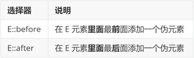

---
# 当前页面内容标题
title: 盒子模型

author: 黑马_pink

sticky: false
# 是否收藏在博客主题的文章列表中，当填入数字时，数字越大，排名越靠前。
star: false
# 是否将该文章添加至文章列表中
article: false
# 是否将该文章添加至时间线中
timeline: false

# 是否原创
isOriginal: true

date: 2024-12-19

---

<br>

## 1. 选择器

### 1.1 结构伪类选择器

#### 1.1.1 基本使用

作用：根据元素的**结构关系**查找元素。 


```css
<!DOCTYPE html>
<html lang="en">

<head>
  <meta charset="UTF-8">
  <meta http-equiv="X-UA-Compatible" content="IE=edge">
  <meta name="viewport" content="width=device-width, initial-scale=1.0">
  <title>Document</title>
  <style>
    /* 结构伪类选择器 */
    /* 1.选择第一个li */
    ul li:first-child {
      color: pink;
    }

    /* 2. 最后一个小li */
    ul li:last-child {
      color: green;
    }

    /* 3. 选择其中任意一个 */
    ul li:nth-child(6) {
      color: red;
    }
  </style>
</head>

<body>
  <!-- ul>li{第$个}*8 -->
  <ul>
    <li>我是第1个小li</li>
    <li>我是第2个小li</li>
    <li>我是第3个小li</li>
    <li>我是第4个小li</li>
    <li>我是第5个小li</li>
    <li>我是第6个小li</li>
    <li>我是第7个小li</li>
    <li>我是第8个小li</li>
  </ul>
</body>

</html>
```

 

#### 1.1.2 :nth-child(公式)


> 提示：公式中的n取值从 **0** 开始。 

~~~html
<!DOCTYPE html>
<html lang="en">

<head>
  <meta charset="UTF-8">
  <meta http-equiv="X-UA-Compatible" content="IE=edge">
  <meta name="viewport" content="width=device-width, initial-scale=1.0">
  <title>Document</title>
  <style>
    /* 公式 */
    /* 2n 是偶数个 */


    ul li:nth-child(2n) {
      background-color: #eee;
    }

    ul li:hover {
      background-color: #bbb;
    }


    /* 2n+1 奇数 */
    /* ul li:nth-child(2n + 1) {
      background-color: #eee;
    } */

    /* 5n 5的倍数 */
    /* ul li:nth-child(5n) {
      background-color: #eee;
    } */

    /* -n+5 选择第5个以前的 包含第5个 */
    /* ul li:nth-child(-n + 5) {
      background-color: #eee;
    } */

    /* n+5 选择第5个以后的 包含第5个 */
    /* ul li:nth-child(n + 5) {
      background-color: #eee;
    } */
  </style>
</head>

<body>
  <ul>
    <li>我是第1个小li</li>
    <li>我是第2个小li</li>
    <li>我是第3个小li</li>
    <li>我是第4个小li</li>
    <li>我是第5个小li</li>
    <li>我是第6个小li</li>
    <li>我是第7个小li</li>
    <li>我是第8个小li</li>
    <li>我是第9个小li</li>
    <li>我是第10个小li</li>
    <li>我是第11个小li</li>
    <li>我是第12个小li</li>
    <li>我是第13个小li</li>
    <li>我是第14个小li</li>
    <li>我是第15个小li</li>
  </ul>
</body>

</html>
~~~


### 1.2 伪元素选择器

作用：创建**虚拟元素**（伪元素），用来**摆放装饰性的内容**。 




```css
div::before {
  content: "before 伪元素";
}
div::after {
  content: "after 伪元素";
}
```

注意点：

* 必须设置 **content: ””属性**，用来 设置伪元素的内容，如果没有内容，则**引号留空**即可
* 伪元素默认是**行内**显示模式
* **权重和标签选择器相同**

## 2. PxCook

PxCook（像素大厨） 是一款切图设计工具软件。支持PSD文件的文字、颜色、距离自动智能识别。

* 开发面板（自动智能识别）
* 设计面板（手动测量尺寸和颜色）

使用方法：创建项目 → 输入 项目名称、项目类型 Web → 单击按钮【创建项目】 → 单击按钮【添加】，导入设计稿 


## 3. 盒子模型

作用：布局网页，摆放盒子和内容。

###  3.1 盒子模型-组成

* 内容区域 – width & height
* 内边距 – padding（出现在内容与盒子边缘之间）
* 边框线 – border 
* 外边距 – margin（出现在盒子外面）

```css
div {
  margin: 50px;
  border: 5px solid brown;
  padding: 20px;
  width: 200px;
  height: 200px;
  background-color: pink;
}
```


### 3.2 边框线

#### 3.2.1 四个方向

属性名：**border**（bd）

属性值：边框线粗细  线条样式  颜色（不区分顺序）

颜色设置为 transparent，透明


```css
div {
  border: 5px solid brown;
  width: 200px;
  height: 200px;
  background-color: pink;
}
```

#### 3.2.2 单方向边框线

属性名：**border-方位名词**（bd+方位名词首字母，例如，bdl）

属性值：边框线粗细  线条样式  颜色（不区分顺序）

```css
div {
  border-top: 2px solid red;
  border-right: 3px dashed green;
  border-bottom: 4px dotted blue;
  border-left: 5px solid orange;
  width: 200px;
  height: 200px;
  background-color: pink;
}
```

### 3.3 内边距

作用：设置 内容 与 盒子边缘 之间的距离。

* 属性名：padding / padding-方位名词

```css
div {
  /* 四个方向 内边距相同 */
  padding: 30px;
  /* 单独设置一个方向内边距 */
  padding-top: 10px;
  padding-right: 20px;
  padding-bottom: 40px;
  padding-left: 80px;
  width: 200px;
  height: 200px;
  background-color: pink;
}
```

> 提示：添加 padding 会撑大盒子。

* padding 多值写法


> 技巧：从**上**开始**顺时针**赋值，当前方向没有数值则与**对面取值相同**。 

~~~html
<!DOCTYPE html>
<html lang="en">

<head>
  <meta charset="UTF-8">
  <meta http-equiv="X-UA-Compatible" content="IE=edge">
  <meta name="viewport" content="width=device-width, initial-scale=1.0">
  <title>Document</title>
  <style>
    .box {
      /* 1. 手动去减 */
      /* width: 160px;
      height: 160px; */
      /* 2. css3 盒子模型 box-sizing: border-box */
      box-sizing: border-box;
      width: 200px;
      height: 200px;
      background-color: pink;
      border: 10px solid red;
      padding: 10px;
    }
  </style>
</head>

<body>
  <div class="box">qwe</div>
</body>

</html>
~~~


### 3.4 尺寸计算


默认情况：盒子尺寸 = 内容尺寸 + border 尺寸 + 内边距尺寸

结论：给盒子加 border / padding 会撑大盒子

解决：

* 手动做减法，减掉 border / padding 的尺寸
* 內减模式：**box-sizing: border-box**

### 3.5 外边距

作用：拉开两个盒子之间的距离

属性名：**margin**

提示：与 padding 属性值写法、含义相同

### 3.6 版心居中


左右 margin 值 为 auto（盒子要有宽度）

auto 为自动占满的意思

```css
div {
  margin: 0 auto;
  width: 1000px;
  height: 200px;
  background-color: pink;
}
```

>1. 行内和行内块元素水平居中对齐，给块级的父元素添加  tac 
>2. 块级元素水平居中对齐： 让盒子的`左右外边距`设置为 auto 就可以了。  margin: auto;
>   - 小米  margin-left: auto;  margin-right: auto;
>   - 京东/淘宝： margin： 0 auto；


### 3.7 清除默认样式


清除标签默认的样式，比如：默认的内外边距。 

第二种效率更高


```css
/* 清除默认内外边距 */
* {
  margin: 0;
  padding: 0;
  box-sizing: border-box;
}
/* 清除列表 li 项目符号(圆点·) */
li {
  list-style: none;
}
```

### 3.8 元素溢出

作用：控制溢出元素的内容的显示方式。

属性名：**overflow**


### 3.9 外边距问题

#### 3.9.1 合并现象

场景：**垂直**排列的兄弟元素，上下 **margin** 会**合并**

现象：取两个 margin 中的**较大值生效**


```css
.one {
  margin-bottom: 50px;
}
.two {
  margin-top: 20px;
}
```

####  3.9.2 外边距塌陷

场景：父子级的标签，子级的添加 **上外边距** 会产生**塌陷**问题

现象：**导致父级一起向下移动**

```css
.son {
  margin-top: 50px;
  width: 100px;
  height: 100px;
  background-color: orange;
}
```


解决方法：

* 取消子级margin，父级设置padding
* 父级设置 overflow: hidden
* 父级设置 border-top

### 3.10 行内元素 – 内外边距问题

场景：行内元素添加 margin 和 padding，无法改变元素垂直位置

解决方法：给行内元素添加 **line-height** 可以改变垂直位置

```css
span {
  /* margin 和 padding 属性，无法改变垂直位置 */
  margin: 50px;
  padding: 20px;
  /* 行高可以改变垂直位置 */
  line-height: 100px;
}
```

### 3.11 圆角

作用：设置元素的外边框为圆角。

属性名：**border-radius**

属性值：数字+px / 百分比

提示：属性值是圆角半径


* 多值写法


> 技巧：从左上角开始顺时针赋值，当前角没有数值则与对角取值相同。 

* 正圆形状：给正方形盒子设置圆角属性值为 **宽高的一半 / 50%**

```css
img {
  width: 200px;
  height: 200px;
  
  border-radius: 100px;
  border-radius: 50%;
}
```


* 胶囊形状：给长方形盒子设置圆角属性值为 盒子高度的一半 

```css
div {
  width: 200px;
  height: 80px;
  background-color: orange;
  border-radius: 40px;
}
```


### 3.12 盒子阴影（拓展）

作用：给元素设置阴影效果

属性名：**box-shadow**

属性值：X 轴偏移量  Y 轴偏移量  模糊半径  扩散半径  颜色  内外阴影

注意： 

* X 轴偏移量 和 Y 轴偏移量 必须书写
* 默认是外阴影，内阴影需要添加 inset

```css
div {
  width: 200px;
  height: 80px;
  background-color: orange;
  box-shadow: 2px 5px 10px 0 rgba(0, 0, 0, 0.5) inset;
}
```

