---
# 当前页面内容标题
title: Flex布局

author: 黑马_pink

sticky: false
# 是否收藏在博客主题的文章列表中，当填入数字时，数字越大，排名越靠前。
star: false
# 是否将该文章添加至文章列表中
article: false
# 是否将该文章添加至时间线中
timeline: false

# 是否原创
isOriginal: true

date: 2024-12-20

---

<br>


## 1. 标准流

标准流也叫文档流，指的是标签在页面中**默认的排布规则**，例如：块元素独占一行，行内元素可以一行显示多个。 


## 2. 浮动

### 2.1 基本使用

作用：让块元素水平排列。

属性名：**float**

属性值

* **left**：左对齐
* **right**：右对齐

```html
<!DOCTYPE html>
<html lang="en">

<head>
  <meta charset="UTF-8">
  <meta http-equiv="X-UA-Compatible" content="IE=edge">
  <meta name="viewport" content="width=device-width, initial-scale=1.0">
  <title>浮动</title>
  <style>
    .left,
    .right {
      /* width: 200px; */
      height: 200px;
      background-color: pink;
    }

    .left {
      /* 左浮动 */
      float: left;
      margin-left: 20px;
    }

    .right {
      /* 右侧浮动 */
      float: left;
      height: 300px;
      background-color: purple;
    }

    .bottom {
      height: 50px;
      background-color: black;
    }
  </style>
</head>

<body>
  <div class="left">左侧123</div>
  <div class="right">右侧123</div>
  <div class="bottom"></div>
</body>

</html>
```

特点：

* 浮动后的盒子**顶对齐**
* 浮动后的盒子具备**行内块**特点
* 浮动后的盒子**脱标**，**不占用标准流的位置**

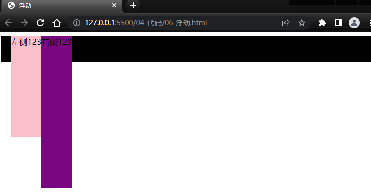

### 2.2 产品区域布局


#### 2.2.1 左右布局

html结构

```html
  <div class="mi">
    <div class="left">左侧</div>
    <div class="right">右侧</div>
  </div>
```

css样式

```html
 <style>
    * {
      margin: 0;
      padding: 0;
      box-sizing: border-box;
    }

    li {
      list-style: none;
    }

    .mi {
      width: 1226px;
      height: 614px;
      /* background-color: pink; */
      margin: 100px auto;
    }

    .left {
      float: left;
      width: 234px;
      height: 614px;
      background-color: skyblue;
    }

    .right {
      float: right;
      width: 978px;
      height: 614px;
      background-color: purple;
    }
</style>
```

效果：

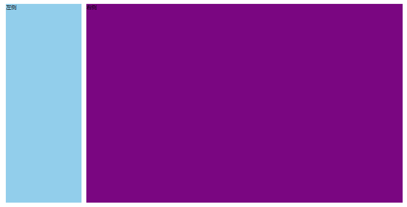

#### 2.2.2 区域小li布局

完整写法

~~~html
<!DOCTYPE html>
<html lang="en">

<head>
  <meta charset="UTF-8">
  <meta http-equiv="X-UA-Compatible" content="IE=edge">
  <meta name="viewport" content="width=device-width, initial-scale=1.0">
  <title>Document</title>
  <style>
    * {
      margin: 0;
      padding: 0;
      box-sizing: border-box;
    }

    li {
      list-style: none;
    }

    .mi {
      width: 1226px;
      height: 614px;
      /* background-color: pink; */
      margin: 100px auto;
    }

    .left {
      float: left;
      width: 234px;
      height: 614px;
      background-color: skyblue;
    }

    .right {
      float: right;
      width: 978px;
      height: 614px;
      /* background-color: purple; */
    }

    .right li {
      float: left;
      width: 234px;
      height: 300px;
      background-color: pink;
      margin-bottom: 14px;
      margin-right: 14px;
    }

    /* 让第4,8 个li 去掉外边距 */
    .right li:nth-child(4n) {
      margin-right: 0;
    }
  </style>
</head>

<body>
  <div class="mi">
    <div class="left">左侧</div>
    <div class="right">
      <ul>
        <li>1</li>
        <li>1</li>
        <li>1</li>
        <li>1</li>
        <li>1</li>
        <li>1</li>
        <li>1</li>
        <li>1</li>
      </ul>
    </div>
  </div>
</body>

</html>
~~~

 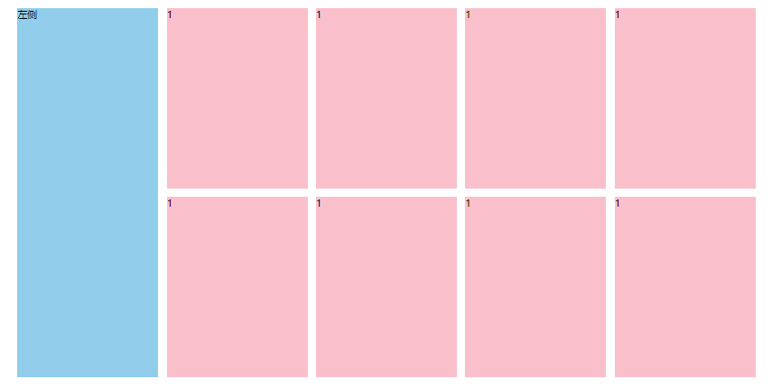

### 2.3 清除浮动

场景：浮动元素会脱标，如果**父级没有高度**，**子级无法撑开父级高度**（可能导致页面布局错乱）

解决方法：**清除浮动**（清除浮动带来的影响）

#### 场景搭建

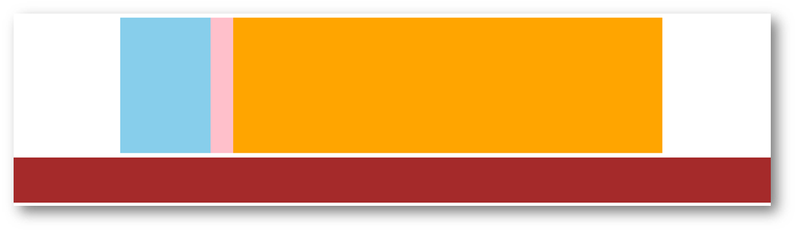

```html
<style>
  .top {
    margin: 10px auto;
    width: 1200px;
    /* height: 300px; */
    background-color: pink;
  }

  .left {
    float: left;
    width: 200px;
    height: 300px;
    background-color: skyblue;
  }

  .right {
    float: right;
    width: 950px;
    height: 300px;
    background-color: orange;
  }

  .bottom {
    height: 100px;
    background-color: brown;
  }

</style>

<div class="top">
  <div class="left"></div>
  <div class="right"></div>
</div>
<div class="bottom"></div>
```

#### 2.4 额外标签法

在**父元素内容的最后**添加一个**块级**元素，设置 CSS 属性 **clear: both** 

```html
<style>
.clearfix {
  clear: both;
}
</style>

<div class="father">
  <div class="left"></div>
  <div class="right"></div>
  <div class="clearfix"></div>
</div>
```

#### 2.5 单伪元素法

1. 准备 after 伪元素

```css
.clearfix::after {
  content: "";
  display: block;
  clear: both;
}
```

2. 父级使用 clearfix 类

```html
<div class="father clearfix"></div>
```

#### 2.6 双伪元素法

1. 准备 after 和 before 伪元素

```css
/* before 解决外边距塌陷问题 */
/* 双伪元素法 */
.clearfix::before,
.clearfix::after {
  content: "";
  display: table;
}

/* after 清除浮动 */
.clearfix::after {
  clear: both;
}
```

2. 父级使用 clearfix 类

```html
<div class="father clearfix"></div>
```

#### 2.7 overfow法

```css
.father {
  margin: 10px auto;
  width: 1200px;
  /* height: 300px; */
  background-color: pink;

  overflow: hidden;
}
```

## 3. Flex布局

Flex 布局也叫**弹性布局**，是浏览器**提倡的布局模型**，非常适合**结构化**布局，提供了强大的空间分布和对齐能力。

Flex 模型不会产生浮动布局中脱标现象，布局网页更简单、更灵活。

<span style="color: red;">加上FLex布局，没有显示模式了即不分div span.....  一律为 Flex 模式</span>

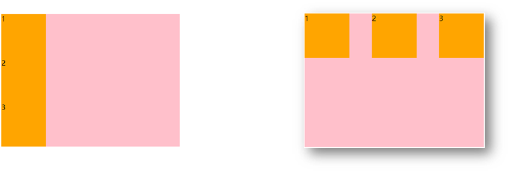

### 3.1 Flex组成

设置方式：给**父**元素设置 **display: flex**，子元素可以自动挤压或拉伸

组成部分：

* 弹性容器
* 弹性盒子
* 主轴：默认在**水平**方向
* 侧轴 / 交叉轴：默认在**垂直**方向

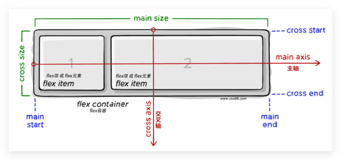

### 3.2 主轴对齐方式

属性名：**justify-content**


重点记住标红的。如果非要问我那个常用，我只能说是  `space-between ` 

```css
justify-content: space-between;
```

显示效果：**两侧没缝隙**

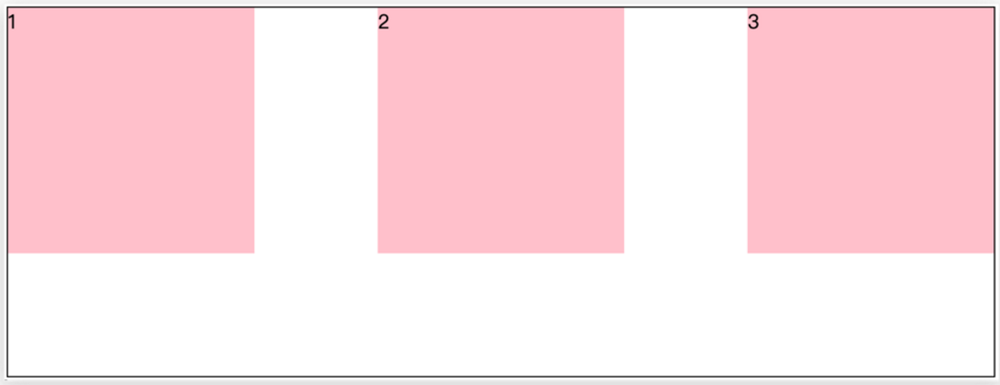

```css
justify-content: space-around;
```

效果如下：  **记住2倍**

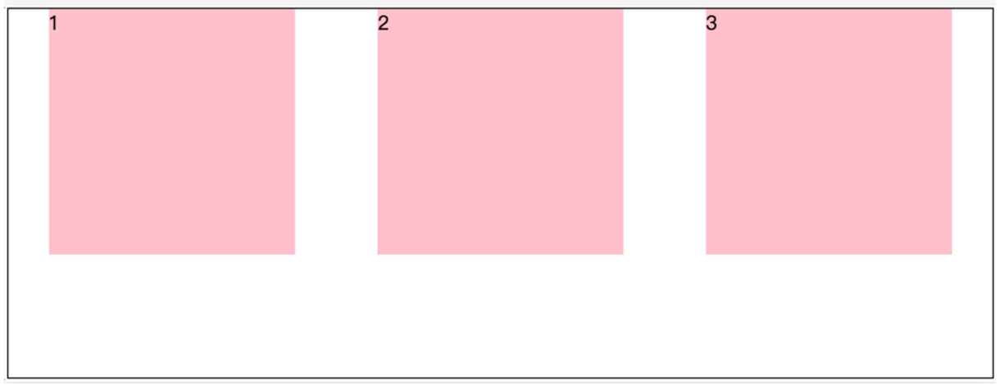

```css
justify-content: space-evenly;
```

效果如下： **记住空隙一样大**

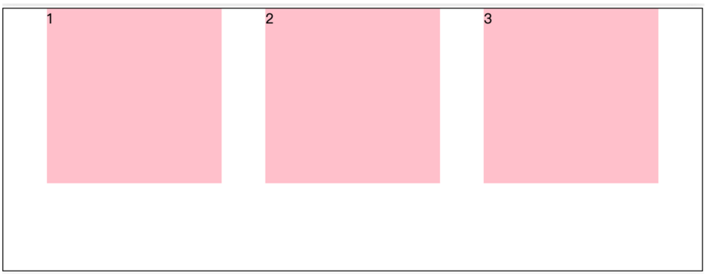

```css
 justify-content: center;
```

效果如下： **经常用于让一个盒子水平居中**

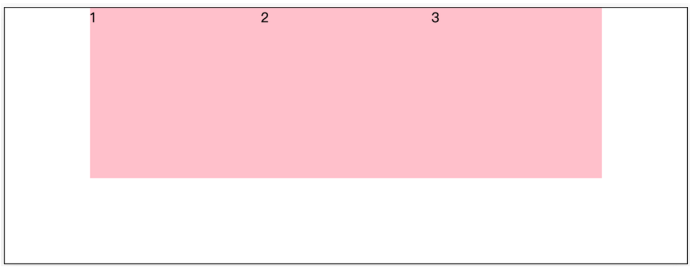

记忆：

1. `两侧没缝隙是 between`
2. 缝隙一样大是 evenly
3. 2倍缝隙是 around

~~~html
<!DOCTYPE html>
<html lang="en">

<head>
  <meta charset="UTF-8">
  <meta http-equiv="X-UA-Compatible" content="IE=edge">
  <meta name="viewport" content="width=device-width, initial-scale=1.0">
  <title>Document</title>
  <style>
    .box {
      /* 给父亲添加 flex */
      display: flex;
      /* 主轴的排列方式 */
      /* justify-content: flex-start; */
      /* justify-content: flex-end; */
      /* 让子盒子居中对齐 */
      /* justify-content: center; */
      /* between  */
      /* justify-content: space-between; */
      /* justify-content: space-around; */
      justify-content: space-evenly;
      width: 900px;
      height: 200px;
      background-color: pink;
    }

    .box div {
      width: 249px;
      height: 200px;
      background-color: skyblue;
    }
  </style>
</head>

<body>
  <div class="box">
    <div>1</div>
    <div>2</div>
    <div>3</div>
  </div>
</body>

</html>
~~~

 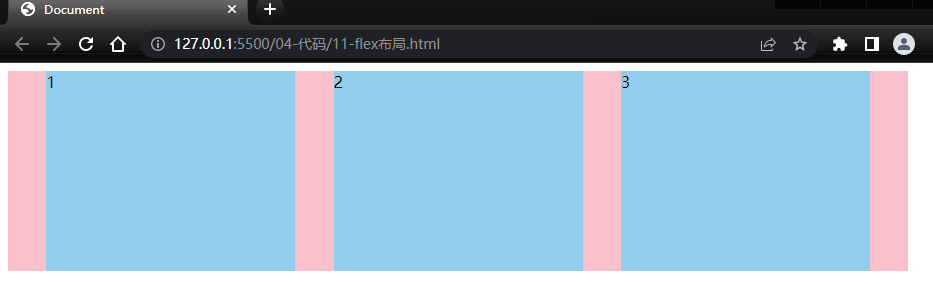

### 3.3 侧轴对齐方式

* align-items：当前弹性容器内**所有**弹性盒子的侧轴对齐方式（给**弹性容器**设置）
* align-self：单独控制**某个弹性盒子**的侧轴对齐方式（给**弹性盒子**设置）

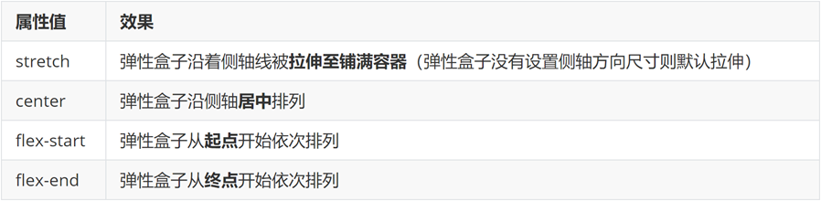

~~~html
<!DOCTYPE html>
<html lang="en">

<head>
  <meta charset="UTF-8">
  <meta http-equiv="X-UA-Compatible" content="IE=edge">
  <meta name="viewport" content="width=device-width, initial-scale=1.0">
  <title>Document</title>
  <style>
    .box {
      /* 给父亲添加 flex */
      display: flex;
      /* 主轴的排列方式 */
      /* justify-content: flex-start; */
      /* justify-content: flex-end; */
      /* 让子盒子居中对齐 */
      /* justify-content: center; */
      /* between  */
      /* 两侧没缝隙 */
      /* justify-content: space-between; */
      /* 两倍缝隙 */
      /* justify-content: space-around; */
      justify-content: space-evenly;

      /* 侧轴的对齐方式 */
      /* 顶部对齐 */
      /* align-items: flex-start; */
      /* 底部对齐 */
      /* align-items: flex-end; */
      /* 居中对齐 */
      /* align-items: center; */
      /* 默认的 拉伸和父亲一样 */
      align-items: stretch;
      width: 900px;
      height: 500px;
      background-color: pink;
    }

    .box div {
      width: 249px;
      /* height: 200px; */
      background-color: skyblue;
    }
  </style>
</head>

<body>
  <div class="box">
    <div>1</div>
    <div>2</div>
    <div>3</div>
  </div>
</body>

</html>
~~~

 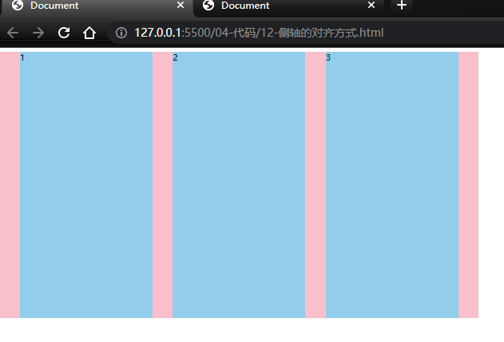

#### 3.3.1 盒子水平和垂直居中的写法

 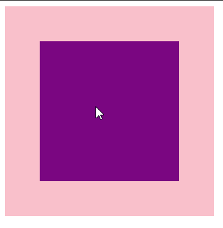

~~~html
<!DOCTYPE html>
<html lang="en">

<head>
  <meta charset="UTF-8">
  <meta http-equiv="X-UA-Compatible" content="IE=edge">
  <meta name="viewport" content="width=device-width, initial-scale=1.0">
  <title>Document</title>
  <style>
    .father {
      /* 利用flex实现 */
      display: flex;
      /* 主轴水平居中 */
      justify-content: center;
      /* 侧轴水平居中 */
      align-items: center;
      width: 300px;
      height: 300px;
      background-color: pink;
    }

    .son {
      width: 200px;
      height: 200px;
      background-color: purple;
    }
  </style>
</head>

<body>
  <div class="father">
    <div class="son"></div>
  </div>
</body>

</html>
~~~


### 3.4 自动换行

弹性盒子可以自动挤压或拉伸，默认情况下，所有弹性盒子都在一行显示。

属性名：flex-wrap

属性值

- wrap：换行

- nowrap：不换行（默认）

### 3.5 多行对齐方式

如果有多行侧轴对齐，则去找align-content

如果是单行侧轴对齐，则去找align-items

属性名：align-content 

属性值：与主轴对齐方式一样

::: warning
1. 该属性对单行弹性盒子模型无效。
2. 侧轴对齐时父盒子一定要设置高度
:::

### 3.6 某个弹性盒子侧轴对齐方式

单独控制某个盒子

属性名：align-self

属性值：auto | flex-start | flex-end | center | baseline | stretch

<span style="color: red;">该属性是加在子盒子的</span>

### 3.7 更改主轴方向

为什么要修改主轴？  

只要父亲添加了`display: flex` 所有的子盒子都会一行显示（水平显示）。但是，我们很多情况下，需要盒子垂直竖着显示，此时就需要把主轴修改一下。

主轴默认在水平方向，侧轴默认在垂直方向，主轴方向改变后，侧轴方向自然随之改变

属性名：flex-direction

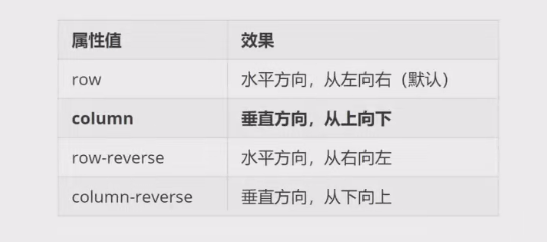

### 3.8 弹性伸缩比

作用：控制弹性盒子的主轴方向的尺寸

属性名：flex

属性值：整数数字，表示占用父级剩余尺寸的份数

<span style="color: red;">该属性是加在子盒子的</span>

#### 3.8.1 圣杯布局

圣杯布局两侧固定，中间自适应

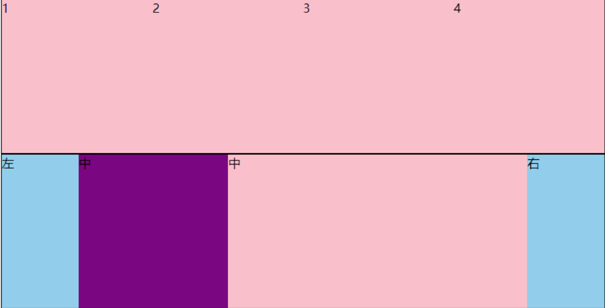

```html
<!DOCTYPE html>
<html lang="en">

<head>
  <meta charset="UTF-8">
  <meta http-equiv="X-UA-Compatible" content="IE=edge">
  <meta name="viewport" content="width=device-width, initial-scale=1.0">
  <title>Document</title>
  <style>
    .box {
      display: flex;
      width: 80%;
      height: 200px;
      border: 1px solid #000;
    }

    .box span {
      /* 不会区分原来属于什么模式 */
      /* width: 100px;
      height: 100px;
      background-color: pink; */
      flex: 1;
      background-color: pink;
    }

    /* 圣杯布局两侧固定，中间自适应 */
    .left,
    .right {
      width: 100px;
      background-color: skyblue;
    }

    .center {
      flex: 1;
      background-color: purple;
    }

    .center1 {
      flex: 2;
      background-color: pink;
    }
  </style>
</head>

<body>
  <div class="box">
    <span>1</span>
    <span>2</span>
    <span>3</span>
    <span>4</span>
  </div>

  <div class="box">
    <div class="left">左</div>
    <div class="center">中</div>
    <div class="center1">中</div>
    <div class="right">右</div>
  </div>
</body>

</html>
```

