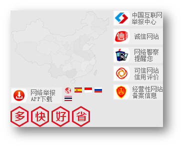

---
# 当前页面内容标题
title: CSS高级

author: 黑马_pink

sticky: false
# 是否收藏在博客主题的文章列表中，当填入数字时，数字越大，排名越靠前。
star: false
# 是否将该文章添加至文章列表中
article: false
# 是否将该文章添加至时间线中
timeline: false

# 是否原创
isOriginal: true

date: 2024-12-22

---

<br>

## 1. 定位（重点）

作用：灵活的改变盒子在网页中的位置

实现：

1.定位模式：position

2.边偏移：设置盒子的位置

* left
* right
* top
* bottom

### 1.1 相对定位

**position: relative**

特点：

* 不脱标，占用自己原来位置
* 显示模式特点保持不变
* 设置边偏移则相对自己原来位置移动

```css
div {
  position: relative;
  top: 100px;
  left: 200px;
}	
```

::: tip
与 margin 的区别，相对定位不会影响其他盒子

很少单独使用，一般与其他定位方式搭配使用
:::

### 1.2 绝对定位

**position: absolute**

使用场景：子级绝对定位，父级相对定位（**子绝父相**）看到一个东西压住一个东西，一定是绝对定位来做

特点：

* 脱标，不占位
* 显示模式具备行内块特点
* 设置边偏移则相对最近的已经定位的祖先元素改变位置
* 如果祖先元素都未定位，则相对浏览器可视区改变位置

```css
.father {
  position: relative;
}

.father span {
  position: absolute;
  top: 0;
  right: 0;
}
```

### 1.3 定位居中


实现步骤：

1. 绝对定位
2. 水平、垂直边偏移为 50%
3. 子级向左、上移动自身尺寸的一半

* 左、上的外边距为 –尺寸的一半
* transform: translate(-50%, -50%)

```css

<!DOCTYPE html>
<html lang="en">

<head>
  <meta charset="UTF-8">
  <meta http-equiv="X-UA-Compatible" content="IE=edge">
  <meta name="viewport" content="width=device-width, initial-scale=1.0">
  <title>Document</title>
  <style>
    /* 让绝对定位的盒子水平和垂直居中 */

    .box {
      position: absolute;
      /* 移动父亲的50% */
      left: 50%;
      /* 往左走自己宽度的一半 */
      /* margin-left: -100px; */
      top: 50%;
      /* margin-top: -100px; */
      /* 让子盒子走自己宽度和高度的一半 */
      transform: translate(-50%, -50%);
      width: 200px;
      height: 200px;
      background-color: pink;
      /* 绝对定位让margin 0 auto 失效 */
      /* margin: 0 auto; */
    }

    img {
      position: absolute;
      top: 50%;
      left: 50%;
      /* 让子盒子走自己宽度和高度的一半 */
      transform: translate(-50%, -50%);
      /*transform: translateX(-50%); 只动X方向的*/  
      /* 注意，translate 百分比相对于盒子自身的宽度和高度来说 */
    }
  </style>
</head>

<body>
  <!-- <div class="box"></div> -->
  
</body>

</html>
```

### 1.4 固定定位

**position: fixed**

场景：元素的位置在网页滚动时不会改变

特点：

* 脱标，不占位
* 显示模式具备行内块特点
* 设置边偏移相对浏览器窗口改变位置

```css

<!DOCTYPE html>
<html lang="en">

<head>
  <meta charset="UTF-8">
  <meta http-equiv="X-UA-Compatible" content="IE=edge">
  <meta name="viewport" content="width=device-width, initial-scale=1.0">
  <title>Document</title>
  <style>
    .header {
      position: fixed;
      left: 0;
      top: 0;
      /* width: 200px; */
      width: 100%;
      height: 80px;
      background-color: pink;
    }
  </style>
</head>

<body>
  <div class="header">123</div>
  <p> 里面有很多的文字</p>
  <p> 里面有很多的文字</p>
  <p> 里面有很多的文字</p>
  <p> 里面有很多的文字</p>
  <p> 里面有很多的文字</p>
  <p> 里面有很多的文字</p>
  <p> 里面有很多的文字</p>
  <p> 里面有很多的文字</p>
  <p> 里面有很多的文字</p>
  <p> 里面有很多的文字</p>
  <p> 里面有很多的文字</p>
  <p> 里面有很多的文字</p>
  <p> 里面有很多的文字</p>
  <p> 里面有很多的文字</p>
  <p> 里面有很多的文字</p>
  <p> 里面有很多的文字</p>
  <p> 里面有很多的文字</p>
  <p> 里面有很多的文字</p>
  <p> 里面有很多的文字</p>
  <p> 里面有很多的文字</p>
  <p> 里面有很多的文字</p>
  <p> 里面有很多的文字</p>
  <p> 里面有很多的文字</p>
  <p> 里面有很多的文字</p>
  <p> 里面有很多的文字</p>
  <p> 里面有很多的文字</p>
  <p> 里面有很多的文字</p>
  <p> 里面有很多的文字</p>
  <p> 里面有很多的文字</p>
  <p> 里面有很多的文字</p>
  <p> 里面有很多的文字</p>
  <p> 里面有很多的文字</p>
  <p> 里面有很多的文字</p>
  <p> 里面有很多的文字</p>
  <p> 里面有很多的文字</p>
  <p> 里面有很多的文字</p>
</body>

</html>
```

### 1.5 堆叠层级z-index


默认效果：按照标签书写顺序，后来者居上

作用：设置定位元素的层级顺序，改变定位元素的显示顺序

属性名：**z-index**

属性值：**整数数字**（默认值为auto，取值越大，层级越高）

```css

<!DOCTYPE html>
<html lang="en">

<head>
  <meta charset="UTF-8">
  <meta http-equiv="X-UA-Compatible" content="IE=edge">
  <meta name="viewport" content="width=device-width, initial-scale=1.0">
  <title>Document</title>
  <style>
    div {
      position: absolute;
      top: 0;
      left: 0;
      /* 默认的层级 z-index: auto; */
      /* 根据标签的书写顺序排列 */
      /* 越往后，层级越高 */
      width: 200px;
      height: 200px;
    }

    .box1 {
      background-color: red;
      /* 层级属性  整数 不要跟单位*/
      /* 数字越大，层级越高 */
      z-index: 1;
    }

    .box2 {
      background-color: green;
      left: 20px;
      top: 20px;
      z-index: 2;
    }

    .box3 {
      background-color: blue;
      left: 40px;
      top: 40px;
    }
  </style>
</head>

<body>
  <div class="box1"></div>
  <div class="box2"></div>
  <div class="box3"></div>
</body>

</html>
```

### 1.6 粘性定位

粘性定位可以被认为是**相对定位**和**固定定位**的**混合**。元素在跨越特定阈值前为相对定位，之后为固定定位

- 须指定 top, right, bottom 或 left 四个值其中之一

```CSS
div {
      position: sticky;
      top: 100;
    }
```


## 2. 高级技巧

### 2.1 CSS精灵

CSS 精灵，也叫 **CSS Sprites**，是一种网页**图片应用处理方式**。把网页中**一些背景图片**整合到**一张图片**文件中，再**background-position** 精确的定位出背景图片的位置。



优点：减少服务器被请求次数，减轻服务器的压力，提高页面加载速度


实现步骤：

1. 创建盒子，**盒子尺寸**与**小图**尺寸**相同**
2. 设置盒子**背景图**为精灵图
3. 添加 **background-position** 属性，改变**背景图位置**

​       3.1 使用 PxCook 测量小图片**左上角坐标**

​       3.2 取**负数**坐标为 background-position 属性值（向左上移动图片位置）

### 2.2 案例-写出自己的名字

#### 2.2.1 HTML结构

```html

<!DOCTYPE html>
<html lang="en">

<head>
  <meta charset="UTF-8">
  <meta http-equiv="X-UA-Compatible" content="IE=edge">
  <meta name="viewport" content="width=device-width, initial-scale=1.0">
  <title>Document</title>
  <style>
    div {
      display: inline-block;
      margin: 0 15px;
      background: url(./images/abcd.jpg) no-repeat;
    }

    .l {
      width: 96px;
      height: 112px;
      background-color: pink;
      background-position: -5px -275px;
    }

    .i {
      width: 62px;
      height: 107px;
      background-position: -324px -141px;
    }

    .u {
      width: 112px;
      height: 112px;
      background-position: -476px -421px;
    }

    span {
      display: block;
      width: 106px;
      height: 118px;
      background: url(./images/abcd.jpg) no-repeat;
      /* 过渡 */
      transition: .2s;
    }

    span:hover {
      /* background-position: -118px -12px; */
      background-position: -484px -10px;
      /* width: 95px; */
      /* background-position: -3px -137px; */
    }
  </style>
</head>

<body>
  <div class="l"></div>
  <div class="i"></div>
  <div class="u"></div>

  <span></span>
</body>

</html>
```


### 2.3 字体图标（重点）


字体图标：**展示的是图标，本质是字体**

作用：在网页中添加**简单的、颜色单一**的小图标

优点

* **灵活性**：灵活地修改样式，例如：尺寸、颜色等
* **轻量级**：体积小、渲染快、降低服务器请求次数
* **兼容性**：几乎兼容所有主流浏览器
* **使用方便**：先下载再使用

#### 2.3.1下载字体

iconfont 图标库：<https://www.iconfont.cn/> 

登录 → 素材库 → 官方图标库 → 进入图标库 → 选图标，加入购物车 → 购物车，添加至项目，确定 → 下载至本地 


#### 2.3.2 使用字体

1. 引入字体样式表（iconfont.css） 


2. 标签使用字体图标类名
   * iconfont：字体图标基本样式（字体名，字体大小等等）
   * icon-xxx：图标对应的类名


~~~html

<!DOCTYPE html>
<html lang="en">

<head>
  <meta charset="UTF-8">
  <meta http-equiv="X-UA-Compatible" content="IE=edge">
  <meta name="viewport" content="width=device-width, initial-scale=1.0">
  <title>Document</title>
  <link rel="stylesheet" href="./fonts/iconfont.css">
  <style>
    .iconfont {
      font-size: 300px;
      color: pink;
    }
  </style>
</head>

<body>
  <!-- 必须2个类名，第一个类名iconfont -->
  <i class="iconfont icon-shouji"></i>

  <span class="iconfont  icon-zhaoxiangji"></span>
</body>

</html>
~~~


## 3. CSS修饰属性

### 3.1 垂直对齐方式


属性名：vertical-align

 

~~~html

<!DOCTYPE html>
<html lang="en">

<head>
  <meta charset="UTF-8">
  <meta http-equiv="X-UA-Compatible" content="IE=edge">
  <meta name="viewport" content="width=device-width, initial-scale=1.0">
  <title>Document</title>
  <style>
    img {
      /* 行内块元素  默认和文字的基线对齐*/
      vertical-align: middle;
    }

    span {
      display: inline-block;
      vertical-align: middle;
      width: 50px;
      height: 50px;
      background-color: pink;
    }

    div {
      /* width: 300px;
      height: 300px; */
      border: 2px solid red;
    }
  </style>
</head>

<body>
   my name is 刘德华

  <span></span> my name is 刘德华

  <hr>
  <div>
    
  </div>
</body>

</html>
~~~

>去除图片底部缝隙的两种方法：
>
>1. 给图片添加  display: block;
>2. 给图片添加  vertical-align: middle; 等，只要不是 baseline就行

### 3.2 过渡

作用：可以为一个元素在不同状态之间切换的时候添加**过渡效果**

属性名：**transition（复合属性）**

属性值：**过渡的属性  花费时间 (s)**

提示：

* 过渡的属性可以是具体的 CSS 属性
* 也可以为 all（两个状态属性值不同的所有属性，都产生过渡效果）
* transition 设置给元素本身

```css

<!DOCTYPE html>
<html lang="en">

<head>
  <meta charset="UTF-8">
  <meta http-equiv="X-UA-Compatible" content="IE=edge">
  <meta name="viewport" content="width=device-width, initial-scale=1.0">
  <title>Document</title>
  <style>
    .box {
      width: 200px;
      height: 200px;
      background-color: pink;
      /* 谁做过渡给谁加 */
      transition: all .3s;

    }

    .box:hover {
      height: 300px;
      width: 300px;
      background-color: green;
    }

    input {
      width: 200px;
      height: 30px;
      transition: all .3s;
    }

    /* 当表单得到光标的时候 */
    input:focus {
      width: 300px;
      background-color: pink;
    }
  </style>
</head>

<body>
  <div class="box"></div>

  <input type="text">
</body>

</html>
```

#### 3.2.1 表单获得焦点选择器  focus

~~~css
/* 当表单得到光标的时候 */
input:focus {
  width: 300px;
  background-color: pink;
}
~~~


### 3.3 透明度opacity

作用：设置**整个元素的透明度**（包含背景和内容）

属性名：opacity

属性值：0 – 1

* 0：完全透明（元素不可见）
* 1：不透明
* 0-1之间小数：半透明

~~~html

<!DOCTYPE html>
<html lang="en">

<head>
  <meta charset="UTF-8">
  <meta http-equiv="X-UA-Compatible" content="IE=edge">
  <meta name="viewport" content="width=device-width, initial-scale=1.0">
  <title>Document</title>
  <style>
    body {
      background: url(./images/huawei.jpg);
    }

    .box1 {
      width: 200px;
      height: 200px;
      background-color: pink;
      /*1. 盒子包括内容都是半透明 */
      /* 0 是完全透明 */
      /* 1 是完全不透明 */
      opacity: 0.2;
    }

    .box2 {
      width: 200px;
      height: 200px;
      /*2. 背景半透明只是盒子背景透明，而里面的内容不透明 */
      background-color: rgba(0, 0, 0, 0.3);
      color: #fff;
    }
  </style>
</head>

<body>
  <div class="box1">
    里面的文字也会半透明
  </div>
  <div class="box2">
    里面的文字不半透明
  </div>
</body>

</html>
~~~


### 3.4 光标类型cursor

作用：鼠标悬停在元素上时指针显示样式

属性名：cursor

 

~~~html

<!DOCTYPE html>
<html lang="en">

<head>
  <meta charset="UTF-8">
  <meta http-equiv="X-UA-Compatible" content="IE=edge">
  <meta name="viewport" content="width=device-width, initial-scale=1.0">
  <title>Document</title>
  <style>
    div:nth-child(1) {

      cursor: default;
    }

    div:nth-child(2) {
      /* 小手 */
      cursor: pointer;
    }

    div:nth-child(3) {
      /* 文本 */
      cursor: text;
    }

    div:nth-child(4) {
      /* 移动 */
      cursor: move;
    }

    div:nth-child(5) {
      /* 禁止 */
      cursor: not-allowed;
    }

    button {
      cursor: pointer;
    }
  </style>
</head>

<body>
  <div>鼠标默认</div>
  <div>鼠标小手</div>
  <div>鼠标选择文本</div>
  <div>鼠标移动</div>
  <div>鼠标禁止</div>

  <button>注册</button>
</body>

</html>
~~~

#### 3.4.1 禁用鼠标样式

 

~~~css
div:nth-child(5) {
  /* 禁止 */
  cursor: not-allowed;
}
~~~


### 3.5 表格样式-合并相邻两个边框

 

~~~html

<!DOCTYPE html>
<html lang="en">

<head>
  <meta charset="UTF-8">
  <meta http-equiv="X-UA-Compatible" content="IE=edge">
  <meta name="viewport" content="width=device-width, initial-scale=1.0">
  <title>Document</title>
  <style>
    table {
      width: 700px;
      height: 400px;
      margin: 0 auto;
      text-align: center;
    }

    table,
    tr,
    td {
      border: 1px solid pink;
      /* 合并相邻的两个边框 */
      border-collapse: collapse;
    }

    /* 2n 偶数 / even   */
    /* tr:nth-child(2n) {
      background-color: #eee;
    } */
    tr:nth-child(even) {
      background-color: #eee;
    }

    /* 2n+1 奇数   odd */
    tr:nth-child(odd) {
      background-color: #ddd;
    }
  </style>
</head>

<body>
  <table>
    <tr>
      <td>内</td>
      <td>内</td>
      <td>内</td>
      <td>内</td>
      <td>内</td>
    </tr>
    <tr>
      <td>内</td>
      <td>内</td>
      <td>内</td>
      <td>内</td>
      <td>内</td>
    </tr>
    <tr>
      <td>内</td>
      <td>内</td>
      <td>内</td>
      <td>内</td>
      <td>内</td>
    </tr>
    <tr>
      <td>内</td>
      <td>内</td>
      <td>内</td>
      <td>内</td>
      <td>内</td>
    </tr>
    <tr>
      <td>内</td>
      <td>内</td>
      <td>内</td>
      <td>内</td>
      <td>内</td>
    </tr>
    <tr>
      <td>内</td>
      <td>内</td>
      <td>内</td>
      <td>内</td>
      <td>内</td>
    </tr>
  </table>
</body>

</html>
~~~
