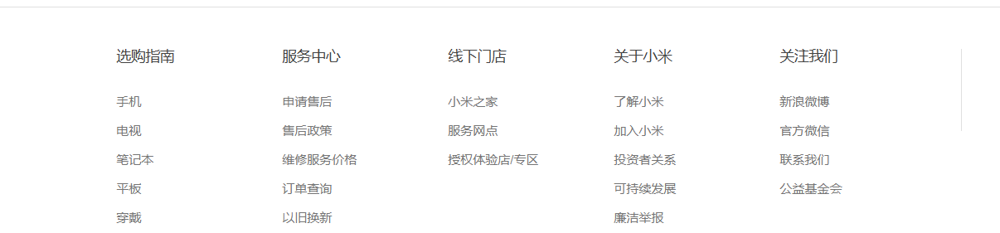
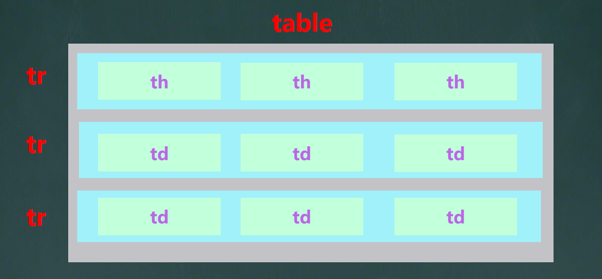

---
# 当前页面内容标题
title: HTML进阶

sticky: false
# 是否收藏在博客主题的文章列表中，当填入数字时，数字越大，排名越靠前。
star: false
# 是否将该文章添加至文章列表中
article: false
# 是否将该文章添加至时间线中
timeline: false

# 是否原创
isOriginal: true

date: 2024-12-17

---


## 1. 列表

用于布局排列整齐的区域

**独占一行**

### 1.1 无序列表

```html
<ul>
    <li>第一项</li>
    <li>第二项</li>
</ul>
```

- ul 标签只能放 li

- li 标签能放其他标签

- `ul>li*数量`  快速生成代码 

  ```html
  <!--  ul有4个li，每个li中包含a标签 -->
  ul>li*4>a
  ```


### 1.2 有序列表

```html
<ol>
    <li>第一项</li>
    <li>第二项</li>
</ol>
```

- ol 标签只能放 li
- li 标签能放其他标签


### 1.3 定义列表



```html
<dl>
    <dt>列表标题</dt>
    <dd>列表描述1</dd>
    <dd>列表描述2</dd>
</dl>
```

- dl 标签只能放 dt、dd
- dt、dd 标签能放其他标签
- 可以通过 `dl>dt+dd` 生成


## 2. 表格

作用：展示数据

标签：table 嵌套 tr ，tr 嵌套 th、td

表格默认没有边框线，使用 **table** 标签的 **border** 属性可以为表格**添加边框线**




### 2.1 表格的结构标签

可以分为 **thead**(表格头部)、**tbody**(表格主体)、**tfoot**(表格底部)


### 2.2 合并单元格

1. 明确合并目标
2. 保留左上的单元格，添加属性
   1. 跨行合并：保留 **最上**的单元格，添加属性 **rowspan**
   2. 跨列合并：保留 **最左** 的单元格，添加属性 **colspan**
3. 删除其他单元格


## 3. 表单

作用：收集用户信息

```html
<form></form>
```


### 3.1 input 标签

#### 3.1.1 type 属性

标签：双标签， **type** 属性值不同，功能不同

| type     | 说明                   |
| -------- | ---------------------- |
| text     | 文本框（单行文本）     |
| password | 密码框                 |
| radio    | 单选框                 |
| checkbox | 多选框                 |
| file     | 上传文件（**文件域**） |

```html
<!-- 配合 name 可实现分组单选-->
<input type="radio" name="sex"> 男
<input type="radio" name="sex"> 女
```


#### 3.1.2 placeholder 属性

作用：占位文本，提示信息


#### 3.1.3 checked 属性

作用：使单选多选框有一个默认选中状态

```html
<input type="radio" checked="checked">
<input type="radio" checked >
```

> 属性名与属性值一样可简写


#### 3.1.4 multiple 属性

作用：使上传文件时可以上传多个文件

```html
<input type="file" multiple >
```


### 3.2 select 标签

下拉表单，双标签

- select：选择
- option：选项
- selected：默认选中

```html
<select>
    <option>北京</option>
    <option selected >山东</option>
    <option>天津</option>
    <option>河北</option>
</select>
```


### 3.3 textarea 标签

作用：文本域，双标签，输入多行文本

```html
<textarea cols="10" rows="4">默认文本内容</textarea>
```

- cols：只能显示多少列
- rows：只能显示多少行


### 3.4 label 标签

不属于表单标签，但经常与表单标签搭配使用

作用：网页中，某个标签的说明文本。用其绑定 **文字** 和 **表单控件** 的关系，可 <span style="color: red;">增大表单控件的点击范围</span>

```html
<!-- 通过 for、id 联系起来 -->
<label for="name">姓名：</label>
<input type="text" id=“name”>
```


### 3.5 button 标签

| type属性 | 说明  |
|--------|-----|
| submit | 提交按钮，点击后可以提交数据到后台(默认功能)    |
| reset  | 重置按钮，点击后将表单控件恢复默认值    |
| button | 普通按钮，默认没有功能，一般配合JavaScript 使用    |


```html
<button type="" >按钮</button>
```

按钮需配合 form 标签 才能实现对应的功能


## 4. 语义化

### 4.1 无语义的布局标签

作用：布局网页(划分网页区域)

- div：独占一行
- span：不换行


### 4.1 有语义的布局标签

| 标签名      | 语义                                                                              |
|:---------|:--------------------------------------------------------------------------------|
| header &nbsp;&nbsp;&nbsp;&nbsp;&nbsp;&nbsp;&nbsp;  | 网页头部   &nbsp;&nbsp;&nbsp;&nbsp;&nbsp;&nbsp;&nbsp;&nbsp;&nbsp;&nbsp;&nbsp;&nbsp; |
| nav      | 网页导航                                                                            |
| footer   | 网页底部                                                                            |
| aside    | 网页侧边栏                                                                           |
| section  | 网页区块                                                                            |
| article  | 网页文章                                                                            |


## 5. 字符实体

作用：在网页中显示预留字符

|显示结果|描述|实体名称|
|----|----|----|
||空格|`&nbsp;`|
| < |小于号|`&lt;`|
| > |大于号|`&gt;`|