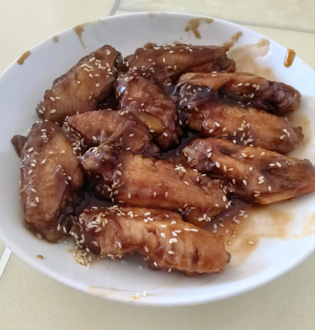

---
# 当前页面内容标题
title: 可乐鸡翅
# 当前页面图标
icon: linter
# 分类
category:
- 优质文章收录
# 标签
tag:
- 美食
sticky: false
# 是否收藏在博客主题的文章列表中，当填入数字时，数字越大，排名越靠前。
star: false
# 是否将该文章添加至文章列表中
article: true
# 是否将该文章添加至时间线中
timeline: true

# 是否原创
isOriginal: null

date: 2024-10-31

---

 

## 用料

> 鸡翅  12个
>
> 油   少许
>
> 可口可乐 1罐
>
> 姜   3片
>
> 盐  1克左右
>
> 啤酒   2汤勺
>
> 生抽  1汤勺
>
> 老抽  小半汤勺
>
> 熟白芝麻  少许

## 步骤

鸡翅洗净背面划二刀，方便入味，伱要真懒，也可以不划(−_−＃)

锅里放冷水、鸡翅、二片姜，煮开。

准备一罐可乐，另一片姜切丝。

水开后煮二分钟左右，捞出洗净备用。

锅里放少许油，把洗净控干水分的鸡翅放下去煎香。

二面都煎好后放入生姜丝和啤酒，炒出香味，啤酒汁略微收干了，木有啤酒的可以用一勺料酒代替。

放入一汤勺的生抽，小半汤勺的老抽，翻炒均匀上色。

倒入可乐，烧开后转中火，盖上锅盖焖。

焖至一半汁时，加入盐，开大火收汁，收到自己喜欢的程度就好。

装盘，撒上熟白芝麻，一定要不停的搅拌，很容易糊。

## 可乐鸡翅的小贴士

锅用不粘锅比较好操作. 可以薄薄刷一层油就行. 鸡翅自身含的油脂是挺高的. 其实汤汁不要收干. 多留一些还是比较好的. 好像除了收汁时. 要不停搅拌. 没啥需要注意的.

**成品**

