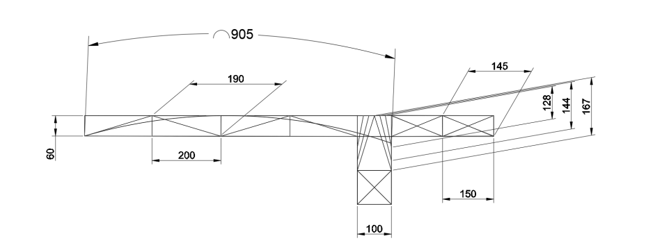
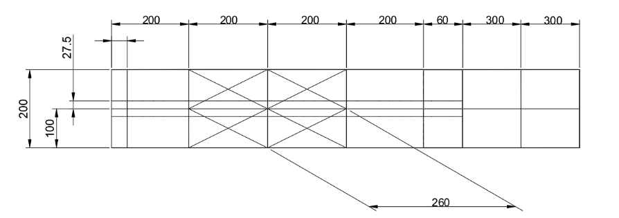
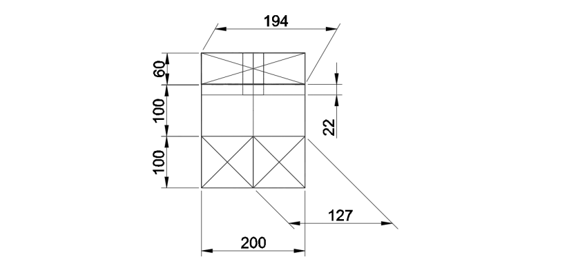
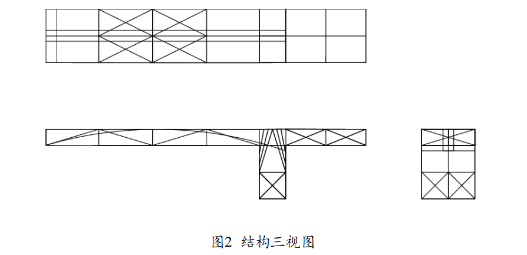
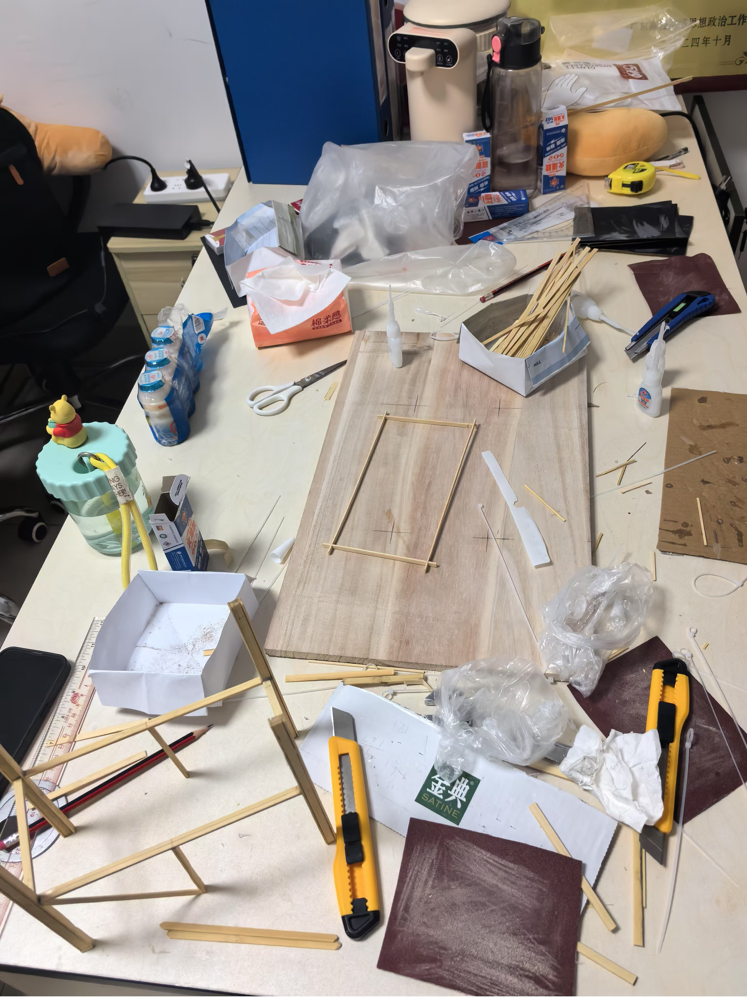
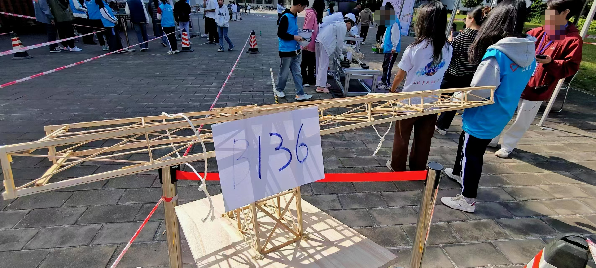

---
# 当前页面内容标题
title: 结构设计大赛

# 分类
category:
- 日常
# 标签
tag:
- 比赛

sticky: false
# 是否收藏在博客主题的文章列表中，当填入数字时，数字越大，排名越靠前。
star: false
# 是否将该文章添加至文章列表中
article: true
# 是否将该文章添加至时间线中
timeline: true

# 是否原创
isOriginal: null

date: 2024-12-17

---

 

朋友邀请我参与了大学中第一次的比赛，现对其进行简单的复盘。赛题如文档所示：

[结构设计大赛题目](./img/五邑大学第二十四届科技学术季暨土木建筑学院第十九届结构设计大赛兴趣组赛题.pdf)

参加第一场线下会议的时候，我看到赛题的时候是有点手足无措的感觉，图片画的是什么玩意？规避区，榫卯结构，吊索.....
前半段时间，朋友们讨论的热火朝天，我却将所有精力投掷于弄清他们究竟在讨论什么。不到两个钟，我刚回过神，朋友已然确定好我们所要制作模型的大体方向，以及制作工艺和分工。

以下是组内大哥设计出来的结构模型以及相关参数

动工的头一天，我们把木条磨来磨去，一开始的几根方杆，我们需要花费半个小时以上才能做出一件成品。
第一天转瞬即逝，台面是一片混乱的，进度是丝毫没有的。

熟能生巧，接下来的几天里，我们如坐针毡，在不断的磨合中，逐渐熟悉了制作工艺和结构参数。熟练后，自然而然会开始飘了，结果那自然就是，杆的连接处歪七八扭，
手被牢牢黏在木条上(当晚洗个半小时澡勉强洗去)..... 在此过程中，我们时常因为考虑不周，导致拆解复工(因为桥面整个模型是用502粘黏的，频繁的拆解会导致木片光滑不易粘黏，
甚至可能严重损坏桥体)

工艺的东西，既费时也费力，就这样我们浑浑噩噩的度过了漫长的一个礼拜，熬进了初赛。

初赛进行的十分顺利，不过就是爆了根装备，无伤大雅。初赛已过，我们对模型充满信心，将模型拿回去后进行了优化，将没用的部分全部去掉，减轻重量，并在需要的地方进行第N次加固。

模型经历了惨绝人寰的折腾后，在决赛场地留下他最后一副照片，他经受住载荷与撞击！！(我们用了三份材料的量，一根方杆堆8片木条，承受不了就废了)

此次比赛，我们实现了最初组内定下的目标（稳中求稳，能过就行），虽说因为料堆得太猛没有拿到很高的名次，但是夜以继日赶工的日子给我们留下的却是一段难以忘却的经历。
做一件事情只顾眼前不考虑下一步给我们带来的窘迫同样深深启迪了我们，做事不规划好，做再多也是白做。

:::right
2024年12月17日
:::

