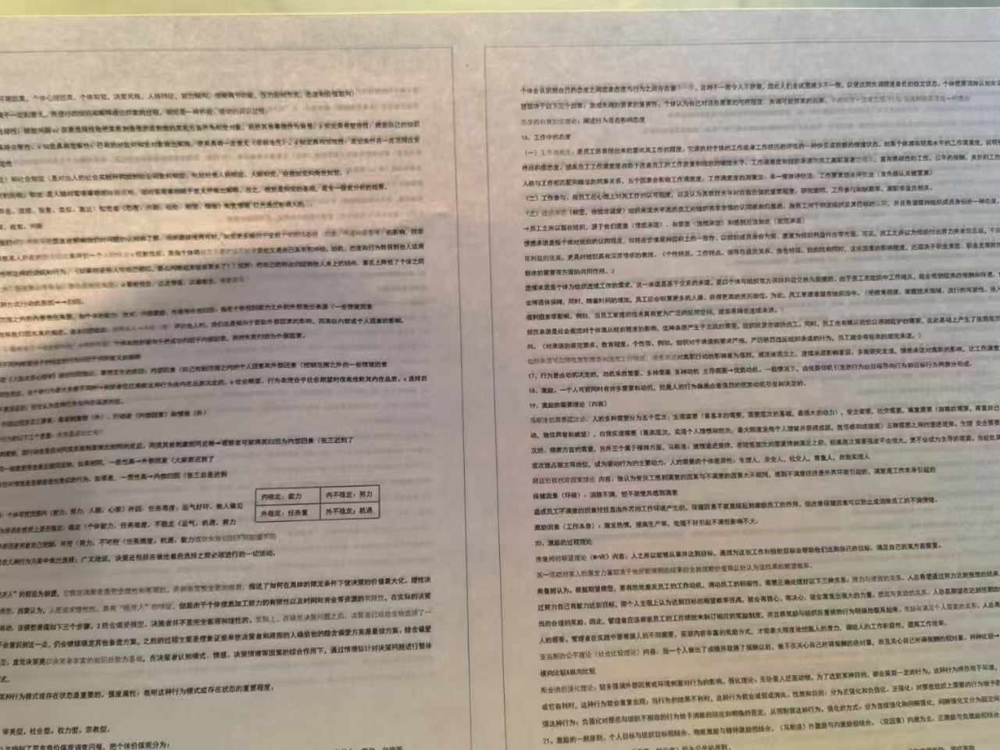

---
# 当前页面内容标题
title: 组织行为学考试有感

# 分类
category:
- 日常
# 标签
tag:
- 大学生活

sticky: false
# 是否收藏在博客主题的文章列表中，当填入数字时，数字越大，排名越靠前。
star: false
# 是否将该文章添加至文章列表中
article: true
# 是否将该文章添加至时间线中
timeline: true

# 是否原创
isOriginal: null

date: 2024-12-20

---

 

今天刚结束了组织行为学的开卷考试，内心五味杂陈。

当我意识到这门课需要考试的时候，距离考试时间仅仅不到一个礼拜。心想着还有这么久才考试，内心丝毫没有泛起半分波澜。待我专心到其他事情的时候，考试的消息早已在脑海中云消雾散。
当我第二次想起考试的时候，是因为那浓厚的备考环境--只要是舍友安静地一如反常钉地在椅子上的时候，那便是到了考试前夕。

本场考试为开卷考试，虽说是只能带一张A4纸进考场，但这冥冥中给我带来了无比庞大的自信。匆忙之下，我向学姐讨到一份笔记，足足4页 小六 字体的文档笔记，囊括了马工程组织行为学中
271页，十个章节的内容（注明：书不一定为正版，页数有误差属于正常波动范围中），硬生生的被缩印成两面A4纸的备考宝典。

自然的，这么多的内容，学肯定是学不下去的，我没有强迫自己，只是睡前大体看了下每块内容的标题吧。仅仅是这般功夫，那一晚我睡得极其踏实。

直到我考试的时候，我依旧未曾拿出过该笔记。事已至此，既然我没学过这门课，况且又不了解考试的题目，那么背答案这条路估计是走不通了。这就可以引出我的一个全新的学习理念--
**以考促学**，通过题目，我从笔记中寻找答案的学习模式，在一定程度上降低了我这门课的挂科率，让我在短短两个小时的考试时间（注明：这也是黄金的两个钟，这不简单是因为我不可能走神，
更是因为其他时间我大概率是不可能会去学的）， 学习到该学期老师讲了些什么玩意。

有人曾和我讲过，每场考试就像众多钥匙中的一把，只有和你的目标方向一样时才会有用，如果你要开的锁压根就不需要这把钥匙，那我们多费的这些气力又有什么意义呢？

试后有感而发。

::: right
2024年12月20日
:::
