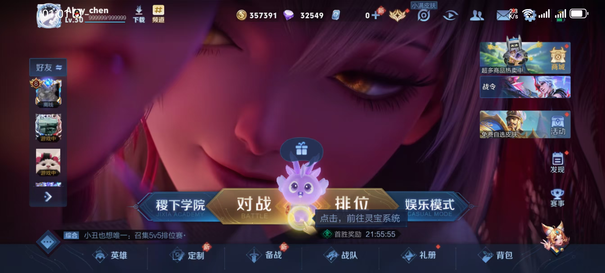
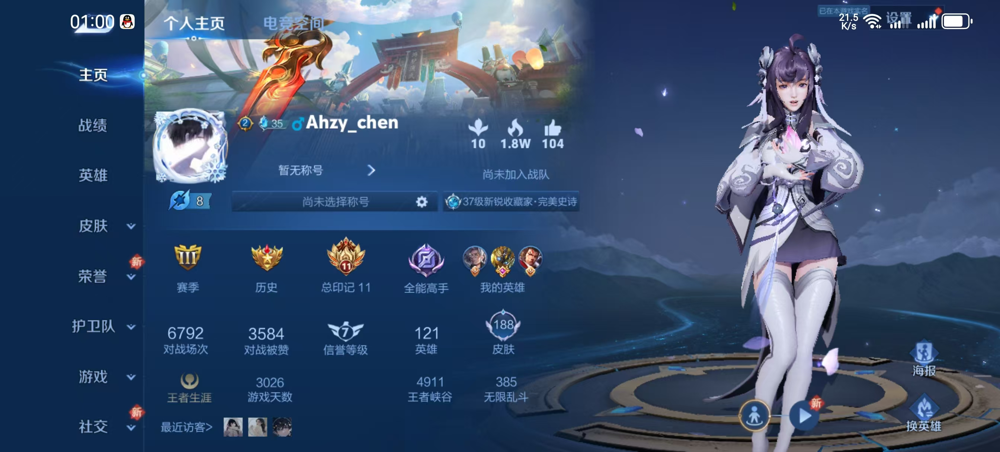

---
# 当前页面内容标题
title: 王者-再见

# 分类
category:
- 日常
# 标签
tag:
- 大学生活

sticky: false
# 是否收藏在博客主题的文章列表中，当填入数字时，数字越大，排名越靠前。
star: false
# 是否将该文章添加至文章列表中
article: true
# 是否将该文章添加至时间线中
timeline: true

# 是否原创
isOriginal: null

date: 2024-12-24

---

 

想起初次与&lt;王者荣耀&gt;的邂逅，大致是在小学时期。那时候懵懵懂懂的我们，总趁下课时分相聚一块，激情探讨每个英雄的技能，接着各抒己见，研究某个英雄所谓最合适的出装。
大家众说纷纭，相互争执，这段时期我们对游戏的理解可谓达到 ”登峰造极“ 的状态。

上了初中，我无形中接触到各式各样的游戏，可是还未曾发现有一款像王者荣耀般广为人知。那会的我和最好的朋友上了同一个补习班，我们一起去上课，一起回家，心血来潮了就上号开黑，
这段时光可能是我人生中最快乐的时刻。

截至目前，这款游戏我反反复复安装下载次数不下于200+次，原因很简单，无非临考试前物理抑制一下自己贪玩的想法，过不久又下载回来。可是今天，我想与这款游戏做一个真正的了断。

原因如下：

1. 王者荣耀的更新速度匹配不上我的游戏时长，英雄机制的更改、装备的迭代过快，增大了我的学习成本与负担

2. 由于种种压力，与朋友开黑时无法找回年少时的激情与感觉

3. 游戏环境的日益恶劣，语言暴力在游戏中展现的淋漓尽致

4. 氪金项目逐渐多元化，不仅局限在游戏皮肤，更囊括了按键、灵宝。。。

5. 技术水平拉跨

其实我可以抛开前面4点，因为最后一点才是我退游的内核原因。

为此我决定完成人生最后一把王者，以纪念这10多年来的青春。

我真的***的，玩个瑶真就黏在打野身上了。。

至此已绝。

::: right
2024年12月24日
:::

