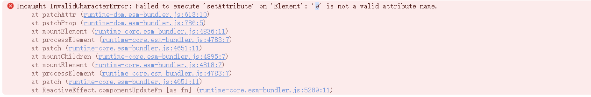
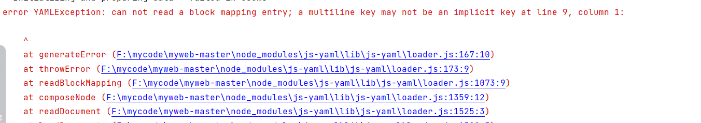

---
# 当前页面内容标题
title: 关于hope主题的一些报错原因
# 当前页面图标
icon: "/icon/question.svg"

date: 2024-11-17

---

 

## 1.关于`setAttribute`报错

在 markdown 编写文本的过程中，如果文本中包含特殊字符，比如 `{}` 等，在转化为 html 的时候会被认为设置了一个属性，然而我们并未设置这个属性和类型，该值赋给谁❓，进而产生这个报错。

在解决该类问题时，一般才用了用代码行包裹的形式，因为hope不会编译代码行、代码块中的内容。

## 2.关于`YAML`报错

在配置 Frontmatter 的时候，使用了ai，一直 <Badge text="Tab" type="danger" /> 下去，生成了中文的冒号😅，我其他的Frontmatter习惯了`英文冒号 + 一个空格` 的格式，没有及时判断出来导致的报错。

在解决该类问题时，只需正确配置好相关Frontmatter即可。