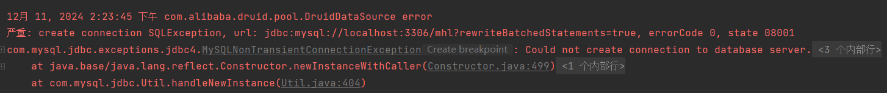
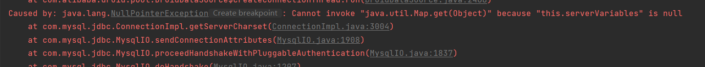
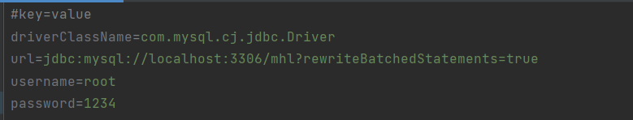
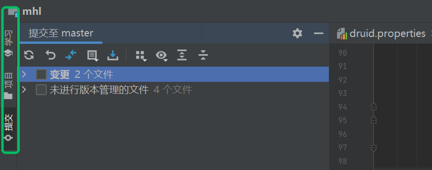
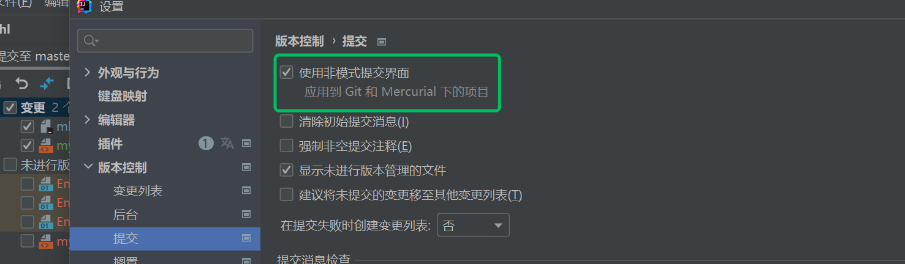

---
# 当前页面内容标题
title: 关于java的一些报错
# 当前页面图标
icon: "/icon/question.svg"

date: 2024-12-11

---

 

## 1.关于 mysql 初始化异常

  
有时候，你在网课的学习过程中，会遇到一些报错，比如上图所示的错误，这时候一瞬间你可能会对这个世界充满震惊，你可能在心里会问自己凭什么自己复现了一次代码可就是无法成功运行呢？

一开始，我看到是关于mysql的初始化异常，我第一时间想到的是去 `property` 文件中检查，检查自己配置是否正确，经过反复检查无误后，我再次运行代码，发现还是无法成功运行。
此时，我就将示例的代码拷贝一份去运行，发现示例代码都跑不起来？？？这时候，我们就要意识到要去考虑版本之间的差异与冲突了。经过上网一番折腾，最终确定下来，发现自己的 MYSQL 版本是8.0版本的，
而 `mysql-connector-java` 的 `jar包` 版本却是资料提供的 5.0 版本，与本地 mysql 版本不兼容导致的异常，此刻，悬着的心终于死了，就这费我一个钟去查问题？？？
吃一堑长一智，以后要多注意一些细节的问题。
  
最后，使用高版本的 mysql 需要将原本的 `driverClassName=com.mysql.jdbc.Driver` 修改为 `driverClassName=com.mysql.cj.jdbc.Driver`。问题解决。

## 2.关于 IDEA 显示问题
   
  
出现侧边栏不显示 git 提交的问题，在设置中做出如图所示的设置即可。
